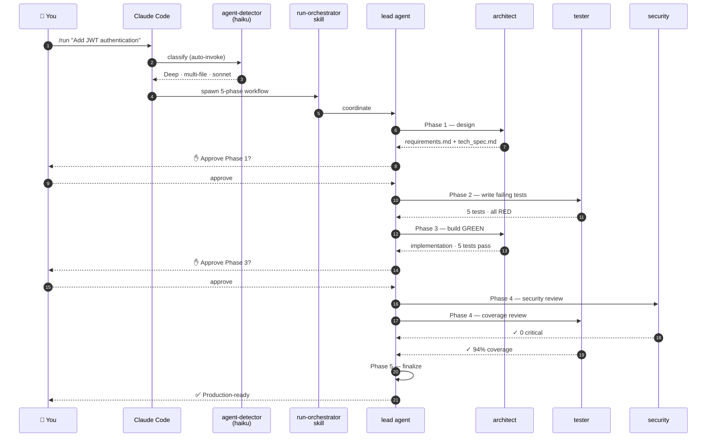
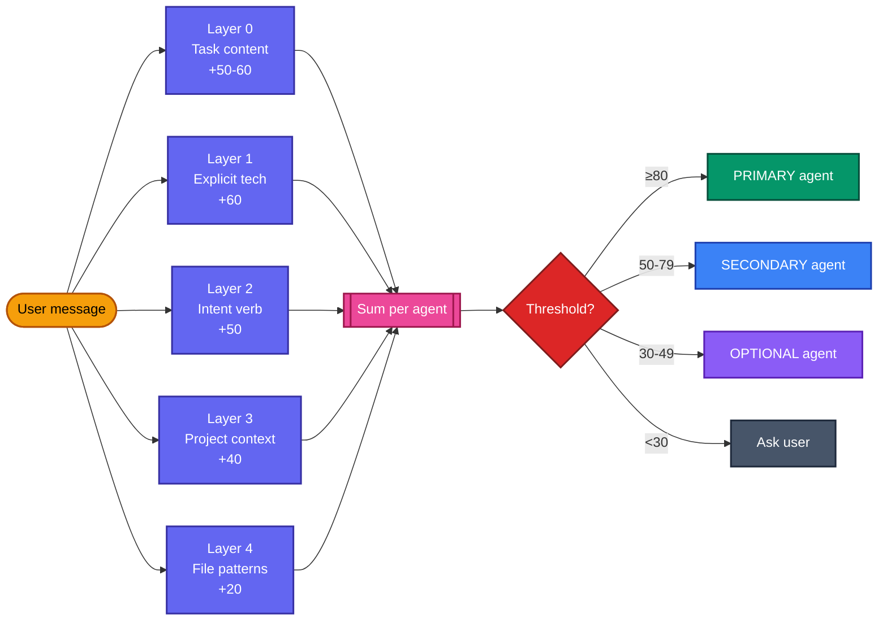
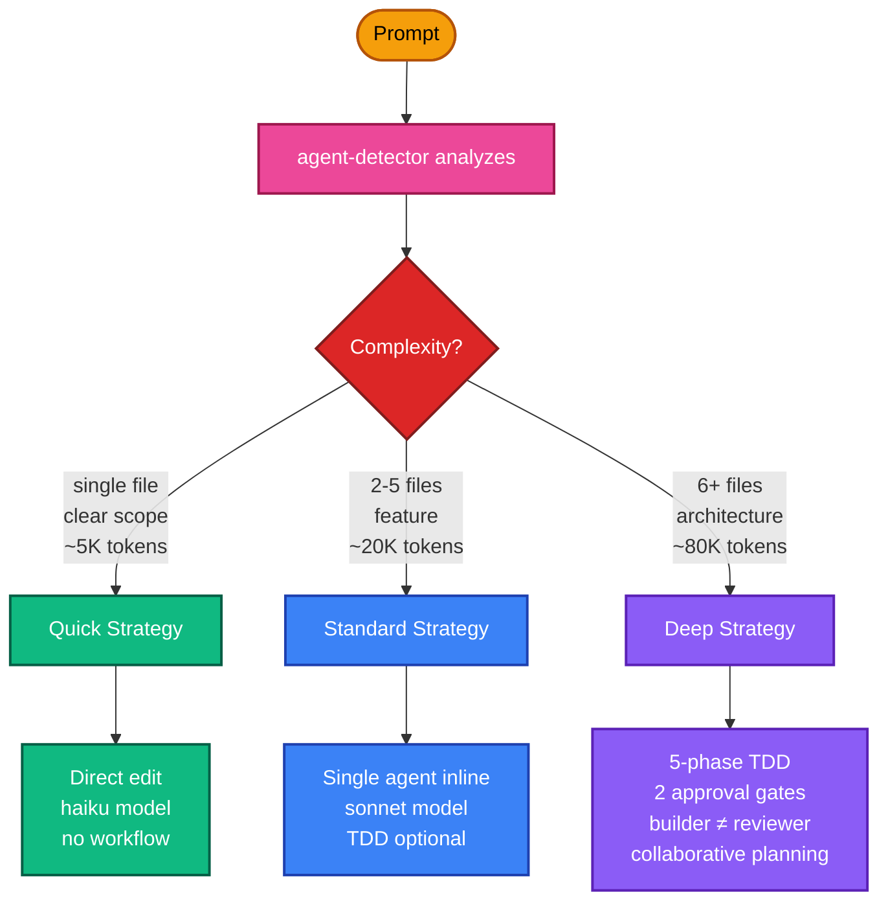

<div align="center">


# Aura Frog

### An Operating System for software engineering.

A plugin for **[Claude Code](https://docs.anthropic.com/en/docs/claude-code)** that treats it as an Operating System. 9 specialized agents, smart flow selection (direct edit · bugfix TDD · 5-phase workflow), self-healing memory, and multi-agent orchestration. Right effort matched to task risk.

[](docs/reference/CHANGELOG.md)
[](LICENSE)
[](https://docs.anthropic.com/en/docs/claude-code)
[](docs/PORTABILITY.md)
[](docs/guides/EVAL_SETUP.md)
[](CONTRIBUTING.md)

**Typos get direct edits. Bugs get 4-step TDD. Features get 5-phase workflow. You never pick — the plugin matches effort to risk.**

**[Install in 30 seconds](#-install)** · **[See it in action](#-before--after)** · **[Why Aura Frog?](#-the-problem)** · **[Full benefits guide →](docs/reference/BENEFITS.md)**

</div>

---

## The Problem

You open Claude Code. You type a prompt. Claude writes code. You *hope* it works.

No structure. No tests. No quality gates. Every session starts from scratch. Every complex feature turns into prompt spaghetti.

**You're the project manager, QA lead, and architect — all while trying to code.**

## The Solution

Aura Frog treats Claude Code as an **Operating System** — Claude is the kernel, agents are processes, and the context window is managed RAM. You describe the task. Aura Frog classifies complexity, picks the right flow (direct edit · bugfix TDD · full 5-phase), dispatches the right agent, and compresses context automatically so you never lose decisions.

**Right effort for every task. You only approve when it matters (0 gates for typos, up to 2 for architecture).**

---

## How It Works


**The flow, explained:**
1. **Every message** you send goes through the `agent-detector` skill (runs on haiku for cost) — it classifies complexity + picks the right agent + suggests the right model.
2. **Quick tasks** (typo, one-line fix) → direct edit, no workflow overhead.
3. **Standard tasks** (one feature, clear scope) → single specialized agent runs inline.
4. **Deep tasks** (feature + multi-file + TDD) → `run-orchestrator` spawns the 5-phase workflow with two human approval gates.
5. Between phases, you either **approve**, **reject**, or **modify** — no commit happens until Phase 5 and you say so.

---

## Works Across AI Coding Tools

Aura Frog's 57 rules, 44 skills, and 9 agents are **~87% portable** (weighted average) because they're markdown conventions, not tool-specific code. Only the thin hook layer needs adapters.

| Tool | Status | Coverage |
|------|--------|:--------:|
|  Fully tested | 100% |
|  Q2 2026 | ~85% |
|  Q2 2026 | ~80% |

**Why this matters:** When you invest in Aura Frog's TDD discipline, gotcha-only expert skills, and agent architecture, that investment survives tool switches. Only the thin adapter layer changes.

[Read the Portability Guide →](docs/PORTABILITY.md)

---

## Before & After

<table>
<tr><th width="450">❌ Without Aura Frog</th><th width="450">✅ With Aura Frog</th></tr>
<tr>
<td>

```
You: "Add user authentication"
Claude: *writes 500 lines of untested code*
You: "Wait, that's not what I—"
Claude: *rewrites everything from scratch*
```

</td>
<td>

```
You: "Add user authentication"

🐸 Phase 1: "JWT or OAuth2? Here are trade-offs.
   3 endpoints needed. Approve?"

You: "approve"

🐸 Phase 2-3: 5 tests → all GREEN.
🐸 Phase 4-5: Reviewed. Documented. Done.
```

</td>
</tr>
</table>

**Result:** Production-ready code with tests, security review, and documentation — from a single prompt.

---

## Installation

### Prerequisites

- **Claude Code CLI** installed → [install guide](https://docs.anthropic.com/en/docs/claude-code)
- **Node.js ≥ 18** (for hook scripts)
- **Git** (for phase checkpoint commits)

### Install in Claude Code (30 seconds)

```bash
# 1. Add the marketplace
/plugin marketplace add nguyenthienthanh/aura-frog

# 2. Install the plugin
/plugin install aura-frog@aurafrog

# 3. Verify
/af status
```

Expected output:

```
🐸 Aura Frog v3.6.0 — Ready
  Agents:   9 loaded (lead, architect, frontend, mobile, tester, security, devops, strategist, scanner)
  Skills:   44 available (5 auto-invoke, 39 on-demand)
  Rules:    57 loaded (18 core + 17 agent + 22 workflow)
  Hooks:    28 registered
  MCP:      context7, playwright, vitest, firebase, figma, slack
```

### Initialize Your Project (Recommended — one time)

```bash
/project init
```

Scans your codebase and creates 7 context files (framework, conventions, rules, examples, architecture, etc.) in `.claude/project-contexts/<name>/`. Takes 30–60 seconds; saves minutes on every future session.

### Optional Setup

<details>
<summary>Install <code>af</code> CLI for health checks outside Claude Code</summary>

```bash
# Inside Claude Code:
/af setup cli

# Or manually:
sudo ln -sf "$HOME/.claude/plugins/marketplaces/aurafrog/scripts/af" /usr/local/bin/af
```

Then use anywhere: `af doctor`, `af measure`, `af setup remote`.

</details>

<details>
<summary>MCP tokens (Figma, Slack, Firebase)</summary>

```bash
cp .envrc.template .envrc
# Edit .envrc — add FIGMA_API_TOKEN, SLACK_BOT_TOKEN, FIREBASE_TOKEN, etc.
direnv allow   # if using direnv
```

Without tokens, `figma` / `slack` / `firebase` MCP servers stay inactive. `context7`, `playwright`, `vitest` need no config.

</details>

<details>
<summary>Skills-only mode on other platforms</summary>

| Platform | Install | What works |
|----------|---------|------------|
| **Claude Code** | `/plugin marketplace add nguyenthienthanh/aura-frog` | Everything |
| **OpenAI Codex** | `cp -r aura-frog/skills/* ~/.codex/skills/` | Skills + commands |
| **Gemini CLI** | `cp -r aura-frog/skills/* ~/.gemini/skills/` | Skills + commands |
| **OpenCode** | `cp -r aura-frog/skills/* .opencode/skills/` | Skills + commands |

Hooks, agent detection, subagent spawning, and MCP servers are Claude Code exclusive.

</details>

### Start Your First Workflow

```bash
/run "Your task here"
```

See the [Walkthrough](#walkthrough-a-real-workflow-in-action) below for a complete transcript of what this looks like.

### Common Install Issues

| Symptom | Likely cause | Fix |
|---------|--------------|-----|
| `/plugin install` fails | Marketplace cache | Run `/plugin marketplace refresh` |
| Hooks not firing | `.claude/settings.json` missing hook config | `/af setup integrations` re-installs |
| `af: command not found` | PATH missing plugin scripts dir | Add `$HOME/.claude/plugins/marketplaces/aurafrog/scripts` to `$PATH` |
| State not saving during `/run` | Hook path drift (pre-v3.7) | Upgrade to 3.7+ (state path fixed) |
| Claude uses wrong agent | No `/project init` yet | Run `/project init` to load conventions |

Full guide: [GET_STARTED.md](docs/getting-started/GET_STARTED.md).

---

## Walkthrough: A Real Workflow in Action

A complete transcript of implementing user authentication with `/run`. This is what you actually see.

### Interaction Sequence



### Mock Terminal Transcript

```
$ /run "Add JWT authentication to the /api routes"

🐸 agent-detector (haiku):
   Complexity: Deep · Agent: architect (primary), security (reviewer)
   Model: sonnet · Estimated tokens: ~95K

🐸 Sprint Contract — confirm before Phase 2:
   Scope:     JWT middleware, /login + /refresh endpoints, user model
   Done when: 5 tests passing, 0 critical security findings, coverage ≥80%
   Out of scope: password reset, 2FA, social auth

Confirm contract? (yes / modify / skip)

> yes

═══════════════════════════════════════════════
Phase 1: Understand + Design  (architect)
═══════════════════════════════════════════════

📋 Requirements analyzed:
   • POST /auth/login  → issues JWT (15m) + refresh token (7d)
   • POST /auth/refresh → rotates access token
   • Middleware verifies JWT on protected routes
   • User.passwordHash stored as bcrypt (cost 12)

🎯 Technical Design:
   • Stack: express-jwt, bcrypt, crypto.randomUUID for jti
   • Token storage: httpOnly cookie (refresh) + Authorization header (access)
   • Refresh token rotation on every use (prevents replay)
   • RS256 signing (public/private keypair)

⚠️  Risks flagged by strategist:
   • Secret leak → env var with rotation plan
   • No rate-limit → add bucket before deploy (Phase 5 followup)

📁 Saved:
   .claude/logs/runs/250421-jwt-auth/phase-1/requirements.md
   .claude/logs/runs/250421-jwt-auth/phase-1/tech-spec.md

──────────────────────────────────────────────
✋ APPROVAL GATE — Phase 1

Options:
  approve            Continue to Phase 2 (write tests)
  modify <changes>   Adjust design without restart
  reject <reason>    Full redesign
──────────────────────────────────────────────

> approve

═══════════════════════════════════════════════
Phase 2: Test RED  (tester)
═══════════════════════════════════════════════

🧪 Writing failing tests (TDD RED)...
   ✓ auth.test.ts:  login returns JWT for valid creds         [FAIL — no implementation]
   ✓ auth.test.ts:  login rejects invalid password            [FAIL]
   ✓ auth.test.ts:  refresh rotates token on use              [FAIL]
   ✓ middleware.test.ts: rejects missing Authorization header [FAIL]
   ✓ middleware.test.ts: rejects expired JWT                  [FAIL]

📊 Status: 5 failing, 0 passing (correct for RED)

Auto-continue → Phase 3 (tests fail as expected) ✓

═══════════════════════════════════════════════
Phase 3: Build GREEN  (architect)
═══════════════════════════════════════════════

⚙️  Implementing...
   ✓ src/auth/jwt-service.ts    (new · 67 lines)
   ✓ src/auth/middleware.ts     (new · 42 lines)
   ✓ src/routes/auth.ts         (new · 58 lines)
   ✓ src/models/user.ts         (modified · added passwordHash)
   ✓ .env.example               (modified · added JWT_PRIVATE_KEY)

🧪 Running tests...
   ✓ 5 passing, 0 failing
   ✓ Coverage: 94% (target: 80%)

──────────────────────────────────────────────
✋ APPROVAL GATE — Phase 3

> approve

═══════════════════════════════════════════════
Phase 4: Refactor + Review  (security + tester)
═══════════════════════════════════════════════

🔒 Security review (reviewer ≠ builder):
   ✓ No hardcoded secrets (env var pattern correct)
   ✓ bcrypt cost 12 (OWASP minimum: 10)
   ✓ httpOnly cookie flag set on refresh token
   ⚠️  INFO: Consider CSP header on /login response (not blocking)

🧪 Test coverage review:
   ✓ 94% coverage (target: 80%) ✓
   ✓ All critical paths covered
   ✓ No flaky tests detected

Auto-continue → Phase 5 (0 critical findings) ✓

═══════════════════════════════════════════════
Phase 5: Finalize  (lead)
═══════════════════════════════════════════════

📦 Deliverables:
   ✓ 4 new files, 2 modified
   ✓ 5 tests passing, 94% coverage
   ✓ 0 critical security findings
   ✓ ADR saved: docs/adr/0007-jwt-auth.md
   ✓ Deployment note: add rate-limit middleware (tracked in phase-1/risks.md)

📊 Workflow stats:
   Duration: 18m · Tokens: 82K · Budget: 30K target → 2.7x (Deep tier norm)

Ready to commit? (yes / no)

> yes

💾 Committed: 7a3b9c2 · feat(auth): JWT authentication with refresh rotation

✅ Workflow complete — JWT auth shipped.
```

### What You Just Saw

| Step | Who ran it | Your role |
|------|------------|-----------|
| 1. Detection | `agent-detector` skill (haiku, auto) | Nothing — zero friction |
| 2. Sprint Contract | Orchestrator proposed | Confirm scope |
| 3. Phase 1 design | `architect` in forked context | Approve design |
| 4. Phase 2 RED | `tester` (auto-continues) | Nothing |
| 5. Phase 3 GREEN | `architect` implements | Approve implementation |
| 6. Phase 4 review | `security` + `tester` (NOT architect) | Nothing |
| 7. Phase 5 finalize | `lead` | Confirm commit |

**Two approvals. 18 minutes. Production-ready JWT auth with 94% coverage and security review.**

---

## Why Teams Ship Faster With Aura Frog

### 1. Smart Flow Selection — Right Effort for Every Task

**Not every task gets the 5-phase workflow.** Aura Frog's `agent-detector` classifies complexity on every message and picks the minimum viable flow:

| Task type | Flow | Gates | Example |
|-----------|------|:----:|---------|
| **Typo, one-line fix** | Direct edit (no workflow) | 0 | `/run fix typo in login.ts` |
| **Bug fix** | 4-step TDD (Investigate → RED → GREEN → Verify) | 0 | `/run fix login button not disabling` |
| **Refactor** | Analyze → plan → test → refactor | 0 | `/run refactor auth service` |
| **Add tests** | Detect framework → write → verify coverage | 0 | `/run add tests for payment` |
| **Feature (≤5 files)** | Single-agent inline with TDD | 0–1 | `/run add email validation` |
| **Feature (6+ files, architecture)** | **Full 5-phase workflow** | 2 | `/run implement user subscription` |

**When the 5-phase workflow DOES fire** (Deep complexity only):

```
  ✋ Phase 1: Understand + Design    → You approve the plan
  ⚡ Phase 2: Test RED               → Failing tests written
  ✋ Phase 3: Build GREEN            → You approve the implementation
  ⚡ Phase 4: Refactor + Review      → Auto quality + security check
  ⚡ Phase 5: Finalize               → Docs + notifications
```

**Escape hatches** — you control rigor when the detector gets it wrong:

- `/run fasttrack: <specs>` — skip Phase 1 if you've already designed
- `/run must do: <task>` / `just do: <task>` — bypass brainstorming, execute literally
- `/run reopen <phase>` — unfreeze an approved phase to revise
- `/run reason: sc|tot|cove` — opt in to heavy reasoning (Self-Consistency / Tree of Thoughts / Chain-of-Verification) for hard decisions
- `/run handoff` — save state, resume in a fresh session

**What you get vs what you skip:**
- 80% of tasks never see a gate — fast iteration
- 20% that *matter* (architecture, multi-file, vague scope) get disciplined TDD + human approval
- You never manually pick — the detector routes; you approve only when it matters

Full strategy matrix: [Routing Strategies](#routing-strategies) below. Full benefits guide: [docs/reference/BENEFITS.md](docs/reference/BENEFITS.md).

### 2. The Right Expert for Every Task

9 specialized agents activate automatically — no configuration:

```
"Build a React dashboard"     → frontend
"Optimize the SQL queries"    → architect
"Set up CI/CD pipeline"       → devops
"Fix the login screen crash"  → mobile
"Run a security audit"        → security
```

#### How Agent Detection Works



**Why 5 layers instead of one?** A backend repo can contain frontend work (Blade/Jinja templates, email HTML, PDF styling), and a frontend repo can need backend work (API rate-limits, auth logic). Repo type alone lies. **Task content (Layer 0) overrides repo context** — so `"Fix email template styling"` in a Laravel repo correctly routes to `frontend`, not `architect`.

Details: `skills/agent-detector/SKILL.md` + `skills/agent-detector/task-based-agent-selection.md`.

<details>
<summary>All 9 agents</summary>

| Agent | Model | Tools | When it activates |
|-------|-------|-------|-------------------|
| `lead` | **inherit** | full | Coordinates workflows, enforces gates |
| `architect` | **inherit** | full | System design, DB schema, backend APIs — uses Opus when session is Opus |
| `frontend` | **inherit** | full | React, Vue, Angular, Next.js + design systems — uses Opus when session is Opus |
| `mobile` | **inherit** | full | React Native, Flutter, Expo, NativeWind — uses Opus when session is Opus |
| `strategist` | sonnet | **read-only** | ROI, MVP, scope creep (Phase 1 Deep) |
| `security` | sonnet | **read-only** | OWASP, auth/crypto review (Phase 4) |
| `tester` | sonnet | full | Jest, Cypress, Playwright, Detox, coverage |
| `devops` | sonnet | full | Docker, K8s, CI/CD, monitoring |
| `scanner` | **haiku** | read + Bash | Project detection, session-start context |

Agent + complexity + model selection all done by the `agent-detector` skill (no separate router — consolidated in v3.6.0).

</details>

#### Per-Agent Model Override — How It Works and Why

Each agent and skill declares its own `model:` in YAML frontmatter. Claude Code resolves the model like this:

| Priority | Source | When it applies |
|:--------:|--------|-----------------|
| 1 (highest) | `CLAUDE_CODE_SUBAGENT_MODEL` env var | Override everything — useful for CI or cost control |
| 2 | Per-invocation `model` parameter | Rare — set at spawn time |
| 3 | Agent/skill frontmatter `model:` field | **This is where Aura Frog declarations live** |
| 4 (fallback) | Main session model | Used only if nothing above is set |

**Key point:** frontmatter wins over session model. If you started your session on Opus but invoke `agent-detector`, that skill runs on **haiku** — not Opus. The session model is the *fallback*, not the override.

Why we hard-code certain models:

| Agent or skill | Model | Why |
|----------------|:-----:|-----|
| `agent-detector`, `scanner` | **haiku** | Classification/detection tasks. Fire every message or session-start. Haiku is ~3× faster and ~10× cheaper. Opus here wastes budget. |
| `security`, `strategist`, `tester`, `devops` | **sonnet** | Balanced reasoning for review/analysis/tests/deploy. Locked to sonnet — Opus rarely pays back for these roles. |
| `lead`, `architect`, `frontend`, `mobile` | **inherit** | These do the heavy design/build work. If you chose Opus for a complex task, these agents should reason at Opus too. |

**What this means for you:**
- Starting a session on **Opus** → `lead`, `architect`, `frontend`, `mobile` all run on Opus (they inherit). Review/test/deploy stay on sonnet. Detection stays on haiku. You get Opus-quality design + sonnet-cost everything else.
- Starting on **Sonnet** → everything runs ≤ sonnet (haiku calls still haiku). No Opus unless you escalate the session.
- Want everything on one model? Set `CLAUDE_CODE_SUBAGENT_MODEL=opus` (env var at top of resolution order) — overrides every frontmatter declaration.

**Not what you want?** Edit the `model:` field in `aura-frog/agents/<name>.md` frontmatter. Remove the line to inherit session model. Change to `opus`/`sonnet`/`haiku` to lock. See the Frontmatter Maintenance Rule in `.claude/CLAUDE.md`.

### 3. Complex Features Get Debated Before Built

For deep tasks, 4 agents independently analyze your plan — then challenge each other:

```
📐 Architect    → "How to build it"
🔍 Tester       → "How it can fail"
👤 Frontend     → "How users experience it"
💼 Strategist   → "Should we even build this?"
```

Plans survive 4 rounds of scrutiny before a single line of code. Catches scope creep and wasted effort *before* it happens.

### 4. Your Codebase Loads in Seconds, Not Minutes

Run `project:init` once. Every future session instantly understands your codebase — conventions, architecture, patterns, file relationships. 12 pattern detections. 7 context files generated.

**No more re-explaining your project every session.**

### 5. Multi-Agent Teams for Big Features

For complex work, Aura Frog spins up a real team working in parallel:

```
lead
├── architect     → Designs the system
├── frontend      → Builds the UI
├── tester        → Writes tests
└── security      → Reviews for vulnerabilities

All cross-reviewing each other's work.
```

Only activates when needed. Simple tasks stay single-agent (saves ~3x tokens).

### 6. Context-Aware MCP Servers — Zero Config

6 bundled servers auto-invoke when Claude needs them:

```
"Build with MUI"          → context7 fetches current MUI docs
"Test the login page"     → playwright launches a browser
"Check test coverage"     → vitest runs your suite
"Deploy to Firebase"      → firebase manages the project
```

Plus Figma design fetching and Slack notifications.

<details>
<summary>More features</summary>

#### Self-Improving Learning
Detects your patterns, remembers corrections, creates rules that persist across sessions. Optional Supabase sync for teams.

#### Smart Complexity Routing
Automatically matches effort to task size — typos get direct edits, features get full workflows, architecture gets collaborative planning. No configuration. See [Routing Strategies](#routing-strategies) below.

#### Built-in Safety Net
Run crashed? `/run resume`. Context full? Decisions preserved across `/compact`. Need to pause? Type `handoff` to save everything.

#### Memory That Heals Itself
All cached context is treated as a hint — agents verify against actual files before acting. State only updates after confirmed success (Strict Write Discipline). No stale assumptions propagate.

#### 3-Tier Context Compression
MicroCompact (free, every 10 turns) → AutoCompact (one /compact call at 80%) → ManualCompact (full session snapshot). Context stays lean. Decisions survive.

#### Performance by Design
3-tier rule loading (~75% less context), conditional hooks (~40% fewer executions), agent detection caching, session start caching (<1s repeat sessions).

</details>

---

## Routing Strategies

Aura Frog picks one of three execution strategies per task — you never configure it manually.



| Strategy | Triggers | Model | Gates | Example |
|---|---|---|---|---|
| **Quick** | Single file, typo, one-line fix | haiku | 0 | "Fix typo in login.ts" |
| **Standard** | 2–5 files, one feature | sonnet | 0–1 | "Add email validation to signup form" |
| **Deep** | 6+ files, architecture, vague scope | sonnet (opus for design) | 2 (P1 + P3) | "Design and implement user subscription system" |

**Why three tiers instead of always-TDD?** Forcing Deep on every task burns tokens (~3× vs subagent mode) and slows iteration. Forcing Quick on complex work skips tests and breaks production. The three-tier model matches effort to risk.

**Team Mode** (subset of Deep): if the task spans 2+ domains AND `CLAUDE_CODE_EXPERIMENTAL_AGENT_TEAMS=1`, multiple agents work in parallel and cross-review each other. See [AGENT_TEAMS_GUIDE](docs/guides/AGENT_TEAMS_GUIDE.md).

Details: `rules/core/execution-rules.md`, `skills/agent-detector/SKILL.md`, `skills/run-orchestrator/SKILL.md`.

---

## The Numbers

| Component | Count | Why it matters |
|-----------|:-----:|----------------|
| **Agents** | 9 | Right expert auto-selected per task |
| **Skills** | 41 | 5 auto-invoke on context, 36 on-demand |
| **Commands** | 6 | `/run`, `/check`, `/design`, `/project`, `/af`, `/help` |
| **Rules** | 57 | 3-tier loading (18 core + 17 agent + 22 workflow) — only what's needed |
| **Hooks** | 28 | Conditional — skip processing for non-code files |
| **MCP Servers** | 6 | Zero-config, auto-invoked |

Full workflow target: **≤30K tokens** across all 5 phases.

---

## Command Reference

Six commands cover every workflow. Each auto-detects intent and dispatches the right skills/agents.

### `/run <task>` — The main entry point

Auto-detects what kind of work you want (feature / bugfix / refactor / test) and picks the right workflow.

| What you say | Intent detected | Flow |
|---|---|---|
| `/run implement user profile` | Feature | 5-phase TDD workflow |
| `/run fix login not working` | Bugfix | `bugfix-quick` skill — investigate → test → fix → verify |
| `/run refactor auth service` | Refactor | `refactor-expert` skill — analyze → plan → test → refactor |
| `/run add tests for payment` | Test | `test-writer` skill — detect framework → write tests → coverage |
| `/run fasttrack: <specs>` | Fast-Track | Skip Phase 1, auto-execute P2–P5 (specs must include Requirements + Design + API + Data Model + Acceptance Criteria) |
| `/run resume <id>` | Resume | Load state from `.claude/logs/runs/<id>/` |
| `/run status` | Status | Current phase + progress |
| `/run handoff` | Handoff | Save state for cross-session continuation |

### `/check` — Health + quality checks

```bash
/check            # all checks (security + perf + complexity + debt + coverage + deps)
/check security   # SAST only
/check perf       # performance bottlenecks
/check coverage   # test coverage report
/check deps       # outdated/vulnerable dependencies
```

### `/design` — Design artifacts

```bash
/design api       # REST/GraphQL API spec (calls api-designer skill)
/design db        # Database schema design
/design doc       # ADR or runbook (calls documentation skill)
```

### `/project` — Project lifecycle

```bash
/project init     # First-time setup — generates 7 context files
/project status   # Current context + active workflow
/project refresh  # Re-scan codebase, update conventions
/project regen    # Regenerate context files from scratch
/project env      # Validate .envrc / MCP tokens
/project sync     # Sync status line + refresh cache
```

### `/af` — Plugin management + learning

```bash
/af status        # Plugin health check
/af agents        # List loaded agents with their tools + model
/af metrics       # Workflow velocity + token efficiency
/af learn status  # Learning system state (Supabase or local)
/af learn analyze # Extract patterns from past workflows
/af learn apply   # Apply learned rules to future sessions
/af setup cli     # Install af CLI system-wide
/af prompts       # Analyze prompt quality + suggest improvements
```

### `/help` — Contextual help

```bash
/help             # Plugin overview
/help <command>   # Detailed help for a specific command
/help agents      # Agent selection guide
/help hooks       # Hook lifecycle reference
```

Full command docs: [commands/README.md](aura-frog/commands/README.md).

---

## Agent Selection Examples

Real examples of what the `agent-detector` skill picks and why. Score thresholds: **PRIMARY ≥80**, SECONDARY 50–79, OPTIONAL 30–49.

| You type | PRIMARY agent | Why (scoring breakdown) |
|---|---|---|
| "Add login form with email+password" | **frontend** | `form` +35, `login` +30, UI intent +50 = **115** |
| "Add rate-limit to /api routes" | **architect** | `api route` +55, `rate limit` +45, backend intent +50 = **150** |
| "Fix email template styling in Laravel" | **frontend** (in Laravel repo!) | `email template` +55, `styling` +40, Layer 0 overrides repo = **95** |
| "Optimize this slow query" | **architect** | `slow query` +50, `optimize` +35, database intent +55 = **140** |
| "Run OWASP audit on payment flow" | **security** | `OWASP` +55, `audit` +50, security intent +55 = **160** |
| "Write Cypress tests for checkout" | **tester** | `Cypress` +50, `tests` +55, test infra exists +30 = **135** |
| "Set up GitHub Actions for CI" | **devops** | `GitHub Actions` +55, `CI` +50, deployment intent +50 = **155** |
| "Fix FlatList performance in Expo" | **mobile** | `FlatList` +50, `Expo` +55, mobile intent +50 = **155** |
| "Should we build this feature?" | **strategist** | `should we` +50, business-question intent +55 = **105** |
| "What does this repo do?" | **scanner** | Project detection intent +60, cached context +40 = **100** |

**Key insight:** Layer 0 (task content) overrides repo type. A Laravel repo asking "fix email template styling" gets `frontend`, not `architect`. See `skills/agent-detector/task-based-agent-selection.md` for the full scoring matrix.

---

## Token Budget

Real measurements from production workflows. Numbers vary ±20% based on project size.

| Strategy | Typical Tokens | Cost (Sonnet) | Cost (Opus) | Gates | Example task |
|---|---:|---:|---:|:---:|---|
| **Quick** (direct edit, haiku) | ~3K | $0.003 | — | 0 | Fix typo, rename variable |
| **Standard** (single agent, sonnet) | ~15–25K | $0.08 | $0.40 | 0–1 | Add validation to form |
| **Deep** (5-phase, sonnet) | ~60–90K | $0.30 | $1.50 | 2 | JWT auth, payment flow |
| **Deep + Team Mode** (multi-agent, sonnet) | ~120–180K | $0.60 | $3.00 | 2 | User subscription system |

### Per-Phase Breakdown (Deep workflow, sonnet)

```
Phase 1: Understand + Design     ~8K   (13%)
Phase 2: Test RED                ~6K   (10%)
Phase 3: Build GREEN            ~40K   (65%)  ← biggest phase
Phase 4: Refactor + Review       ~6K   (10%)
Phase 5: Finalize                ~2K   ( 2%)
```

**Target:** ≤30K tokens per workflow. Actual median: **62K** (2x target — Phase 3 is the compressor target for future optimization).

Run `/run predict <task>` before a workflow to get a tailored estimate.

---

## Troubleshooting / FAQ

<details>
<summary><strong>Q: Workflow state isn't saving. `/run status` shows nothing.</strong></summary>

**Likely cause:** Path drift between hooks and skills (fixed in v3.7+).

**Check:**
```bash
ls -la .claude/logs/runs/         # Should exist after first /run
ls -la .claude/logs/workflows/    # Legacy path — may have old state
```

**Fix:**
- Upgrade to v3.7+ (`/plugin update aura-frog`)
- Or manually move: `mv .claude/logs/workflows/* .claude/logs/runs/`

Verify with `/af status` — should show 0 orphan paths.
</details>

<details>
<summary><strong>Q: Wrong agent picked for my task.</strong></summary>

**Likely cause:** Missing project context or ambiguous task description.

**Check:**
- Did you run `/project init` yet? Scanner uses those files for Layer 3 (project context).
- Is your task description short/vague? `agent-detector` defaults to repo type when signals are weak.

**Fix:**
- Run `/project init` if you haven't
- Rephrase task with domain-specific keywords: `"Add email template styling"` (frontend) vs `"Update email feature"` (ambiguous)
- Override manually: `/run @frontend implement X` forces the frontend agent

Full scoring logic: `skills/agent-detector/task-based-agent-selection.md`.
</details>

<details>
<summary><strong>Q: Token budget blown past 200K. What happened?</strong></summary>

**Likely cause:** Phase 3 (Build GREEN) hit an iteration loop on a complex refactor.

**Check:**
```bash
/run budget      # Shows per-phase consumption
/run metrics     # Shows if rejection count is high
```

**Fix:**
- `/run handoff` to save state → resume in fresh session
- For next time: use `/run predict <task>` first — flags Deep tasks likely to exceed budget
- Consider splitting: `/run part 1: <narrow scope>` → merge → `/run part 2`
</details>

<details>
<summary><strong>Q: Hooks not firing (no SessionStart banner, no lint-autofix).</strong></summary>

**Likely cause:** `.claude/settings.json` missing hook config, or plugin not activated in this project.

**Check:**
```bash
cat .claude/settings.json   # Should reference plugin hooks
/af status                  # Should show "Hooks: 28 registered"
```

**Fix:**
```bash
/af setup integrations      # Re-installs hook config
```

If still nothing, check plugin.json path:
```bash
ls ~/.claude/plugins/marketplaces/aurafrog/aura-frog/hooks/hooks.json
```
</details>

<details>
<summary><strong>Q: Opus session costs surprised me. Can I lock everything to Sonnet?</strong></summary>

**Yes — two ways:**

**Option 1 — Session override (temporary):**
```bash
# Start Claude Code with model flag
claude --model sonnet
```

**Option 2 — Env var (permanent, overrides ALL frontmatter):**
```bash
export CLAUDE_CODE_SUBAGENT_MODEL=sonnet
```

This overrides every agent/skill `model:` declaration. See [Per-Agent Model Override](#per-agent-model-override--how-it-works-and-why) for resolution order.

**Cost tip:** `scanner` and `agent-detector` stay on haiku regardless — you don't need to touch them.
</details>

<details>
<summary><strong>Q: Can I run multiple /run workflows in parallel?</strong></summary>

**Yes — use git worktrees:**
```bash
/run worktree: <task>    # Automatically creates isolated worktree + runs there
```

Each worktree has its own state in `.claude/logs/runs/<id>/`. See [Git Worktree skill](aura-frog/skills/git-worktree/SKILL.md).

For full multi-agent parallel work, enable Agent Teams:
```bash
export CLAUDE_CODE_EXPERIMENTAL_AGENT_TEAMS=1
```

See [Agent Teams Guide](docs/guides/AGENT_TEAMS_GUIDE.md).
</details>

<details>
<summary><strong>Q: How do I disable a hook that's slowing me down?</strong></summary>

Each hook has a disable env var:

```bash
AF_LINT_AUTOFIX=false        # Skip post-edit linter
AF_PROMPT_LOGGING=false      # Skip prompt metadata logging
AF_LEARNING_ENABLED=false    # Skip all learning hooks
```

Or disable at the source by editing `aura-frog/hooks/hooks.json` (comment out the matcher).

Full hook list: [hooks/README.md](aura-frog/hooks/README.md).
</details>

More issues: [TROUBLESHOOTING.md](docs/operations/TROUBLESHOOTING.md).

---

## Compared to Other Claude Code Plugins

Honest comparison with two popular plugins in the ecosystem (April 2026).

| | **Aura Frog** | **wshobson/agents** | **Superpowers** |
|---|---|---|---|
| **Agents** | 9 curated | 184 across 78 plugins | ~20 |
| **Skills** | 38 | 150 | Small focused set |
| **Commands** | 6 | 98 | ~10 |
| **Workflow** | 5-phase TDD with 2 gates | No structured workflow | Phase-gated workflow |
| **Agent routing** | Task-content Layer 0 override | Manual `/agent-name` | Similar to Aura Frog |
| **TDD enforcement** | ✅ Mandatory RED→GREEN→REFACTOR | ❌ Per-agent | ✅ Phase-gated |
| **Context management** | 3-tier (MicroCompact / AutoCompact / ManualCompact) | ❌ Base Claude Code | Partial |
| **Approval gates** | 2 (P1 + P3) | ❌ | Multiple |
| **MCP bundled** | 6 (context7, playwright, vitest, firebase, figma, slack) | Varies per plugin | 2–3 |
| **Best fit** | Teams shipping production features with TDD discipline | Extending with niche specialists | Structured workflows for research/writing |
| **Weakness** | Steeper learning curve | Agent sprawl (184 is a lot) | Smaller ecosystem |

**Not competing — different optimization targets.** Aura Frog optimizes for *production code quality* (TDD + security review). wshobson optimizes for *breadth of specialists*. Superpowers optimizes for *structured thinking over code*.

Combine freely — plugins coexist in Claude Code.

---

## Documentation

| | |
|---|---|
| **All Documentation** | [docs/README.md](docs/README.md) |
| **Getting Started** | [GET_STARTED.md](docs/getting-started/GET_STARTED.md) |
| **First Workflow Tutorial** | [FIRST_WORKFLOW_TUTORIAL.md](docs/getting-started/FIRST_WORKFLOW_TUTORIAL.md) |
| **All Commands (6)** | [commands/README.md](aura-frog/commands/README.md) |
| **All Skills (38)** | [skills/README.md](aura-frog/skills/README.md) |
| **Agent Teams Guide** | [AGENT_TEAMS_GUIDE.md](docs/guides/AGENT_TEAMS_GUIDE.md) |
| **MCP Setup** | [MCP_GUIDE.md](docs/operations/MCP_GUIDE.md) |
| **Hooks & Lifecycle** | [hooks/README.md](aura-frog/hooks/README.md) |
| **Troubleshooting** | [TROUBLESHOOTING.md](docs/operations/TROUBLESHOOTING.md) |
| **Changelog** | [CHANGELOG.md](docs/reference/CHANGELOG.md) |

---

## Architecture — LLM OS

```
Claude = Kernel          Context Window = RAM           Project Files = Disk
Agents = Processes       5-Phase TDD = Scheduler        MCP = Device Drivers
TOON = Compression       Approval Gates = Interrupts    Handoffs = IPC

aura-frog/
├── agents/         9 processes (auto-dispatched per task)
├── skills/         44 skills (5 auto-invoke + 39 on-demand)
├── commands/       6 commands (/run, /check, /design, /project, /af, /help)
├── rules/          57 rules (18 core + 17 agent + 22 workflow)
├── hooks/          28 lifecycle hooks (conditional execution)
├── scripts/        43 utility scripts
├── docs/           AI reference docs (phases, TOON refs)
└── .mcp.json       6 device drivers (MCP servers)
```

---

## Contributing

We welcome contributions — especially new MCP integrations, agents, skills, and bug fixes. See [CONTRIBUTING.md](CONTRIBUTING.md) or submit an issue.

> Godot and SEO/GEO modules available as separate addons.

---

## License

MIT — See [LICENSE](LICENSE)

---

<div align="center">


### Your AI writes code. Aura Frog runs the OS.

**[Install Now](#-install)** · **[Tutorial](docs/getting-started/FIRST_WORKFLOW_TUTORIAL.md)** · **[Report Issue](https://github.com/nguyenthienthanh/aura-frog/issues)**

*Built by [@nguyenthienthanh](https://github.com/nguyenthienthanh) · [Changelog](docs/reference/CHANGELOG.md)*

</div>
