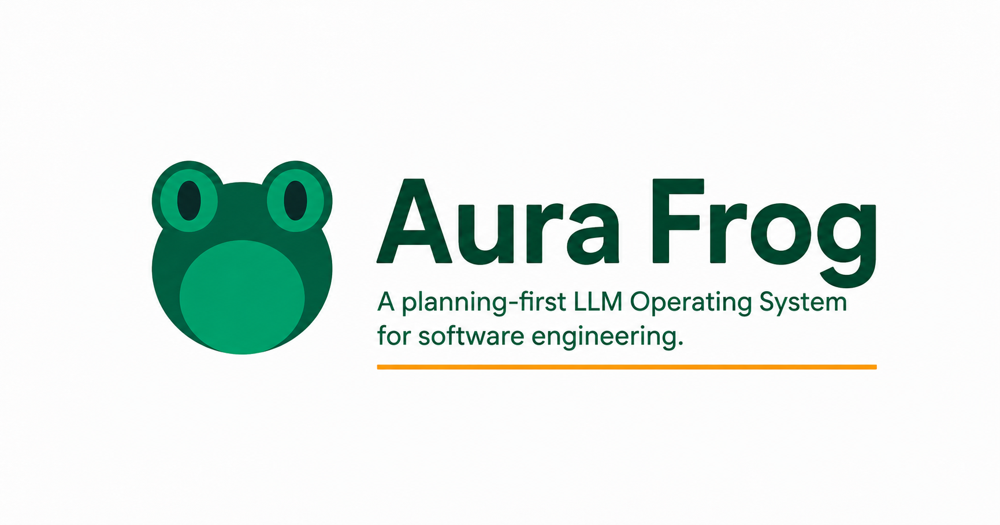

<div align="center">



# Aura Frog

### Stop prompting. Start shipping.

The most powerful plugin for **[Claude Code](https://docs.anthropic.com/en/docs/claude-code)** — turns your AI into a structured development team with agents, TDD workflows, and real multi-agent orchestration.

[](aura-frog/CHANGELOG.md)
[](LICENSE)
[](https://docs.anthropic.com/en/docs/claude-code)
[](CONTRIBUTING.md)

> **25+ releases** · **9,000+ lines of hook code** · **8 test suites & CI** · **MIT License**

**[Install in 30 seconds](#-install)** | **[See it in action](#-see-it-in-action)** | **[Why Aura Frog?](#-the-problem)**

</div>

---

## The Problem

You open Claude Code. You type a prompt. Claude writes code. You hope it works.

**No structure. No tests. No quality gates. No memory between sessions.**

Every session starts from scratch. Every complex feature turns into prompt spaghetti. You're the project manager, QA lead, and architect — all while trying to code.

## The Solution

Aura Frog gives Claude Code **structure, memory, and a team.**

```
You: "Implement user authentication with JWT"

Aura Frog:
  1. Analyzes requirements, challenges assumptions     ← Phase 1: Understand
  2. Writes failing tests first                        ← Phase 2: Test RED
  3. Implements code to pass tests                     ← Phase 3: Build GREEN
  4. Refactors + security review                       ← Phase 4: Review
  5. Docs, notifications, done                         ← Phase 5: Finalize
```

**You approve twice. Aura Frog handles the rest.**

<details>
<summary>🆕 What's New in v2.1 — Performance Release</summary>

- **~60% less context overhead** — 3-tier rule architecture (core/agent/workflow)
- **Smart caching everywhere** — Agent detection, session start, test patterns
- **Workflow survives /compact** — Design decisions preserved across context resets
- **Auto-test pattern matching** — Tests match your project's conventions automatically
- **Incremental project refresh** — Only re-scan changed files via `git diff`

</details>

---

## Install

```bash
# In Claude Code terminal (takes 30 seconds):
/plugin marketplace add nguyenthienthanh/aura-frog
/plugin install aura-frog@aurafrog
```

That's it. Start your first workflow:

```bash
workflow:start "Your task here"
```

---

## See It In Action

### Before Aura Frog
```
You: "Add user authentication"
Claude: *writes 500 lines of untested code*
You: "Wait, that's not what I—"
Claude: *rewrites everything from scratch*
```

### After Aura Frog
```
You: "Add user authentication"

🐸 Phase 1: "Here's my understanding. You said JWT — did you consider OAuth2?
   Here are the trade-offs. 3 API endpoints needed. Approve?"

You: "approve"

🐸 Phase 2: "5 tests written. All RED (failing). Ready to implement."

🐸 Phase 3: "All 5 tests GREEN. Auth middleware + routes implemented.
   Review the code?"

You: "approve"

🐸 Phase 4-5: "Refactored. Security review passed. Docs generated. Done."
```

**Result:** Production-ready code with tests, documentation, and a security review — from a single prompt.

---

## What You Get

<div align="center">

| | Without Aura Frog | With Aura Frog |
|---|:---|:---|
| **Quality** | Hope and pray | TDD enforced (RED → GREEN → REFACTOR) |
| **Agents** | One generic AI | **10 specialists** auto-selected per task |
| **Context** | Re-explain every session | **Deep Project Init** remembers everything |
| **Planning** | One perspective, hope for the best | **3 agents debate** your plan before building |
| **Teams** | One agent at a time | **Multi-agent orchestration** with cross-review |
| **Integrations** | Copy-paste from docs | **6 MCP servers** auto-invoked |

</div>

---

## The Numbers

<div align="center">

| 10 Agents | 43 Skills | 88 Commands | 45 Rules | 27 Hooks | 6 MCPs |
|:-:|:-:|:-:|:-:|:-:|:-:|
| Auto-selected per task | 8 auto-invoke | 5 bundled menus | 3-tier loading | Conditional execution | Zero-config |

</div>

---

## Key Features

### Structured TDD Workflow

Every feature goes through 5 phases. Only 2 require your approval:

```
  ✋ Phase 1: Understand + Design    → You approve the plan
  ⚡ Phase 2: Test RED               → Tests written automatically
  ✋ Phase 3: Build GREEN            → You approve the implementation
  ⚡ Phase 4: Refactor + Review      → Auto quality check
  ⚡ Phase 5: Finalize               → Docs + notifications
```

**Fast-Track Mode:** Already have specs? Skip Phase 1 entirely.

### 10 Specialized Agents

Claude stops being a generalist. The right expert activates for every task:

```
"Build a React dashboard"     → frontend activates
"Optimize the SQL queries"    → architect activates
"Set up CI/CD pipeline"       → devops activates
"Fix the login screen crash"  → mobile activates
"Run a security audit"        → security activates
```

<details>
<summary>See all 10 agents</summary>

| Agent | Specialization |
|-------|---------------|
| `architect` | System design, database, backend (Node.js, Python, Laravel, Go) |
| `frontend` | Frontend (React, Vue, Angular, Next.js) + design systems |
| `mobile` | React Native, Flutter, Expo, NativeWind |
| `strategist` | Business strategy, ROI evaluation, MVP scoping |
| `security` | OWASP audits, vulnerability scanning, SAST |
| `tester` | Jest, Cypress, Playwright, Detox, coverage |
| `devops` | Docker, K8s, CI/CD, monitoring |
| `scanner` | Project detection, config, context |
| `router` | Intelligent agent + model selection |
| `lead` | Workflow coordination, team lead |

</details>

### Smart Complexity Routing

Aura Frog auto-detects task complexity and recommends the optimal approach:

```
"Fix this typo"              → Quick: direct edit, no workflow
"Add pagination to the API"  → Standard: light workflow
"Design the auth system"     → Deep: full 5-phase + collaborative planning
```

Automatic. No configuration needed. Saves tokens by matching effort to complexity.

### Agent Teams

For complex features, Aura Frog spins up a real team:

```
lead (Lead)
├── architect          → Designs the system
├── frontend          → Builds the frontend
├── tester      → Writes tests
└── security    → Reviews for vulnerabilities

All working in parallel. Cross-reviewing each other's work.
```

**Complexity gate:** Only activates for tasks that actually need it. Simple tasks stay single-agent (saves ~3x tokens).

### Collaborative Planning (Deep Tasks)

For complex tasks, Phase 1 doesn't just analyze — it **debates**.

```
Round 1: Four agents independently analyze the same task
         📐 Architect (Builder)    — "How to build it"
         🔍 Tester (Breaker)      — "How it can fail"
         👤 Frontend (User)       — "How it's experienced"
         💼 Strategist (Why)      — "Should we even build this?"

Round 2: Each reviews the other three — flags disagreements + gaps
         architect:   "JWT with refresh tokens, monolith architecture"
         tester:      "Nobody addressed rate limiting or token rotation"
         frontend:    "Users expect social login, not just email"
         strategist:  "Start with email-only MVP. Social login Phase 2."

Round 3: Simulate real scenarios against the proposed plan
         ✅ Happy path signup        — all 4 handle it
         ❌ Brute force login        — nobody addressed it → added
         💼 Low signup conversion    — strategist added tracking

Round 4: Lead converges on the optimal plan
         Scope reduced 40% (strategist challenged). Risks documented.
         Plan is battle-tested before a single line of code.
```

**Result:** Plans that survive scrutiny from 4 perspectives — including "should we build this at all?" Catches scope creep and wasted effort before it happens.

### Deep Project Init

Run once. Every future session instantly understands your codebase:

```bash
project:init
```

Generates 7 context files:
- **Repo map** — annotated directory tree
- **File registry** — key files with roles & relationships
- **Architecture analysis** — patterns, dependencies, data flow
- **Conventions** — your coding style, patterns, idioms
- **12 pattern detections** — imports, state management, API style, and more

**Result:** 95% fewer tokens wasted on re-scanning. New sessions start working immediately.

### Performance-Conscious by Design

Aura Frog is aware of its own resource consumption:

```
Context Optimization:
  📦 3-tier rules          → Only load what's needed per agent & phase
  🧠 Agent detection cache → Skip re-detection during active workflow
  ⚡ Session start cache   → <1s on repeat sessions (vs 3-5s cold)
  🔇 Conditional hooks     → Skip processing for non-code files
  📋 Smart compact         → Preserve decisions when Claude resets context

Token Budget:
  Full workflow target: ≤30K tokens (5 phases)
  Always-loaded context: ~2,700 lines (core rules only)
  Full rules if needed: 11,612 lines (loaded selectively)
```

### 6 MCP Servers (Zero Config)

Library docs, E2E testing, unit tests, Firebase, Figma designs, Slack notifications — all auto-invoked when Claude needs them.

```
"Build with MUI"          → context7 fetches MUI docs
"Test the login page"     → playwright launches browser
"Check test coverage"     → vitest runs your tests
"Deploy to Firebase"      → firebase manages your project
```

### Self-Improving Learning

Aura Frog learns from every session:

- Detects your patterns and preferences
- Remembers corrections ("don't mock the database")
- Creates learned rules that persist across sessions
- Optional Supabase sync for cross-machine memory

### Built-in Safety Net

```
Workflow crashed?     → Auto-saves state. Type `workflow:resume`
Context window full?  → Auto-preserves Phase 1 decisions across /compact
Need to pause?        → `workflow:handoff` saves everything for later
```

Your work is never lost.

### CLI Tool (`af`)

Zero-dependency bash CLI for quick checks outside Claude Code:

```bash
./scripts/af doctor     # Health check
./scripts/af measure    # Performance report
./scripts/af profile    # Hook execution profiling
./scripts/af version    # Current version
./scripts/af update     # Check for updates
```

---

## Workflow Modes

| Mode | Command | When to Use |
|------|---------|-------------|
| **Full Workflow** | `workflow:start "task"` | New features, production code |
| **Fast-Track** | `fasttrack: <specs>` | Pre-approved specs |
| **Quick Fix** | `bugfix:quick "fix"` | Small bug fixes with TDD |
| **Refactor** | `refactor "file"` | Code refactoring |

---

## Documentation

| | Link |
|---|---|
| **Getting Started** | [GET_STARTED.md](aura-frog/GET_STARTED.md) |
| **All Commands (86)** | [commands/README.md](aura-frog/commands/README.md) |
| **All Skills (43)** | [skills/README.md](aura-frog/skills/README.md) |
| **Agent Teams** | [AGENT_TEAMS_GUIDE.md](aura-frog/docs/AGENT_TEAMS_GUIDE.md) |
| **MCP Setup** | [MCP_GUIDE.md](aura-frog/docs/MCP_GUIDE.md) |
| **Lifecycle Hooks** | [hooks/README.md](aura-frog/hooks/README.md) |
| **Changelog** | [CHANGELOG.md](aura-frog/CHANGELOG.md) |
| **Tutorial** | [FIRST_WORKFLOW_TUTORIAL.md](aura-frog/docs/guides/FIRST_WORKFLOW_TUTORIAL.md) |
| **Troubleshooting** | [TROUBLESHOOTING.md](aura-frog/docs/TROUBLESHOOTING.md) |
| **Release Notes** | [RELEASE_NOTES.md](aura-frog/docs/RELEASE_NOTES.md) |

---

## Architecture

```
aura-frog/
├── agents/         10 specialized agents (auto-selected)
│   └── reference/  10 pattern files (lazy-loaded)
├── skills/         43 skills (8 auto-invoke + 35 reference)
├── commands/       86 commands (5 bundled menus)
├── rules/          45 quality rules (3-tier: core/agent/workflow)
│   ├── core/       13 rules — always loaded
│   ├── agent/      15 rules — loaded per agent type
│   └── workflow/   17 rules — loaded per phase
├── hooks/          27 lifecycle hooks (conditional execution)
├── scripts/        20 utility scripts
├── templates/      Document templates
├── docs/           Guides, tutorials & references
└── .mcp.json       6 bundled MCP servers
```

---

## How It Works Under the Hood

- **Agents are instruction-based** — Same Claude instance, different expert instructions per task. No extra API calls or separate models.
- **3-tier rule loading** — Core rules always active. Agent-specific rules load when that agent is detected. Phase-specific rules load when entering that phase. ~60% less context vs loading everything.
- **Agent Teams requires experimental flag** — `CLAUDE_CODE_EXPERIMENTAL_AGENT_TEAMS=1`. Without it, standard subagent mode works for all tasks.
- **Self-learning is local-first** — Works immediately with JSON files. No Supabase required. Optional cloud sync for teams.
- **Hooks are conditional** — Security scans only run on code files. Test runners only fire during TDD phases. Learning only tracks code patterns. ~40-60% fewer hook executions vs always-fire.

---

## Contributing

We welcome contributions! The highest-impact areas:

- **New MCP integrations** — connect more tools
- **New agents** — add domain expertise
- **New skills** — extend capabilities
- **Bug fixes & docs** — always appreciated

See [CONTRIBUTING.md](CONTRIBUTING.md) or submit an issue.

> **Godot and SEO modules available as separate addons.**

---

## License

MIT License — See [LICENSE](LICENSE)

---

<div align="center">


### Code with main character energy.

**[Install Now](#-install)** · **[Tutorial](aura-frog/docs/guides/FIRST_WORKFLOW_TUTORIAL.md)** · **[Troubleshooting](aura-frog/docs/TROUBLESHOOTING.md)** · **[Report Issue](https://github.com/nguyenthienthanh/aura-frog/issues)**

*Built by [@nguyenthienthanh](https://github.com/nguyenthienthanh) · [Release Notes](aura-frog/docs/RELEASE_NOTES.md) · [Changelog](aura-frog/CHANGELOG.md)*

</div>
