<div align="center">


# Aura Frog

### A planning-first LLM Operating System for software engineering.

A plugin for **[Claude Code](https://docs.anthropic.com/en/docs/claude-code)** that treats it as an Operating System. **15 specialized agents**, **hierarchical planning** (Mission → Initiative → Feature → Story → Task), **forensic reasoning traces**, **conflict detection between parallel work**, **self-healing safety gates**, **per-agent MCP security**, smart flow selection, and multi-agent orchestration.

[](docs/reference/CHANGELOG.md)
[](LICENSE)
[](https://docs.anthropic.com/en/docs/claude-code)
[](docs/PORTABILITY.md)
[](CONTRIBUTING.md)

**Two entry points, same natural-language pattern.** `/run <task>` for task execution (5-phase TDD with agents). `/aura-frog:plan <verb> [args]` for project planning (T0–T4 hierarchical tree). Both accept natural language, route through skills, and share state via the run↔feature bridge. You never lose decisions; every Claude tool call leaves a trace; conflicts are caught before silent overwrites.

**[Install in 30 seconds](#-install)** · **[v3.7.3 highlights](#-whats-new-in-v373)** · **[Migration guide](MIGRATION_TO_V3.7.md)** · **[Full benefits guide →](docs/reference/BENEFITS.md)**

---

## 🆕 What's new in v3.7.3

v3.7.3 relocates the plan tree under `.claude/plans/` (next to other Claude Code state), normalises every node to a folder, and wires bidirectional `/run` ↔ feature linking. Backward-compatible patch.

| Change | What it means |
|---|---|
| **Storage moves to `.claude/plans/`** | Plan tree now lives next to runs (`.claude/logs/runs/`) instead of in a separate `.aura/` directory. Resolution order: `--plans-dir` arg → `$AF_PLANS_DIR` env → `.claude/plans/` (default) → `.aura/plans/` (legacy fallback, removal v4.0). |
| **Every node is a folder** | T0 mission, T1 initiative, T2 feature, T3 story, T4 task — each lives in `{ID}_{kebab-slug}/` containing its `<tier>.md` spec. Tickets (JIRA-/LIN-/GH-) used as ID prefix when attached; otherwise auto-minted `FEAT-N` / `STORY-NNNN` / `TASK-NNNNN`. |
| **Co-located aux files** | `<node>/checkpoints/{ISO}.json` and `<task>/trace.jsonl` live INSIDE the node folder (was: global `plans/checkpoints/` and `plans/traces/`). Archive consolidated to `archive/{ID}_{slug}/{summary.md, original/}`. |
| **Run ↔ feature linking (bidirectional)** | `run-state.json` gains `feature_id` + `feature_slug` + `anchor.task_id`. Feature.md gains a `## Runs` table listing every `/run` that anchored to it. New `scripts/plans/link-run.sh` is the single writer; idempotent (re-link replaces row). |
| **New `/run` prefixes** | `/run feature: FEAT-A <task>` — anchor a new run to a feature. `/run resume FEAT-A` — list runs under a feature, prompt to pick (auto-resume if single in-progress). Existing `/run task: …` and `/run project: …` (v3.7.2) unchanged. |
| **INDEX.md auto-emitted** | `new-plan.sh` writes a `.claude/plans/INDEX.md` on first init documenting the layout, naming convention, run-feature linking, commands, and migration path. |

**Backward-compatible patch.** Scripts have legacy fallbacks for `.aura/plans/`, flat `mission.md`, flat `initiatives/INIT-N.md`, flat `tasks/TASK-N.md`, and global `plans/checkpoints/` — all keep working until v4.0. No data migration required; new structure activates when `.claude/plans/` is present.

<details>
<summary><b>v3.7.2 highlights (still shipped — plan consolidation + /run escalation)</b></summary>

| System | What changed | Why it matters |
|---|---|---|
| Plan consolidation | `/aura-frog:plan <verb> [args]` — one command, 11 verbs. Routes via `plan-orchestrator` skill. | 10 legacy `/aura-frog:plan-*` aliases preserved (soft-deprecated v3.7.2 → warning v4.0 → removed v5.0). |
| 9 backing scripts | `scripts/plans/{expand,next,freeze,thaw,archive,conflicts,replan,promote,undo}-node.sh`. | Implementation that matched the docs. |
| Bare-word activation | Prompts ≤5 words starting with a plan verb route to `/aura-frog:plan`. | Opt-out: `AF_BARE_WORD_ROUTER_DISABLED=true`. |
| /run escalation | At weight ≥ 3 without a plan, 3-option prompt: `plan` / `deep` / `details`. | Opt-out: `AF_ESCALATION_DISABLED=true`. |

</details>

<details>
<summary><b>v3.7.0 baseline (still shipped — 8 Pillars below)</b></summary>

| System | Opt-in via | What it solves |
|---|---|---|
| Hierarchical planning | `/aura-frog:plan` | Plans persist across sessions; T0-T4 schema; forensic decision audit at `.claude/plans/history.jsonl` |
| Reasoning trace + grounding | `/aura-frog:trace` | Every `output_claim` is grounded in a prior `file_read`; hallucinations flagged with `grounded: false` |
| Conflict detection (L1+L2) | `/aura-frog:plan conflicts check` | File + function overlap between parallel work; freeze cascade; auto-thaw on compatible blocker |
| Memory tier + session reset | `/aura-frog:reset-session` | T2 done distills into `permanent_memory.md`; clean session restart preserves wisdom |
| Self-healing + MCP security | `/aura-frog:heal` + `/aura-frog:mcp` | F2/F3 patch proposals (NEVER auto-apply); per-agent allowlists + audit + rate limits |

</details>

</div>

---

## The Problem

You open Claude Code. You type a prompt. Claude writes code. You *hope* it works.

No structure. No tests. No quality gates. Every session starts from scratch. Every complex feature turns into prompt spaghetti.

**You're the project manager, QA lead, and architect — all while trying to code.**

## The Solution

Aura Frog treats Claude Code as an **Operating System** — Claude is the kernel, agents are processes, and the context window is managed RAM. You describe the task. Aura Frog classifies complexity, picks the right flow (direct edit · bugfix TDD · full 5-phase), dispatches the right agent, and compresses context automatically so you never lose decisions.

**Right effort for every task. You only approve when it matters (0 gates for typos, up to 2 for architecture).**

---

## How It Works

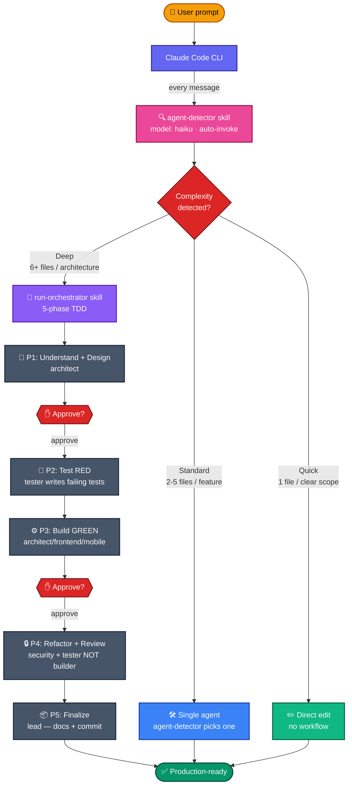

**The flow, explained:**
1. **Every message** you send goes through the `agent-detector` skill (runs on haiku for cost) — it classifies complexity + picks the right agent + suggests the right model.
2. **Quick tasks** (typo, one-line fix) → direct edit, no workflow overhead.
3. **Standard tasks** (one feature, clear scope) → single specialized agent runs inline.
4. **Deep tasks** (feature + multi-file + TDD) → `run-orchestrator` spawns the 5-phase workflow with two human approval gates.
5. Between phases, you either **approve**, **reject**, or **modify** — no commit happens until Phase 5 and you say so.

---

## 🐸 The 8 Pillars of the Planning-First LLM OS

v3.7.0 introduced **eight features** that compose into one cohesive OS; v3.7.2 + v3.7.3 polished their entry points + storage layout (notably Pillar 1). Each pillar solves a real failure mode of shipping with an AI agent. Status legend: ✅ shipped · 🚧 queued for v3.8+.

| # | Pillar | One-liner | Status |
|---|---|---|---|
| 1 | **Hierarchical Planning** | Plans survive session reset · `/compact` · machine restart. v3.7.3: uniform folder-per-node layout under `.claude/plans/` · run↔feature linking | ✅ |
| 2 | **Reasoning Trace Audit** | Every Claude decision is forensically recorded with grounded evidence | ✅ |
| 3 | **Semantic Session Reset** | Finished an Epic? Distill it into permanent memory, then reset cleanly | ✅ |
| 4 | **Pre-flight Validation** | Bash linters block bad AI output before it hits disk | ✅ Tier 1 · 🚧 Tier 2 OPA |
| 5 | **Semantic Conflict Detection** | L1-L4 layered detection prevents silent overwrites between parallel tasks | ✅ L1+L2 · 🚧 L3+L4 LLM |
| 6 | **Self-Healing Orchestrator** | Auto-diagnose F2/F3 failures, propose patches — never auto-apply | ✅ manual · 🚧 auto-trigger |
| 7 | **MCP Security Layer** | Per-agent allowlist, audit log, rate limits — defense for external integrations | ✅ |
| 8 | **Phase-Role Binding** | Phase 4 reviewer MUST differ from Phase 3 builder (Generator ≠ Evaluator) | ✅ |

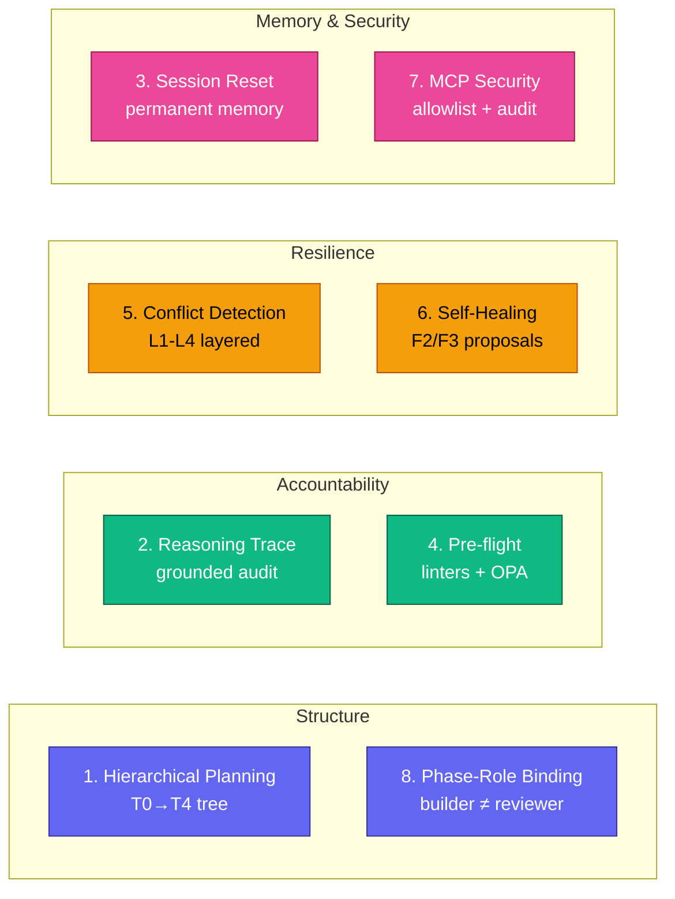

---

### 1 · Hierarchical Planning  ✅

**What you get:** A plan tree (Mission → Initiative → Feature → Story → Task) that persists to `.claude/plans/` and survives session resets, `/compact`, and machine restarts. Pick up exactly where you stopped — three weeks later.

**v3.7.3+ uniform folder-per-node layout** — every node lives in `{ID}_{kebab-slug}/` with its spec file + co-located aux:

```
.claude/plans/                           # next to .claude/logs/runs/
├── INDEX.md                             # auto-emitted readme of the tree
├── mission/mission.md                   # T0
├── initiatives/INIT-001_q1-rollout/initiative.md
├── features/JIRA-1234_oauth-flow/       # T2 (ticket-ID prefix when attached)
│   ├── feature.md                       # spec + ## Runs table
│   ├── REQUIREMENTS.md · DESIGN.md      # /run Phase 1 deliverables
│   ├── checkpoints/{ISO}.json
│   └── stories/STORY-0001_login-form/
│       ├── story.md
│       └── tasks/TASK-00001_password-input/
│           ├── task.md
│           ├── trace.jsonl              # per-task forensic log
│           └── checkpoints/
└── archive/FEAT-X_kebab-slug/{summary.md, original/}
```

**One command, 11 verbs** (since v3.7.2):

```bash
/aura-frog:plan                          # Interview-bootstrap T0 → T1 → T2
/aura-frog:plan expand FEAT-7            # Decompose one tier down
/aura-frog:plan next                     # Claim next ready Task
/aura-frog:plan status                   # ASCII tree
/aura-frog:plan {replan,promote,archive,undo,freeze,thaw,conflicts} <args>
```

Bare-word activation when a plan is active: just type `next`, `expand FEAT-A`, etc. Legacy `/aura-frog:plan-<verb>` aliases still work (soft-deprecated v3.7.2 → warning v4.0 → removed v5.0).

**Run ↔ feature linking** (v3.7.3): `/run feature: FEAT-A <task>` anchors a run to a feature; `/run resume FEAT-A` lists runs and prompts to pick. Bidirectional: `run-state.json` carries `feature_id`, the feature's `## Runs` table records every run that touched it. Resume / rework / continue across sessions becomes trivial.

**`/run` escalation** (v3.7.2): Multi-feature tasks (weight ≥ 3 on the bridge heuristic) prompt 3 options — `plan` (bootstrap with mission seed) / `deep` (normal 5-phase) / `details` (show signals). Force with `/run task: …` or `/run project: …`; opt out via `AF_ESCALATION_DISABLED=true`.

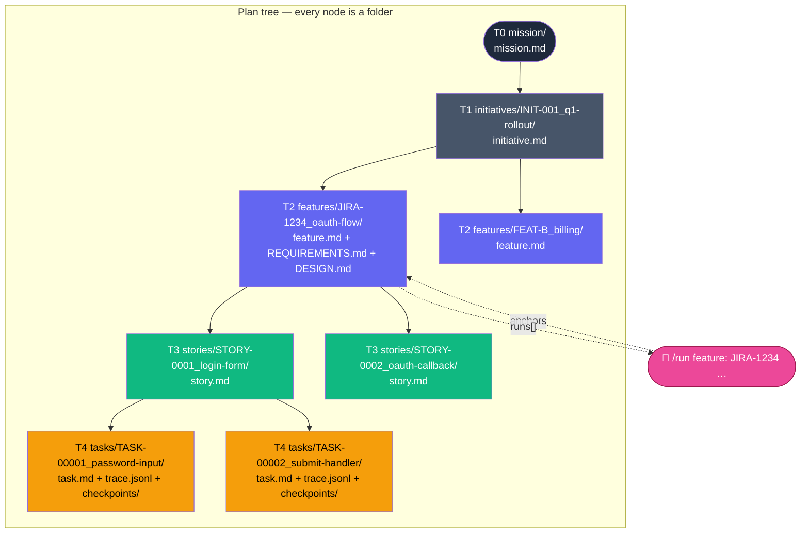

**Why it matters:** Long-running projects no longer lose decisions to context compaction. Team handoffs become trivial — read `mission/mission.md` + `active.json` + the feature folder and you're caught up. The folder-per-node layout keeps everything about a feature (spec, deliverables, traces, checkpoints, runs that touched it) in one place. Multi-week features get explicit decomposition with provenance — every `/run` against a feature shows up in its `## Runs` table.

---

#### How hierarchical planning actually works

The TL;DR is "a folder per node, with metadata and references that the model loads on demand." Here is the full breakdown — read this if you want to understand the **components**, **mechanisms**, and **memory layers** behind the pillar.

> **Full runtime deep-dive** (every agent invocation, every memory tier, every failure path, from `/aura-frog:plan` through T4 task completion): [`docs/architecture/HIERARCHICAL_PLANNING.md`](docs/architecture/HIERARCHICAL_PLANNING.md). Required reading before proposing changes to planning agents, the bare-word router, or the failure classifier.

##### Tier semantics

Five tiers from intent down to executable atom. Each tier has one specialist agent that owns its decomposition.

| Tier | Purpose | ID | Folder | Spec file | Decomposed by |
|---|---|---|---|---|---|
| **T0** Mission | Why the project exists. One per repo. | `MISSION` | `mission/` | `mission.md` | `strategist` (one-shot during bootstrap) |
| **T1** Initiative *(optional)* | Multi-feature theme — quarter / OKR / milestone. Skip on solo projects. | `INIT-NNN` | `initiatives/{ID}_{slug}/` | `initiative.md` | `master-planner` + `strategist` |
| **T2** Feature | User-facing capability. Anchor for `/run`. | `FEAT-N` or `JIRA-1234` | `features/{ID}_{slug}/` (top-level) or `features/<parent>/subfeatures/{ID}_{slug}/` (nested, v3.7.3+) | `feature.md` | `feature-architect` |
| **T3** Story | TDD-bounded unit. Fits one Phase 1 design. | `STORY-NNNN` | `<feature-folder>/stories/{ID}_{slug}/` — lives wherever the parent feature lives, including under `subfeatures/` | `story.md` | `story-planner` |
| **T4** Task | Single agent invocation. Atomic. | `TASK-NNNNN` | `<story-folder>/tasks/{ID}_{slug}/` — same nesting rule | `task.md` | `story-planner` (alongside T3) |

Subfeatures (T2 recursion) ship in v3.7.3+: a feature can decompose into child features rather than stories when one Phase 1 design isn't enough. The child sits inside the parent's `subfeatures/` folder with `parent: <PARENT_FEAT_ID>` in its frontmatter. **Subfeatures own their own stories** — a `features/FEAT-001/subfeatures/FEAT-B/stories/STORY-0001/` path is canonical, not a special case. The `child_path:` line printed by `/aura-frog:plan expand` resolves the concrete folder for whichever agent is doing the decomposition.

##### Components inventory

```toon
components[29]{kind,name,role}:
  agents,master-planner,"Stateful kernel — owns plan tree, dispatches replan decisions, audits every mutation to history.jsonl. Never executes code."
  agents,strategist,"T0/T1 framing — challenges intent, sizes initiatives, surfaces ROI tradeoffs. Read-only on code."
  agents,feature-architect,"T2 → T3 decomposition. Splits one feature into 2-6 stories with acceptance criteria + dependency hints."
  agents,story-planner,"T3 → T4 decomposition. Splits a story into 1-6 atomic tasks. Stubs the acceptance test skeleton so each task has a real test_ref path."
  agents,replanner,"F2-F4 mutation proposals — re-decompose / promote / discard. Budget-aware (per-node replan_budget enforced)."
  agents,epic-summarizer,"On T2 done, distills the feature's stories + tasks + traces into permanent_memory.md. Confidence-scored. Writes ONLY to .claude/memory/."
  agents,conflict-arbiter,"L1-L4 conflict adjudication — freeze / sequential / replan / escalate per spec §21.5."
  skills,plan-orchestrator,"Single dispatcher for the 11-verb /aura-frog:plan vocabulary. Routes user intent → backing script via verb_table + intent classifier."
  skills,plan-loader,"Auto-invokes every turn when .claude/plans/ exists. Loads mission + active branch + ancestors — stays under 800 tokens regardless of tree size."
  skills,plan-validator,"Schema gate — frontmatter shape, tier coherence, children/parent symmetry. Run before mutations."
  skills,plan-archivist,"Compresses completed T2 branches into archive/{ID}_{slug}/summary.md. Removes original (preserved in checkpoints)."
  skills,reasoning-trace-recorder,"Auto-invokes during active T4 execution. Appends tool_call / file_read / output_claim events to the task's trace.jsonl."
  skills,permanent-memory-loader,"Auto-invokes every turn when .claude/memory/permanent_memory.md exists. Loads section headers + 1-line summaries (≤120 tokens)."
  skills,conflict-detector,"L1 file overlap + L2 function/region overlap (bash, free). L3 semantic + L4 architectural (LLM, queued for v3.8)."
  skills,self-healing-orchestrator,"On F2/F3 failure, proposes patches. PROPOSES; user APPLIES — same gate as manual replan. Confidence ≥ 0.7 required to surface."
  scripts,new-plan.sh,"Bootstraps the tree. Writes INDEX.md + active.json + .counters.json + mission/. Resolves AF_PLANS_DIR / .claude/plans / .aura/plans legacy."
  scripts,expand-node.sh,"Tier-aware decomposition prep. Picks the right specialist agent based on parent tier."
  scripts,next-task.sh,"DAG-aware ready-task pop. Marks chosen task active in active.json + ready_queue."
  scripts,resolve-node.sh,"ID / title-substring / --active-token resolver. Recursive find — works on top-level + nested subfeatures."
  scripts,freeze-branch.sh + thaw-branch.sh,"Cascade-freeze descendants when a conflict requires it. Thaw with conflict-resolution gate."
  scripts,link-run.sh,"Two-sided run↔feature linker. Writes run-state.json#feature_id + the feature's ## Runs row. Idempotent."
  scripts,replan-node.sh + promote-node.sh + undo-decision.sh + archive-feature.sh + conflicts-scan.sh,"The other 5 backing scripts that the 11 verbs dispatch to."
  hooks,session-start-restore-active.cjs,"On every SessionStart, reads active.json + emits a banner so the model picks up where it left off. Survives /compact."
  hooks,pre-execute-load-plan-context.cjs,"Before any agent dispatch, ensures the active-branch context is loaded if .claude/plans/ exists."
  hooks,post-execute-update-node.cjs,"After a tool call mutates a node file, advances status + appends history.jsonl."
  hooks,tool-call-tracer.cjs,"During T4 execution, emits trace events to the task's trace.jsonl."
  hooks,pre-dispatch-conflict-check.cjs + post-execute-conflict-rescan.cjs,"L1+L2 gate around every dispatch and a 60s post-execute rescan window."
  hooks,feature-done-trigger-archive.cjs,"When a T2 transitions to done, triggers epic-summarizer + plan-archivist."
  hooks,session-reset-trigger.cjs,"Detects when a /aura-frog:reset-session is appropriate (1+ T2 done + ≥80% context used)."
```

##### Memory model — five layers, each with its own lifetime

The system has more memory than a flat "save to disk" — it's tiered by what survives what, and by how much it costs to keep loaded.

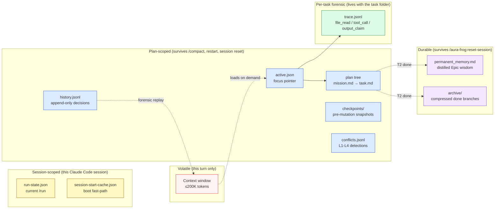

| Layer | File(s) | Lifetime | Read by | Written by |
|---|---|---|---|---|
| **Context window** | (in-process) | Single turn | Every agent | Anthropic API |
| **Session cache** | `.claude/cache/session-start-cache.json` | Until next session-start | `session-start.cjs` fast-path | `session-start.cjs` (TTL 1h) |
| **Run state** | `.claude/logs/runs/<run-id>/run-state.json` | Until the `/run` completes / is discarded | `/run status`, `/run resume`, statusline | `run-orchestrator`, `link-run.sh` |
| **Active pointer** | `.claude/plans/active.json` | Until manually changed | `plan-loader` (every turn) | `master-planner`, `next-task.sh`, `link-run.sh` |
| **Plan tree** | `.claude/plans/**/*.md` | Until archived or deleted | `plan-loader`, `resolve-node.sh` | The 6 planning agents + their scripts |
| **Decision audit** | `.claude/plans/history.jsonl` | Append-only forever | `/aura-frog:plan undo`, forensic replay | Every plan-script mutation |
| **Checkpoints** | `.claude/plans/<node>/checkpoints/{ISO}.json` | Until pruned | `undo-decision.sh` | Pre-mutation snapshot in every script |
| **Conflict log** | `.claude/plans/conflicts.jsonl` | Append-only | `/aura-frog:plan conflicts`, `conflict-arbiter` | `pre-dispatch-conflict-check`, `post-execute-conflict-rescan` |
| **Task trace** | `<task-folder>/trace.jsonl` | Until task archived | `/aura-frog:trace`, grounding-discipline rule | `reasoning-trace-recorder` + `tool-call-tracer.cjs` |
| **Permanent memory** | `.claude/memory/permanent_memory.md` | Survives `/aura-frog:reset-session` | `permanent-memory-loader` (every turn) | `epic-summarizer` (on T2 done) |
| **Archive** | `.claude/plans/archive/{ID}_{slug}/` | Forever (compressed) | `/aura-frog:plan status --archived` | `plan-archivist` (on T2 done) |

**Token discipline.** The two auto-loaded layers (`plan-loader`, `permanent-memory-loader`) are budget-capped: plan-loader stays ≤ 800 tokens regardless of tree size by reading only the active branch, and permanent-memory-loader stays ≤ 120 tokens by reading only section headers + 1-line summaries. Everything else loads on demand — `expand FEAT-A` reads only that subtree.

##### Lifecycle — from "no plan" to "shipped feature"

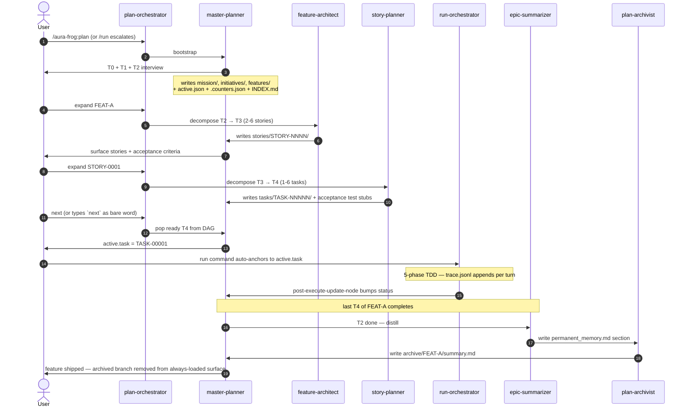

##### Decomposition discipline — the agent-by-agent contract

- **strategist** owns T0/T1 framing. Read-only on code. Asks "is this initiative actually worth the surface area we'd add?" Writes nothing on its own — surfaces tradeoffs for the user to commit.
- **feature-architect** owns T2 → T3. Reads existing code (with Glob/Grep, no MCP DB calls) to inform decomposition. Hard caps: 2-6 stories per feature, intent ≤ 120 chars per story, 2-5 acceptance criteria each. More than 6 stories means the feature is too big — escalates to promote or split.
- **story-planner** owns T3 → T4. Reads code + may stub `__tests__/<story-id>/*.test.cjs` with `it.skip()` so each task's `test_ref` points to a real path. 1-6 tasks per story. Each task names exactly one agent for execution.
- **replanner** owns mutations. Triggered on F2-F4 failures (per `failure-classifier`). Budget-aware: each node carries `replan_count` + a `replan_budget` (default 3 per node, 8 per feature). Exceeded → escalate to user, no autonomous loop.
- **conflict-arbiter** owns L1-L4 conflict adjudication. When `pre-dispatch-conflict-check.cjs` flags an overlap, the arbiter picks one of four resolutions: `freeze` (block descendants), `sequential` (reorder), `replan` (re-decompose conflicting branch), `escalate` (ask user). Decision logged to `conflicts.jsonl`.
- **epic-summarizer** owns the distillation pass. Confidence-scored: items below 0.7 confidence land in a `### Tentative (low confidence)` subsection of `permanent_memory.md`. Never copies verbatim file content — uses `sha256:abc…` references instead.

##### The 11 verbs — what each one does

```toon
verbs[11]{verb,what_happens,mutates_active}:
  bootstrap,"(no verb) T0+T1+T2 interview — strategist surfaces mission, master-planner mints IDs, writes INDEX.md",true
  expand,"<NODE> — dispatches to the right tier-specialist (feature-architect for T2, story-planner for T3). Pre-mutation checkpoint.",false
  next,"Pops the next ready T4 from the DAG (no unresolved depends_on). Marks active.task in active.json.",true
  status,"Renders the tree as ASCII. Highlights active branch + frozen nodes + ready queue.",false
  replan,"<NODE> — re-decompose. Discards descendants, re-runs the tier specialist. Counts against replan_budget.",false
  promote,"<TASK> → T1/T2 — when a T4 discovery (e.g. a missing service) warrants its own feature. Bubbles up.",false
  archive,"<FEATURE> — triggers epic-summarizer + plan-archivist. Moves the subtree to archive/, drops always-loaded cost.",false
  undo,"<NODE> — LIFO restore from the latest checkpoint. Useful for 'I did not mean to replan that.'",true
  freeze,"<NODE> — sets status=frozen on the node + cascades to descendants. Blocks dispatch.",false
  thaw,"<NODE> — reverses freeze. Runs the conflict-resolution gate (won't thaw if the original cause still triggers).",false
  conflicts,"list/show/resolve/history — view detected conflicts and their L1-L4 type, drive arbiter decisions.",false
```

Three input modes, same vocabulary:

1. **Explicit verb form** — `/aura-frog:plan expand FEAT-A`.
2. **Bare-word activation** — type `expand FEAT-A` (no slash) when `.claude/plans/active.json` exists. Hook `bare-word-router.cjs` catches the first token, asks for confirmation, routes via plan-orchestrator.
3. **Intent classifier** — descriptive natural-language ("show me the tree", "what's next?") — plan-orchestrator pattern-matches to the right verb.

##### `/run` ↔ plan bridge — how they share state

Two pieces of state link the two systems:

- **`active.json#active.task`** — when set, every `/run` invocation auto-anchors to that task. Phase 5 finalize syncs deliverables back into the task's folder.
- **`feature.md### Runs` table** — every `/run feature: FEAT-A …` writes a row here via `link-run.sh`. Surfaces in `/run resume FEAT-A` and in the feature's status line.

The **escalation heuristic** in `rules/workflow/run-plan-bridge.md` scores every `/run <task>` on 8 signals (word count, scope verbs, file count, multi-domain keywords, …). At weight ≥ 3 without an active plan, it prompts `plan` / `deep` / `details`. Tasks fail this test for a reason — they're project-scoped, not single-feature.

##### What survives what (the resilience matrix)

|  | `/compact` | Session restart | `/aura-frog:reset-session` | `git clean` |
|---|:---:|:---:|:---:|:---:|
| Context window | ❌ | ❌ | ❌ | ❌ |
| `run-state.json` | ✅ | ✅ | ✅ | ❌ (in `.claude/logs/`) |
| `active.json` + plan tree | ✅ | ✅ | ✅ | ❌ (committed if you commit it) |
| `history.jsonl` | ✅ | ✅ | ✅ | ❌ |
| `trace.jsonl` (per task) | ✅ | ✅ | ✅ | ❌ |
| `permanent_memory.md` | ✅ | ✅ | ✅ (this is what it's for) | ❌ |
| `archive/*` | ✅ | ✅ | ✅ | ❌ |

Plan files live under `.claude/plans/` — commit them to keep the project's planning context in version control alongside the code.

---

### 2 · Reasoning Trace Audit  ✅

**What you get:** Every Claude tool call writes an append-only event to the task's `trace.jsonl` (v3.7.3: co-located inside `.claude/plans/features/.../tasks/{TASK_ID}_{slug}/trace.jsonl`; legacy fallback to `.claude/plans/traces/{TASK_ID}.jsonl`) — `tool_call`, `file_read` (with sha256), `tool_result`. The `grounding-discipline` rule rejects any factual claim that isn't backed by a prior `file_read` event. Hallucinations get *caught*, not shipped.

```bash
/aura-frog:trace                              # Full trace for active task
/aura-frog:trace --hallucinations             # Only ungrounded claims
/aura-frog:trace --filter file_read           # Filter by event type
/aura-frog:trace --tail 20                    # Last 20 events
AF_TRACE_DISABLED=true                        # Opt out per session
```

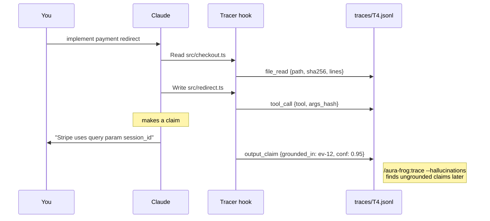

**Why it matters:** AI-generated code reviews used to trust the AI. Now every factual statement has a sha256-anchored evidence trail. Debugging "why did Claude do that?" three months later becomes a single `/aura-frog:trace` call.

---

### 3 · Semantic Session Reset  ✅

**What you get:** When a Feature (T2) reaches `done`, the `epic-summarizer` agent distills the most valuable findings — architectural decisions, gotchas, anti-patterns — into `.claude/memory/permanent_memory.md`. Then Master Planner offers you a clean session restart: working context wipes, permanent memory anchors.

```bash
/aura-frog:reset-session                      # Distill + prompt to reset
/aura-frog:reset-session --feature FEAT-007   # Distill specific feature
/aura-frog:reset-session --dry-run            # Preview what gets written
/aura-frog:reset-session --no-prompt          # CI-friendly
```

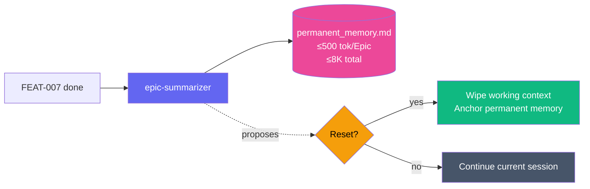

**Why it matters:** 3-month projects accumulate decision drift; long sessions exceed any context window. Distillation captures *what mattered* (decisions, gotchas) and discards *what was noise* (tool output verbatim, transcripts). Quarterly retrospectives reduce to reading 8K tokens of permanent memory.

---

### 4 · Pre-flight Validation  ✅ Tier 1 · 🚧 Tier 2

**What you get:** Bash linters run on every tool call: command allowlist, path safety, secret-pattern detection, frontmatter validation. Bad AI output never hits disk. Tier 1 is zero-dependency bash; Tier 2 adds optional OPA Rego policies (queued for v3.8+).

```bash
/aura-frog:preflight check                              # Manual run
/aura-frog:preflight policies                           # List active rules
/aura-frog:preflight bypass <reason ≥ 10 chars>         # Per-call escape
AF_PREFLIGHT_DISABLED=true                              # Per-session disable
```

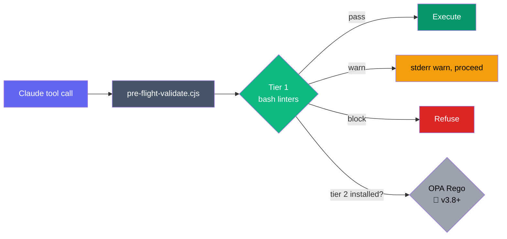

**Why it matters:** AI-coded `rm -rf $HOME` is real. Path-traversal in generated configs is real. Hardcoded credentials in generated code are real. Pre-flight catches them before the tool fires — no rollback needed because the damage never happened.

---

### 5 · Semantic Conflict Detection  ✅ L1+L2 · 🚧 L3+L4

**What you get:** Before dispatching any task, `conflict-detector` checks scope overlap against active and pending-confirm sibling tasks. L1 (file-set intersection) + L2 (function/region overlap) ship as deterministic bash — sub-300ms. L3 (LLM intent comparison) + L4 (LLM-vs-permanent-memory architectural check) are queued for v3.8+. Conflicting branches **freeze**, descendants cascade, siblings stay free to work.

```bash
/aura-frog:plan conflicts check          # Manually re-scan
/aura-frog:plan conflicts list           # Active conflicts
/aura-frog:plan conflicts resolve <id>   # User-pick resolution
/aura-frog:plan-freeze FEAT-007 "reason" # Manual freeze
/aura-frog:plan-thaw FEAT-007            # Reverse
AF_CONFLICT_LLM_DISABLED=true            # Skip L3/L4 (no-op until v3.8+)
```

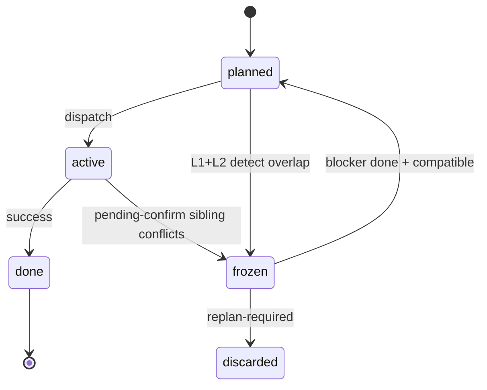

**Why it matters:** Parallel agents on the same codebase used to clobber each other's work silently. Now overlap is detected *before* dispatch; the blocked task freezes; when the blocker finishes, conflict-detector re-checks against *actual* changes (not just planned scope) before auto-thawing.

---

### 6 · Self-Healing Orchestrator  ✅ manual · 🚧 auto-trigger

**What you get:** When a Task fails with class F2 (local logic) or F3 (local design), `/aura-frog:heal diagnose` parses the error, queries `context7` MCP for known patterns, cross-references `permanent_memory.md` for past gotchas, and proposes a patch with confidence ≥ 0.7 — **never auto-applies**. Sources are limited to official docs + your project's own memory; never random blogs. Auto-trigger on F2/F3 classification queued for v3.8+.

```bash
/aura-frog:heal diagnose <task-id>       # Manual diagnosis
/aura-frog:heal status                   # Recent attempts + outcomes
/aura-frog:heal disable                  # Per-session
AF_SELF_HEAL_DISABLED=true               # Permanent
```

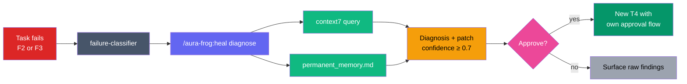

**Why it matters:** "Cannot read property of undefined at line 42" used to send you to Stack Overflow for 20 minutes. Now you get a diagnosis citing the official Stripe docs *and* DEC-007 from your own past Epic — with the exact one-line patch ready to apply on your approval.

---

### 7 · MCP Security Layer  ✅

**What you get:** Per-agent MCP allowlist via frontmatter (`mcp_servers: [context7, postgres]`). Every MCP call audited to `.aura/security/mcp-audit.jsonl` with secrets sanitized. Per-server rate limits in `plugin.json` (soft warn at 80%, hard block at 100%). Two new opt-in MCPs: `postgres` and `redis`, both `disabled: true` by default, destructive operations (`DROP TABLE`, `FLUSHDB`) blocked unconditionally.

```bash
/aura-frog:mcp status                # Per-agent allowlists + current state
/aura-frog:mcp audit                 # Recent calls + blocked attempts
/aura-frog:mcp audit --week          # 7-day window
/aura-frog:mcp reset-limits          # Manual rate-limit reset
AF_MCP_AUDIT_DISABLED=true           # Disable audit log (enforcement still on)
```

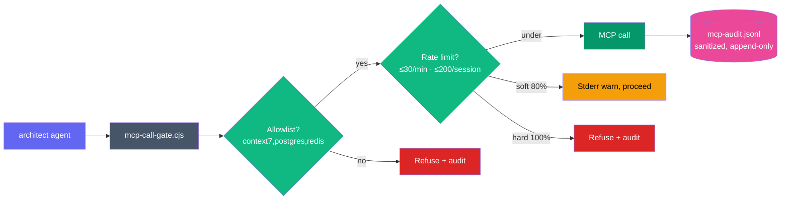

**Why it matters:** Before v3.7.0, every agent could hit every MCP. A frontend agent could query your production Postgres. Now the architect gets DB access; the frontend gets Figma + Playwright; the security agent gets nothing because it's read-only on code. Audit log gives compliance + forensics — "why did the agent query the DB 1000 times?" gets a JSONL answer.

---

### 8 · Phase-Role Binding  ✅

**What you get:** The 5-phase TDD workflow now hard-enforces **Phase 4 reviewer ≠ Phase 3 builder**. Same agent reviewing its own code drifts toward "LGTM"; different agents provide fresh perspective. Aura Frog's Phase 4 dispatches `security` + `tester` (never the Phase 3 builder), formalizing Anthropic's Generator/Evaluator separation insight.

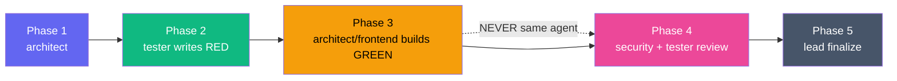

**Why it matters:** Self-reviewed code has blind spots — confirmation bias is real, even in agents. PR reviews exist for the same reason in human teams. Generator ≠ Evaluator is non-negotiable in Phase 4; it's what makes the workflow produce shippable code, not just code that *passes its own tests*.

---

### Status snapshot — what ships now vs queued

| Pillar | Ships now (v3.7.0 + v3.7.2/v3.7.3 polish) | Queued for v3.8+ |
|---|---|---|
| 1 — Planning | T0-T4 tree at `.claude/plans/`, **uniform folder-per-node layout** (v3.7.3), **consolidated `/aura-frog:plan <verb>`** (v3.7.2), 12 backing scripts, 5 agents, bare-word router, `link-run.sh` for run↔feature bidirectional linking | — |
| 2 — Reasoning Trace | tracer hook (writes per-task `trace.jsonl` inside the task folder, v3.7.3), grounding-discipline, `/trace` queries | helper CLI scripts (deferred per [issue #6](https://github.com/nguyenthienthanh/aura-frog/issues/6)) |
| 3 — Session Reset | epic-summarizer, permanent-memory-loader (`.claude/memory/`), `/reset-session` | — |
| 4 — Pre-flight | 7 Tier-1 bash linters, hook, bypass with 3-warn | Tier 2 OPA + 5 `.rego` policies |
| 5 — Conflict Detection | L1 (file) + L2 (function) + freeze cascade + arbitration | L3 (semantic LLM) + L4 (architectural LLM) |
| 6 — Self-Healing | manual `/heal diagnose`, ≥0.7 confidence, never auto-apply | auto-trigger hook on F2/F3 classification |
| 7 — MCP Security | per-agent allowlist + audit + rate limits + sanitizer | SQLite WAL for audit ([issue #8](https://github.com/nguyenthienthanh/aura-frog/issues/8)) |
| 8 — Phase-Role | hard rule in `cross-review-workflow.md` + run-orchestrator | — |
| Routing — `/run` | **3-option escalation** (`plan`/`deep`/`details`) on weight ≥ 3, **`task:` / `project:` override prefixes** (v3.7.2), **`feature: <ID>` prefix** + **`resume <FEATURE_ID>`** (v3.7.3) | — |

Disable any pillar individually via env var: `AF_SELF_HEAL_DISABLED`, `AF_MCP_AUDIT_DISABLED`, `AF_TRACE_DISABLED`, `AF_PREFLIGHT_DISABLED`, `AF_CONFLICT_LLM_DISABLED`, `AF_RUN_PLAN_BRIDGE_DISABLED`, `AF_TOKEN_TRACKER_DISABLED`, `AF_BARE_WORD_ROUTER_DISABLED`, `AF_ESCALATION_DISABLED`. Override the plans dir entirely with `AF_PLANS_DIR=<path>` (e.g. to keep using legacy `.aura/plans/`). All eight pillars + the v3.7.2/v3.7.3 routing additions are opt-in friendly.

---

## Works Across AI Coding Tools

Aura Frog's 71 rules, 56 skills, and 15 agents are **~87% portable** (weighted average) because they're markdown conventions, not tool-specific code. Only the thin hook layer needs adapters.

| Tool | Status | Coverage |
|------|--------|:--------:|
|  Fully tested | 100% |
|  Q2 2026 | ~85% |
|  Q2 2026 | ~80% |

**Why this matters:** When you invest in Aura Frog's TDD discipline, gotcha-only expert skills, and agent architecture, that investment survives tool switches. Only the thin adapter layer changes.

[Read the Portability Guide →](docs/PORTABILITY.md)

---

## Before & After

<table>
<tr><th width="450">❌ Without Aura Frog</th><th width="450">✅ With Aura Frog</th></tr>
<tr>
<td>

```
You: "Add user authentication"
Claude: *writes 500 lines of untested code*
You: "Wait, that's not what I—"
Claude: *rewrites everything from scratch*
```

</td>
<td>

```
You: "Add user authentication"

🐸 Phase 1: "JWT or OAuth2? Here are trade-offs.
   3 endpoints needed. Approve?"

You: "approve"

🐸 Phase 2-3: 5 tests → all GREEN.
🐸 Phase 4-5: Reviewed. Documented. Done.
```

</td>
</tr>
</table>

**Result:** Production-ready code with tests, security review, and documentation — from a single prompt.

---

## Installation

### Prerequisites

- **Claude Code CLI** installed → [install guide](https://docs.anthropic.com/en/docs/claude-code)
- **Node.js ≥ 18** (for hook scripts)
- **Git** (for phase checkpoint commits)

### Install in Claude Code (30 seconds)

```bash
# 1. Add the marketplace
/plugin marketplace add nguyenthienthanh/aura-frog

# 2. Install the plugin
/plugin install aura-frog@aurafrog

# 3. Verify
/af status
```

Expected output:

```
🐸 Aura Frog v3.7.3 — Ready
  Agents:   15 loaded (lead, architect, frontend, mobile, tester, security, devops, strategist, scanner,
                       master-planner, feature-architect, story-planner, replanner, epic-summarizer, conflict-arbiter)
  Skills:   56 available (9 auto-invoke, 47 on-demand)
  Rules:    71 loaded (22 core + 19 agent + 30 workflow)
  Hooks:    43 registered
  MCP:      context7, playwright, vitest, firebase, figma, slack, postgres (disabled), redis (disabled)
```

### Initialize Your Project (Recommended — one time)

```bash
/project init
```

Scans your codebase and creates 7 context files (framework, conventions, rules, examples, architecture, etc.) in `.claude/project-contexts/<name>/`. Takes 30–60 seconds; saves minutes on every future session.

### Optional Setup

<details>
<summary>Install <code>af</code> CLI for health checks outside Claude Code</summary>

```bash
# Inside Claude Code:
/af setup cli

# Or manually:
sudo ln -sf "$HOME/.claude/plugins/marketplaces/aurafrog/scripts/af" /usr/local/bin/af
```

Then use anywhere: `af doctor`, `af measure`, `af setup remote`.

</details>

<details>
<summary>MCP tokens (Figma, Slack, Firebase)</summary>

```bash
cp .envrc.template .envrc
# Edit .envrc — add FIGMA_API_TOKEN, SLACK_BOT_TOKEN, FIREBASE_TOKEN, etc.
direnv allow   # if using direnv
```

Without tokens, `figma` / `slack` / `firebase` MCP servers stay inactive. `context7`, `playwright`, `vitest` need no config.

</details>

<details>
<summary>Skills-only mode on other platforms</summary>

| Platform | Install | What works |
|----------|---------|------------|
| **Claude Code** | `/plugin marketplace add nguyenthienthanh/aura-frog` | Everything |
| **OpenAI Codex** | `cp -r aura-frog/skills/* ~/.codex/skills/` | Skills + commands |
| **Gemini CLI** | `cp -r aura-frog/skills/* ~/.gemini/skills/` | Skills + commands |
| **OpenCode** | `cp -r aura-frog/skills/* .opencode/skills/` | Skills + commands |

Hooks, agent detection, subagent spawning, and MCP servers are Claude Code exclusive.

</details>

### Start Your First Workflow

```bash
/run "Your task here"
```

See the [Walkthrough](#walkthrough-a-real-workflow-in-action) below for a complete transcript of what this looks like.

### Common Install Issues

| Symptom | Likely cause | Fix |
|---------|--------------|-----|
| `/plugin install` fails | Marketplace cache | Run `/plugin marketplace refresh` |
| Hooks not firing | `.claude/settings.json` missing hook config | `/af setup integrations` re-installs |
| `af: command not found` | PATH missing plugin scripts dir | Add `$HOME/.claude/plugins/marketplaces/aurafrog/scripts` to `$PATH` |
| State not saving during `/run` | Hook path drift (pre-v3.7) | Upgrade to 3.7+ (state path fixed) |
| Claude uses wrong agent | No `/project init` yet | Run `/project init` to load conventions |

Full guide: [GET_STARTED.md](docs/getting-started/GET_STARTED.md).

---

## Walkthrough: A Real Workflow in Action

A complete transcript of implementing JWT auth with `/run` — 18 minutes, 2 approvals, 94% coverage, 8 agents dispatched. Full sequence diagram + step-by-step + agent table in [docs/getting-started/WALKTHROUGH.md](docs/getting-started/WALKTHROUGH.md).

---

## Why Teams Ship Faster With Aura Frog

Smart flow selection · multi-agent orchestration · approval gates that don't block · context economy · TDD enforcement · JIRA integration. Full prose with examples and rationale in [docs/marketing/WHY_TEAMS_SHIP_FASTER.md](docs/marketing/WHY_TEAMS_SHIP_FASTER.md).

---

## Routing Strategies

Aura Frog picks one of three execution strategies per task — you never configure it manually.


| Strategy | Triggers | Model | Gates | Example |
|---|---|---|---|---|
| **Quick** | Single file, typo, one-line fix | haiku | 0 | "Fix typo in login.ts" |
| **Standard** | 2–5 files, one feature | sonnet | 0–1 | "Add email validation to signup form" |
| **Deep** | 6+ files, architecture, vague scope | sonnet (opus for design) | 2 (P1 + P3) | "Design and implement user subscription system" |

**Why three tiers instead of always-TDD?** Forcing Deep on every task burns tokens (~3× vs subagent mode) and slows iteration. Forcing Quick on complex work skips tests and breaks production. The three-tier model matches effort to risk.

**Team Mode** (subset of Deep): if the task spans 2+ domains AND `CLAUDE_CODE_EXPERIMENTAL_AGENT_TEAMS=1`, multiple agents work in parallel and cross-review each other. See [AGENT_TEAMS_GUIDE](docs/guides/AGENT_TEAMS_GUIDE.md).

Details: `rules/core/execution-rules.md`, `skills/agent-detector/SKILL.md`, `skills/run-orchestrator/SKILL.md`.

---

## The Numbers

| Component | Count | Why it matters |
|-----------|:-----:|----------------|
| **Agents** | 15 | Right expert auto-selected per task (build + review + planning + safety roles) |
| **Skills** | 56 | 9 auto-invoke on context, 47 on-demand (incl. v3.7.2 `plan-orchestrator`) |
| **Commands** | 24 | Core: `/run`, `/check`, `/design`, `/project`, `/af`, `/help` + `/aura-frog:*` hierarchical-planning suite (14 user-facing + 10 legacy `/aura-frog:plan-<verb>` alias stubs) |
| **Rules** | 71 | 3-tier loading (22 core + 19 agent + 30 workflow) — only what's needed |
| **Hooks** | 43 | Conditional — skip processing for non-code files (v3.7.2 adds `bare-word-router.cjs`) |
| **Backing scripts** | 12 | Hierarchical-planning operations (v3.7.2): `new-plan`, `validate-plan-tree`, `render-plan-tree` + 9 new (`expand`, `next`, `freeze`, `thaw`, `archive`, `conflicts`, `replan`, `promote`, `undo`) + `resolve-node` + `_lib` |
| **MCP Servers** | 8 | 6 enabled by default; postgres + redis opt-in |
| **Tests** | 317 | Coverage gate at 25% statements floor; +102 tests in v3.7.2 (38 plan scripts + 64 bare-word router) |

Full workflow target: **≤30K tokens** across all 5 phases.

---

## Command Reference

Six core commands cover every everyday workflow — they auto-detect intent and dispatch the right skills/agents. The `/aura-frog:*` namespace (plan, trace, heal, mcp, dashboard, preflight, reset-session) layers on for hierarchical planning and safety operations.

### `/aura-frog:plan <verb> [args]` — Hierarchical planning (v3.7.2 consolidated form)

One command, 11 verbs. The `plan-orchestrator` skill routes via a 3-stage pipeline (explicit verb → intent keywords → LLM fallback). Bare-word activation works when `.claude/plans/active.json` exists.

```bash
/aura-frog:plan                          # Interview-bootstrap T0→T1→T2 (no args)
/aura-frog:plan expand FEAT-7            # Decompose one tier down
/aura-frog:plan next                     # Claim next ready T4; /run auto-anchors
/aura-frog:plan status                   # ASCII tree
/aura-frog:plan replan STORY-42          # Budget-aware replan + discard descendants
/aura-frog:plan promote "note"           # Bubble T4 discovery up to T2/T1
/aura-frog:plan freeze TASK-101          # Cascade-freeze descendants
/aura-frog:plan thaw TASK-101            # Reverse freeze + compatibility check
/aura-frog:plan archive FEAT-5           # Compress completed T2 to summary
/aura-frog:plan conflicts list --open    # L1+L2 conflict log
/aura-frog:plan undo                     # LIFO checkpoint restore
```

**Legacy `/aura-frog:plan-<verb>` forms** (e.g., `/aura-frog:plan-expand FEAT-7`) still work via 20-line alias stubs. Soft-deprecated v3.7.2 → warning v4.0 → removed v5.0.

**Bare-word activation:** with a plan active, prompts ≤5 words starting with a plan verb route automatically: just type `next`, `expand FEAT-A`, `freeze TASK-1`. Opt-out: `AF_BARE_WORD_ROUTER_DISABLED=true`.


### `/run <task>` — The main entry point

Auto-detects what kind of work you want (feature / bugfix / refactor / test) and picks the right workflow. v3.7.2 adds intelligent escalation for project-scope tasks; v3.7.3 adds feature-anchored runs.

| What you say | Intent detected | Flow |
|---|---|---|
| `/run implement user profile` | Feature | 5-phase TDD workflow |
| `/run fix login not working` | Bugfix | `bugfix-quick` skill — investigate → test → fix → verify |
| `/run refactor auth service` | Refactor | `refactor-expert` skill — analyze → plan → test → refactor |
| `/run add tests for payment` | Test | `test-writer` skill — detect framework → write tests → coverage |
| `/run fasttrack: <specs>` | Fast-Track | Skip Phase 1, auto-execute P2–P5 (specs must include Requirements + Design + API + Data Model + Acceptance Criteria) |
| `/run resume <id>` | Resume (run-id) | Load state from `.claude/logs/runs/<id>/` |
| `/run resume FEAT-A` | Resume (feature) | v3.7.3+ — list runs under FEAT-A's `## Runs` table, prompt to pick (auto-resume if single in-progress) |
| `/run status` | Status | Current phase + progress |
| `/run handoff` | Handoff | Save state for cross-session continuation |
| `/run rebuild auth + OAuth + 2FA` | Project (v3.7.2+) | Escalation prompt — `plan` bootstraps `/aura-frog:plan`, `deep` proceeds inline, `details` shows signals |
| `/run task: <desc>` | Override (v3.7.2+) | Force task mode; skip escalation entirely |
| `/run project: <desc>` | Override (v3.7.2+) | Force project mode; write `pending-plan-bootstrap.json` + invoke `/aura-frog:plan` |
| `/run feature: FEAT-A <desc>` | Anchor (v3.7.3+) | Anchor a new run to a feature; writes `run-state.json#feature_id` + appends to the feature's `## Runs` table |

### `/check` — Health + quality checks

```bash
/check            # all checks (security + perf + complexity + debt + coverage + deps)
/check security   # SAST only
/check perf       # performance bottlenecks
/check coverage   # test coverage report
/check deps       # outdated/vulnerable dependencies
```

### `/design` — Design artifacts

```bash
/design api       # REST/GraphQL API spec (calls api-designer skill)
/design db        # Database schema design
/design doc       # ADR or runbook (calls documentation skill)
```

### `/project` — Project lifecycle

```bash
/project init     # First-time setup — generates 7 context files
/project status   # Current context + active workflow
/project refresh  # Re-scan codebase, update conventions
/project regen    # Regenerate context files from scratch
/project env      # Validate .envrc / MCP tokens
/project sync     # Sync status line + refresh cache
```

### `/af` — Plugin management + learning

```bash
/af status        # Plugin health check
/af agents        # List loaded agents with their tools + model
/af metrics       # Workflow velocity + token efficiency
/af learn status  # Learning system state (Supabase or local)
/af learn analyze # Extract patterns from past workflows
/af learn apply   # Apply learned rules to future sessions
/af setup cli     # Install af CLI system-wide
/af prompts       # Analyze prompt quality + suggest improvements
```

### `/help` — Contextual help

```bash
/help             # Plugin overview
/help <command>   # Detailed help for a specific command
/help agents      # Agent selection guide
/help hooks       # Hook lifecycle reference
```

Full command docs: [commands/README.md](aura-frog/commands/README.md).

---

## Agent Selection Examples

Real examples of what the `agent-detector` skill picks and why (Layer 0 task-content overrides repo type). Full scoring breakdown + 10 worked examples in [docs/getting-started/AGENT_SELECTION.md](docs/getting-started/AGENT_SELECTION.md).

---

## Token Budget

Real measurements from production workflows: typical token cost per strategy (Quick/Standard/Deep/Team), per-phase breakdown, target vs actual. Full table + 5-phase numbers in [docs/getting-started/TOKEN_BUDGET.md](docs/getting-started/TOKEN_BUDGET.md).

---
---

## Troubleshooting / FAQ

<details>
<summary><strong>Q: Workflow state isn't saving. `/run status` shows nothing.</strong></summary>

**Likely cause:** Path drift between hooks and skills (fixed in v3.7+).

**Check:**
```bash
ls -la .claude/logs/runs/         # Should exist after first /run
ls -la .claude/logs/workflows/    # Legacy path — may have old state
```

**Fix:**
- Upgrade to v3.7+ (`/plugin update aura-frog`)
- Or manually move: `mv .claude/logs/workflows/* .claude/logs/runs/`

Verify with `/af status` — should show 0 orphan paths.
</details>

<details>
<summary><strong>Q: Wrong agent picked for my task.</strong></summary>

**Likely cause:** Missing project context or ambiguous task description.

**Check:**
- Did you run `/project init` yet? Scanner uses those files for Layer 3 (project context).
- Is your task description short/vague? `agent-detector` defaults to repo type when signals are weak.

**Fix:**
- Run `/project init` if you haven't
- Rephrase task with domain-specific keywords: `"Add email template styling"` (frontend) vs `"Update email feature"` (ambiguous)
- Override manually: `/run @frontend implement X` forces the frontend agent

Full scoring logic: `skills/agent-detector/task-based-agent-selection.md`.
</details>

<details>
<summary><strong>Q: Token budget blown past 200K. What happened?</strong></summary>

**Likely cause:** Phase 3 (Build GREEN) hit an iteration loop on a complex refactor.

**Check:**
```bash
/run budget      # Shows per-phase consumption
/run metrics     # Shows if rejection count is high
```

**Fix:**
- `/run handoff` to save state → resume in fresh session
- For next time: use `/run predict <task>` first — flags Deep tasks likely to exceed budget
- Consider splitting: `/run part 1: <narrow scope>` → merge → `/run part 2`
</details>

<details>
<summary><strong>Q: Hooks not firing (no SessionStart banner, no lint-autofix).</strong></summary>

**Likely cause:** `.claude/settings.json` missing hook config, or plugin not activated in this project.

**Check:**
```bash
cat .claude/settings.json   # Should reference plugin hooks
/af status                  # Should show "Hooks: 28 registered"
```

**Fix:**
```bash
/af setup integrations      # Re-installs hook config
```

If still nothing, check plugin.json path:
```bash
ls ~/.claude/plugins/marketplaces/aurafrog/aura-frog/hooks/hooks.json
```
</details>

<details>
<summary><strong>Q: Opus session costs surprised me. Can I lock everything to Sonnet?</strong></summary>

**Yes — two ways:**

**Option 1 — Session override (temporary):**
```bash
# Start Claude Code with model flag
claude --model sonnet
```

**Option 2 — Env var (permanent, overrides ALL frontmatter):**
```bash
export CLAUDE_CODE_SUBAGENT_MODEL=sonnet
```

This overrides every agent/skill `model:` declaration. See [Per-Agent Model Override](#per-agent-model-override--how-it-works-and-why) for resolution order.

**Cost tip:** `scanner` and `agent-detector` stay on haiku regardless — you don't need to touch them.
</details>

<details>
<summary><strong>Q: Can I run multiple /run workflows in parallel?</strong></summary>

**Yes — use git worktrees:**
```bash
/run worktree: <task>    # Automatically creates isolated worktree + runs there
```

Each worktree has its own state in `.claude/logs/runs/<id>/`. See [Git Worktree skill](aura-frog/skills/git-worktree/SKILL.md).

For full multi-agent parallel work, enable Agent Teams:
```bash
export CLAUDE_CODE_EXPERIMENTAL_AGENT_TEAMS=1
```

See [Agent Teams Guide](docs/guides/AGENT_TEAMS_GUIDE.md).
</details>

<details>
<summary><strong>Q: How do I disable a hook that's slowing me down?</strong></summary>

Each hook has a disable env var:

```bash
AF_LINT_AUTOFIX=false        # Skip post-edit linter
AF_PROMPT_LOGGING=false      # Skip prompt metadata logging
AF_LEARNING_ENABLED=false    # Skip all learning hooks
```

Or disable at the source by editing `aura-frog/hooks/hooks.json` (comment out the matcher).

Full hook list: [hooks/README.md](aura-frog/hooks/README.md).
</details>

More issues: [TROUBLESHOOTING.md](docs/operations/TROUBLESHOOTING.md).

---

## Compared to Other Claude Code Plugins

Honest comparison with two popular plugins in the ecosystem (April 2026).

| | **Aura Frog** | **wshobson/agents** | **Superpowers** |
|---|---|---|---|
| **Agents** | 15 curated | 184 across 78 plugins | ~20 |
| **Skills** | 56 | 150 | Small focused set |
| **Commands** | 24 (14 user-facing + 10 legacy aliases) | 98 | ~10 |
| **Workflow** | 5-phase TDD with 2 gates | No structured workflow | Phase-gated workflow |
| **Agent routing** | Task-content Layer 0 override | Manual `/agent-name` | Similar to Aura Frog |
| **TDD enforcement** | ✅ Mandatory RED→GREEN→REFACTOR | ❌ Per-agent | ✅ Phase-gated |
| **Context management** | 3-tier (MicroCompact / AutoCompact / ManualCompact) | ❌ Base Claude Code | Partial |
| **Approval gates** | 2 (P1 + P3) | ❌ | Multiple |
| **MCP bundled** | 6 (context7, playwright, vitest, firebase, figma, slack) | Varies per plugin | 2–3 |
| **Best fit** | Teams shipping production features with TDD discipline | Extending with niche specialists | Structured workflows for research/writing |
| **Weakness** | Steeper learning curve | Agent sprawl (184 is a lot) | Smaller ecosystem |

**Not competing — different optimization targets.** Aura Frog optimizes for *production code quality* (TDD + security review). wshobson optimizes for *breadth of specialists*. Superpowers optimizes for *structured thinking over code*.

Combine freely — plugins coexist in Claude Code.

---

## Honest Maturity Report

What works well, what doesn't, what's tracked. v3.7.2 polishes the surface; the underlying engineering still has real tech debt. We name it so you can plan around it.

### Confidence

- **8 Pillars feature surface** — all shipped and exercised through the integration tests. Hierarchical planning, reasoning trace, conflict detection, self-healing proposals, MCP security, pre-flight, session reset, phase-role binding. Day-to-day production use is fine.
- **Plan consolidation (v3.7.2) + uniform layout (v3.7.3)** — 43 unit tests against the 9 backing scripts + `link-run.sh` using temp `.claude/plans/` fixtures. 64 tests for the bare-word router with require()-based imports (no test theater).
- **CI green on Node 18** — 317 tests, coverage gate held.

### Known tech debt (tracked openly)

| Item | Severity | Issue | Effort |
|---|---|---|---|
| 5 deferred env-var-dependent hooks still rely on undocumented `CLAUDE_TOOL_NAME` / `CLAUDE_FILE_PATHS` instead of the documented stdin-JSON contract. Only `mcp-call-gate` got the stdin fallback in v3.7.1. | medium | [#7](https://github.com/nguyenthienthanh/aura-frog/issues/7) | ~1d |
| `hooks/lib/hook-runtime.cjs` doesn't exist yet — every hook re-implements stdin parsing + audit appending + atomic writes. Boilerplate × 43 files. | medium | [#6](https://github.com/nguyenthienthanh/aura-frog/issues/6) | ~2d |
| `.claude/plans/.../trace.jsonl` files and `.aura/security/mcp-audit.jsonl` use append-only text. High-traffic logs would benefit from SQLite WAL but currently break "zero runtime dependencies." | low | [#8](https://github.com/nguyenthienthanh/aura-frog/issues/8) | open question (maintainer trade-off) |
| Hook performance budget not enforced. ~19 hooks fire on every Write/Edit; estimated 100-300ms p95 but unmeasured. | medium | [#9](https://github.com/nguyenthienthanh/aura-frog/issues/9) | ~1d for budget + benchmark |
| Node 20/22 test matrix hangs on Ubuntu CI runners (Node 18 + macOS pass in ~22s). Temporarily reduced to Node 18 only for v3.7.2 release. | low | (no open issue yet — investigate in v3.7.3) | ~2-4h to bisect |
| Pillar 4 Tier 2 OPA Rego policies, Pillar 5 L3+L4 LLM conflict detection, Pillar 6 auto-trigger on F2/F3 — all in the v3.7.0 roadmap, queued for v3.8+. | feature | — | varies |
| `cc-plugin-eval` upstream npm peer-dep conflict (`madge` vs `typescript ^6`) breaks the behavioral-eval CI workflow. Not a regression in this plugin; tracked as upstream. | external | — | wait for cc-plugin-eval fix |

### What v3.7.2 explicitly does NOT do

- It does not enable Tier 2 OPA pre-flight (queued v3.8+).
- It does not add L3 (semantic LLM) or L4 (architectural LLM) conflict checks. The env var `AF_CONFLICT_LLM_DISABLED` is a no-op until v3.8+.
- It does not auto-apply self-heal patches — proposals only, confidence ≥ 0.7, max 5/session.
- It does not change `/run`'s 5-phase TDD flow. The escalation prompt adds an option, not a replacement.

### How to assess fit

Use this checklist:

- ✅ Multi-week features, complex refactors, scope creep risk → high value
- ✅ AI hallucination concerns (reasoning trace + grounding rejects ungrounded claims) → high value
- ✅ Parallel-team work with conflict risk → L1+L2 detector catches file/function overlap
- ✅ MCP-heavy workflows (Figma + Firebase + Slack + DBs) → per-agent allowlists + audit log
- ⚠️ Single-file edits / quick prototypes → workflow overhead may not pay off; use `/run task: …` to bypass
- ⚠️ Haiku-only budget — some features (planning, conflict, design phases) prefer Sonnet/Opus
- ⚠️ Minimalist-plugin preference — Aura Frog is substantial (15 agents, 56 skills, 71 rules, 43 hooks)

---

## Documentation

| | |
|---|---|
| **All Documentation** | [docs/README.md](docs/README.md) |
| **Getting Started** | [GET_STARTED.md](docs/getting-started/GET_STARTED.md) |
| **First Workflow Tutorial** | [FIRST_WORKFLOW_TUTORIAL.md](docs/getting-started/FIRST_WORKFLOW_TUTORIAL.md) |
| **All Commands (24)** | [commands/README.md](aura-frog/commands/README.md) |
| **All Skills (56)** | [skills/README.md](aura-frog/skills/README.md) |
| **Agent Teams Guide** | [AGENT_TEAMS_GUIDE.md](docs/guides/AGENT_TEAMS_GUIDE.md) |
| **MCP Setup** | [MCP_GUIDE.md](docs/operations/MCP_GUIDE.md) |
| **Hooks & Lifecycle** | [hooks/README.md](aura-frog/hooks/README.md) |
| **Troubleshooting** | [TROUBLESHOOTING.md](docs/operations/TROUBLESHOOTING.md) |
| **Changelog** | [CHANGELOG.md](docs/reference/CHANGELOG.md) |

---

## Architecture — LLM OS

```
Claude = Kernel          Context Window = RAM           Project Files = Disk
Agents = Processes       5-Phase TDD = Scheduler        MCP = Device Drivers
TOON = Compression       Approval Gates = Interrupts    Handoffs = IPC

aura-frog/
├── agents/         15 processes (auto-dispatched per task)
├── skills/         56 skills (9 auto-invoke + 47 on-demand)
├── commands/       24 commands (core /run /check /design /project /af /help + /aura-frog:* hierarchical-planning suite)
├── rules/          71 rules (22 core + 19 agent + 30 workflow)
├── hooks/          43 lifecycle hooks (conditional execution)
├── scripts/        utility scripts (CI, plans, preflight, workflow, security, …)
├── docs/           AI reference docs (phases, TOON refs)
└── .mcp.json       8 device drivers (6 enabled + postgres/redis opt-in)
```

---

## Contributing

We welcome contributions — especially new MCP integrations, agents, skills, and bug fixes. See [CONTRIBUTING.md](CONTRIBUTING.md) or submit an issue.

> Godot and SEO/GEO modules available as separate addons.

---

## License

MIT — See [LICENSE](LICENSE)

---

<div align="center">


### Your AI writes code. Aura Frog runs the OS.

**[Install Now](#-install)** · **[Tutorial](docs/getting-started/FIRST_WORKFLOW_TUTORIAL.md)** · **[Report Issue](https://github.com/nguyenthienthanh/aura-frog/issues)**

*Built by [@nguyenthienthanh](https://github.com/nguyenthienthanh) · [Changelog](docs/reference/CHANGELOG.md)*

</div>
