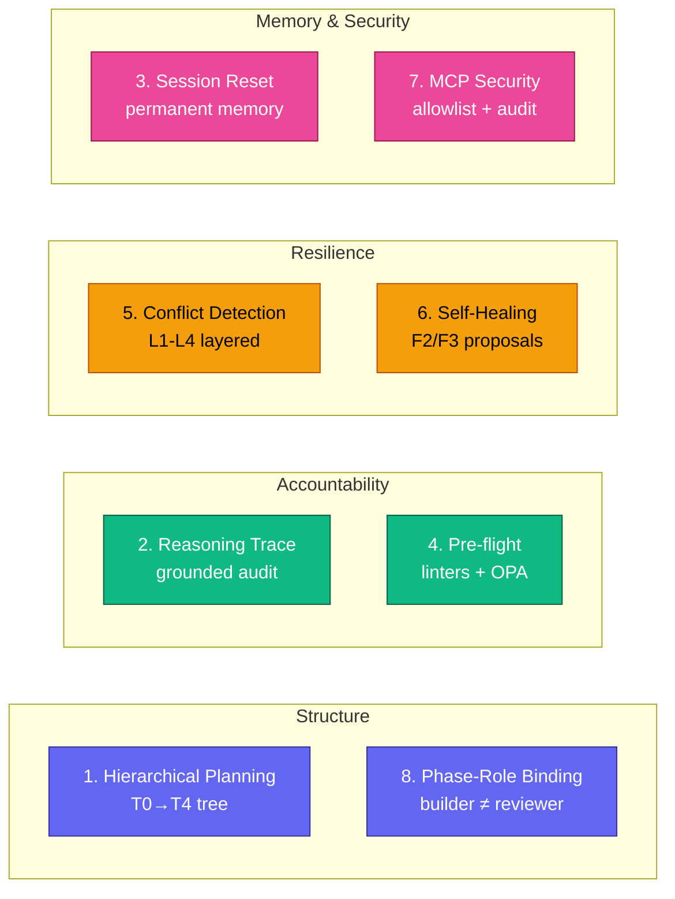

<div align="center">


# Aura Frog

### A planning-first LLM Operating System for software engineering.

A plugin for **[Claude Code](https://docs.anthropic.com/en/docs/claude-code)** that treats it as an Operating System. **15 specialized agents**, **hierarchical planning** (Mission → Initiative → Feature → Story → Task), **forensic reasoning traces**, **conflict detection between parallel work**, **self-healing safety gates**, **per-agent MCP security**, smart flow selection, and multi-agent orchestration.

[](docs/reference/CHANGELOG.md)
[](LICENSE)
[](https://docs.anthropic.com/en/docs/claude-code)
[](docs/PORTABILITY.md)
[](CONTRIBUTING.md)

**Two entry points, same natural-language pattern.** `/run <task>` for task execution (5-phase TDD with agents). `/aura-frog:plan <verb> [args]` for project planning (T0–T4 hierarchical tree). Both accept natural language, route through skills, and share state via the run↔feature bridge. You never lose decisions; every Claude tool call leaves a trace; conflicts are caught before silent overwrites.

**[Install in 30 seconds](#-install)** · **[v3.7.4 highlights](#-whats-new-in-v374)** · **[Full benefits guide →](docs/reference/BENEFITS.md)**

---

## 🆕 What's new in v3.7.4

v3.7.4 is a **documentation cleanup release** — no new features, no runtime behaviour change. Eliminates 122 stale command references that accumulated during the v3.6 → v3.7 transition, slims the README, and ships two new CI gates that prevent doc rot from re-entering main.

| Change | What it means |
|---|---|
| **CI guard against stale syntax** | New `aura-frog/scripts/ci/validate-docs-syntax.sh` ships an 18-entry BLOCKED_PATTERNS list covering every pre-v3.7 verb form (the old `workflow:*`-prefixed lifecycle verbs, the old `agent:` / `bugfix:` / `learn:` / `project:` namespaces, and the removed phase-hook MD paths). Any of these re-entering `docs/`, `README.md`, or `MIGRATION_TO_V3.7.md` blocks the commit. Wired into the validate job in `.github/workflows/ci.yml`. The full pattern list lives in the script header — single source of truth. |
| **Doc maturity infrastructure** | Every `docs/**/*.md` (except `docs/showcase/`, `docs/specs/`) now carries `last_aligned_with` + `status` + `audience` frontmatter. `aura-frog/scripts/ci/validate-doc-maturity.sh` checks staleness (status=current docs warn at diff > 2 minor versions) and shape. 9 pre-v3.6 docs/guides/* flagged `needs_review` for contributor attention (non-blocking). |
| **Onboarding fix** | `docs/getting-started/GET_STARTED.md` rewritten 472L → 148L. New `docs/getting-started/README.md` is the single ordered entry index (QUICKSTART → GET_STARTED → FIRST_WORKFLOW_TUTORIAL). Supplementary install paths extracted to new `docs/operations/INSTALLATION.md`. |
| **Stale-syntax sweep** | 122 stale references across 12 files cleaned. Pre-v3.7 `docs/guides/USAGE_GUIDE.md` archived to `docs/marketing/USAGE_GUIDE.pre-v3.7.md`. Pre-v3.0 `docs/architecture/overview.md` archived to `docs/marketing/overview.pre-v3.0.md`. `docs/reference/TESTING_GUIDE.md` syntax refresh (31 hits) + frontmatter. |
| **README slim** | 1294L → 706L (45% reduction). 8 Pillars deep-dives collapsed to per-pillar paragraphs linking to BENEFITS.md Part 9. Command Reference compressed to a single 8-row table. Optional-install `<details>` blocks moved to INSTALLATION.md. |
| **AI vs human boundary** | All 56 SKILL.md files + 71 rule files now carry an *AI-consumed reference* banner pointing readers at `docs/architecture/HIERARCHICAL_PLANNING.md` / `docs/getting-started/`. `docs/README.md` declares **docs/ as canonical** with an 8-entry source-of-truth table. |
| **Broader audit tool** | New `scripts/audit/stale-cmd-check.sh` for contributors — 3-pass detection (verb syntax · `/aura-frog:*` namespaced · backticked bare `/word`). Knows about Claude Code built-ins (`/clear`, `/compact`, `/plugin`, …). Idempotent. |

**Zero runtime change.** No new agents, no new skills, no hook changes. The pre-v3.7 verb syntax has been gone since v3.7.0 — these are exclusively doc fixes. CI now prevents the same drift from recurring.

<details>
<summary><b>v3.7.3 highlights (still shipped — plan relocation + run linking)</b></summary>

| Change | What it means |
|---|---|
| **Storage moves to `.claude/plans/`** | Plan tree now lives next to runs (`.claude/logs/runs/`) instead of in a separate `.aura/` directory. Resolution order: `--plans-dir` arg → `$AF_PLANS_DIR` env → `.claude/plans/` (default) → `.aura/plans/` (legacy fallback, removal v4.0). |
| **Every node is a folder** | T0–T4 each lives in `{ID}_{kebab-slug}/` containing its `<tier>.md` spec. Tickets used as ID prefix when attached; otherwise auto-minted `FEAT-N` / `STORY-NNNN` / `TASK-NNNNN`. |
| **Co-located aux files** | `<node>/checkpoints/{ISO}.json` and `<task>/trace.jsonl` live INSIDE the node folder. Archive consolidated to `archive/{ID}_{slug}/{summary.md, original/}`. |
| **Run ↔ feature linking (bidirectional)** | `run-state.json` gains `feature_id` + `feature_slug` + `anchor.task_id`. Feature.md gains a `## Runs` table; `scripts/plans/link-run.sh` is the single writer. |
| **New `/run` prefixes** | `/run feature: FEAT-A <task>` anchors a new run; `/run resume FEAT-A` lists runs and prompts. Existing `/run task: …` and `/run project: …` unchanged. |

</details>

<details>
<summary><b>v3.7.2 highlights (still shipped — plan consolidation + /run escalation)</b></summary>

| System | What changed | Why it matters |
|---|---|---|
| Plan consolidation | `/aura-frog:plan <verb> [args]` — one command, 11 verbs. Routes via `plan-orchestrator` skill. | 10 legacy `/aura-frog:plan-*` aliases preserved (soft-deprecated v3.7.2 → warning v4.0 → removed v5.0). |
| 9 backing scripts | `scripts/plans/{expand,next,freeze,thaw,archive,conflicts,replan,promote,undo}-node.sh`. | Implementation that matched the docs. |
| Bare-word activation | Prompts ≤5 words starting with a plan verb route to `/aura-frog:plan`. | Opt-out: `AF_BARE_WORD_ROUTER_DISABLED=true`. |
| /run escalation | At weight ≥ 3 without a plan, 3-option prompt: `plan` / `deep` / `details`. | Opt-out: `AF_ESCALATION_DISABLED=true`. |

</details>

<details>
<summary><b>v3.7.0 baseline (still shipped — 8 Pillars below)</b></summary>

| System | Opt-in via | What it solves |
|---|---|---|
| Hierarchical planning | `/aura-frog:plan` | Plans persist across sessions; T0-T4 schema; forensic decision audit at `.claude/plans/history.jsonl` |
| Reasoning trace + grounding | `/aura-frog:trace` | Every `output_claim` is grounded in a prior `file_read`; hallucinations flagged with `grounded: false` |
| Conflict detection (L1+L2) | `/aura-frog:plan conflicts check` | File + function overlap between parallel work; freeze cascade; auto-thaw on compatible blocker |
| Memory tier + session reset | `/aura-frog:reset-session` | T2 done distills into `permanent_memory.md`; clean session restart preserves wisdom |
| Self-healing + MCP security | `/aura-frog:heal` + `/aura-frog:mcp` | F2/F3 patch proposals (NEVER auto-apply); per-agent allowlists + audit + rate limits |

</details>

</div>

---

## The Problem

You open Claude Code. You type a prompt. Claude writes code. You *hope* it works.

No structure. No tests. No quality gates. Every session starts from scratch. Every complex feature turns into prompt spaghetti.

**You're the project manager, QA lead, and architect — all while trying to code.**

## The Solution

Aura Frog treats Claude Code as an **Operating System** — Claude is the kernel, agents are processes, and the context window is managed RAM. You describe the task. Aura Frog classifies complexity, picks the right flow (direct edit · bugfix TDD · full 5-phase), dispatches the right agent, and compresses context automatically so you never lose decisions.

**Right effort for every task. You only approve when it matters (0 gates for typos, up to 2 for architecture).**

---

## How It Works


**The flow, explained:**
1. **Every message** you send goes through the `agent-detector` skill (runs on haiku for cost) — it classifies complexity + picks the right agent + suggests the right model.
2. **Quick tasks** (typo, one-line fix) → direct edit, no workflow overhead.
3. **Standard tasks** (one feature, clear scope) → single specialized agent runs inline.
4. **Deep tasks** (feature + multi-file + TDD) → `run-orchestrator` spawns the 5-phase workflow with two human approval gates.
5. Between phases, you either **approve**, **reject**, or **modify** — no commit happens until Phase 5 and you say so.

---

## 🐸 The 8 Pillars of the Planning-First LLM OS

v3.7.0 introduced **eight features** that compose into one cohesive OS; v3.7.2 + v3.7.3 polished their entry points + storage layout (notably Pillar 1). Each pillar solves a real failure mode of shipping with an AI agent. Status legend: ✅ shipped · 🚧 queued for v3.8+.

| # | Pillar | One-liner | Status |
|---|---|---|---|
| 1 | **Hierarchical Planning** | Plans survive session reset · `/compact` · machine restart. v3.7.3: uniform folder-per-node layout under `.claude/plans/` · run↔feature linking | ✅ |
| 2 | **Reasoning Trace Audit** | Every Claude decision is forensically recorded with grounded evidence | ✅ |
| 3 | **Semantic Session Reset** | Finished an Epic? Distill it into permanent memory, then reset cleanly | ✅ |
| 4 | **Pre-flight Validation** | Bash linters block bad AI output before it hits disk | ✅ Tier 1 · 🚧 Tier 2 OPA |
| 5 | **Semantic Conflict Detection** | L1-L4 layered detection prevents silent overwrites between parallel tasks | ✅ L1+L2 · 🚧 L3+L4 LLM |
| 6 | **Self-Healing Orchestrator** | Auto-diagnose F2/F3 failures, propose patches — never auto-apply | ✅ manual · 🚧 auto-trigger |
| 7 | **MCP Security Layer** | Per-agent allowlist, audit log, rate limits — defense for external integrations | ✅ |
| 8 | **Phase-Role Binding** | Phase 4 reviewer MUST differ from Phase 3 builder (Generator ≠ Evaluator) | ✅ |



---

### 1 · Hierarchical Planning  ✅

A plan tree (Mission → Initiative → Feature → Story → Task) that persists to `.claude/plans/` and survives session resets, `/compact`, and machine restarts. v3.7.3 ships uniform `{ID}_{kebab-slug}/` folder-per-node layout, run↔feature bidirectional linking (`run-state.json` ↔ feature's `## Runs` table), and the consolidated `/aura-frog:plan <verb>` surface (`expand` · `next` · `replan` · `promote` · `archive` · `undo` · `freeze` · `thaw` · `conflicts` · `status`). Bare-word activation when a plan is active: type `next`, `expand FEAT-A`. The `/run` escalation heuristic (v3.7.2) prompts plan-mode for multi-feature tasks (weight ≥ 3) — overrides: `task:` / `project:` prefixes, `AF_ESCALATION_DISABLED=true`. Full depth + DAG examples in [BENEFITS.md Part 9 §1](docs/reference/BENEFITS.md#part-9--the-8-pillars-of-the-planning-first-llm-os-v370) and [HIERARCHICAL_PLANNING.md](docs/architecture/HIERARCHICAL_PLANNING.md).

### 2 · Reasoning Trace Audit  ✅

Every Claude decision during T4 execution is forensically recorded to a per-task `trace.jsonl` (co-located with the task spec). Captured events: file reads, output claims, tool calls, decisions — each linked to the grounding evidence. The trace is the source of truth for grounding-discipline checks (anti-hallucination); deliverables that cite a file must show a corresponding read event. Query via `/trace` (planned CLI shipped in helper scripts). Disable per-session with `AF_TRACE_DISABLED=true`. Full schema + worked examples in [BENEFITS.md Part 9 §2](docs/reference/BENEFITS.md#part-9--the-8-pillars-of-the-planning-first-llm-os-v370).

### 3 · Semantic Session Reset  ✅

Long projects accumulate decisions that don't fit in a context window. When a Feature ships, `epic-summarizer` distils its history into `.claude/memory/permanent_memory.md` — a confidence-scored, append-only memo (low-confidence items land in a Tentative subsection). Future sessions load only the header lines via `permanent-memory-loader` (≤120 always-loaded tokens, hard cap 200). `/reset-session` triggers the distil + optional clean-slate restart. Lets you take a Mission across weeks without context creep. Full depth in [BENEFITS.md Part 9 §3](docs/reference/BENEFITS.md#part-9--the-8-pillars-of-the-planning-first-llm-os-v370).

### 4 · Pre-flight Validation  ✅ Tier 1 · 🚧 Tier 2

Bash linters that block bad AI output before it hits disk. Tier 1 ships seven checks (path safety, command allowlist, secret patterns, frontmatter shape, markdown sanity, slash-syntax currency, doc maturity). Tier 2 (queued for v3.8) adds OPA + five `.rego` policies for declarative org-specific gates. Hook-driven — fires on Write/Edit. Bypass with 3-warn confirmation when the linter is wrong. Disable with `AF_PREFLIGHT_DISABLED=true`. Full rules in [BENEFITS.md Part 9 §4](docs/reference/BENEFITS.md#part-9--the-8-pillars-of-the-planning-first-llm-os-v370).

### 5 · Semantic Conflict Detection  ✅ L1+L2 · 🚧 L3+L4

Parallel `/run` tasks can step on each other. v3.7 ships L1 (file-overlap) and L2 (function/region overlap) deterministic checks, plus a freeze-cascade state machine that pauses descendants when a parent conflicts. L3 (semantic, LLM-judged) and L4 (architectural, LLM-judged) ship in v3.7.0-rc.1+. `conflict-arbiter` adjudicates — outcomes recorded to `conflicts.jsonl` + history. Disable LLM tiers with `AF_CONFLICT_LLM_DISABLED=true`. Full state machine + sample conflicts in [BENEFITS.md Part 9 §5](docs/reference/BENEFITS.md#part-9--the-8-pillars-of-the-planning-first-llm-os-v370).

### 6 · Self-Healing Orchestrator  ✅ manual · 🚧 auto-trigger

When `failure-classifier` flags a task as F2 (local-logic) or F3 (local-design), the self-healing skill proposes a patch — but **never auto-applies**. Confidence ≥0.7 is required to surface; below threshold the raw findings are escalated to the user. Auto-trigger on the F2/F3 classification hook is queued for v3.7.2+. Per-task cap: 1 self-heal attempt; per-session cap: 5. Disable with `AF_SELF_HEAL_DISABLED=true`. Full workflow in [BENEFITS.md Part 9 §6](docs/reference/BENEFITS.md#part-9--the-8-pillars-of-the-planning-first-llm-os-v370).

### 7 · MCP Security Layer  ✅

Per-agent allowlist for MCP calls + audit log + rate limits + input sanitization. The `mcp-call-gate` hook authorises every MCP invocation against the agent's declared scope; blocked + rate-limited calls land in `.aura/security/mcp-audit.jsonl`. Post-incident forensics via `/aura-frog:mcp audit`. Tokens never leave the process. Disable audit-only with `AF_MCP_AUDIT_DISABLED=true`. Full threat model in [BENEFITS.md Part 9 §7](docs/reference/BENEFITS.md#part-9--the-8-pillars-of-the-planning-first-llm-os-v370) and [SECURITY_AND_TRUST.md](docs/operations/SECURITY_AND_TRUST.md).

### 8 · Phase-Role Binding  ✅

The Phase 4 reviewer **MUST** differ from the Phase 3 builder. Generator ≠ Evaluator is enforced by `run-orchestrator` and `cross-review-workflow.md` — self-reviewed code has blind spots that PR reviews catch in human teams; same logic for agents. Non-negotiable. The constraint is what makes the 5-phase workflow produce shippable code, not just code that passes its own tests. Full rationale in [BENEFITS.md Part 9 §8](docs/reference/BENEFITS.md#part-9--the-8-pillars-of-the-planning-first-llm-os-v370).


### Status snapshot — what ships now vs queued

| Pillar | Ships now (v3.7.0 + v3.7.2/v3.7.3 polish) | Queued for v3.8+ |
|---|---|---|
| 1 — Planning | T0-T4 tree at `.claude/plans/`, **uniform folder-per-node layout** (v3.7.3), **consolidated `/aura-frog:plan <verb>`** (v3.7.2), 12 backing scripts, 5 agents, bare-word router, `link-run.sh` for run↔feature bidirectional linking | — |
| 2 — Reasoning Trace | tracer hook (writes per-task `trace.jsonl` inside the task folder, v3.7.3), grounding-discipline, `/trace` queries | helper CLI scripts (deferred per [issue #6](https://github.com/nguyenthienthanh/aura-frog/issues/6)) |
| 3 — Session Reset | epic-summarizer, permanent-memory-loader (`.claude/memory/`), `/reset-session` | — |
| 4 — Pre-flight | 7 Tier-1 bash linters, hook, bypass with 3-warn | Tier 2 OPA + 5 `.rego` policies |
| 5 — Conflict Detection | L1 (file) + L2 (function) + freeze cascade + arbitration | L3 (semantic LLM) + L4 (architectural LLM) |
| 6 — Self-Healing | manual `/heal diagnose`, ≥0.7 confidence, never auto-apply | auto-trigger hook on F2/F3 classification |
| 7 — MCP Security | per-agent allowlist + audit + rate limits + sanitizer | SQLite WAL for audit ([issue #8](https://github.com/nguyenthienthanh/aura-frog/issues/8)) |
| 8 — Phase-Role | hard rule in `cross-review-workflow.md` + run-orchestrator | — |
| Routing — `/run` | **3-option escalation** (`plan`/`deep`/`details`) on weight ≥ 3, **`task:` / `project:` override prefixes** (v3.7.2), **`feature: <ID>` prefix** + **`resume <FEATURE_ID>`** (v3.7.3) | — |

Disable any pillar individually via env var: `AF_SELF_HEAL_DISABLED`, `AF_MCP_AUDIT_DISABLED`, `AF_TRACE_DISABLED`, `AF_PREFLIGHT_DISABLED`, `AF_CONFLICT_LLM_DISABLED`, `AF_RUN_PLAN_BRIDGE_DISABLED`, `AF_TOKEN_TRACKER_DISABLED`, `AF_BARE_WORD_ROUTER_DISABLED`, `AF_ESCALATION_DISABLED`. Override the plans dir entirely with `AF_PLANS_DIR=<path>` (e.g. to keep using legacy `.aura/plans/`). All eight pillars + the v3.7.2/v3.7.3 routing additions are opt-in friendly.

---

## Works Across AI Coding Tools

Aura Frog's 71 rules, 59 skills, and 15 agents are **~87% portable** (weighted average) because they're markdown conventions, not tool-specific code. Only the thin hook layer needs adapters.

| Tool | Status | Coverage |
|------|--------|:--------:|
|  Fully tested | 100% |
|  Q2 2026 | ~85% |
|  Q2 2026 | ~80% |

**Why this matters:** When you invest in Aura Frog's TDD discipline, gotcha-only expert skills, and agent architecture, that investment survives tool switches. Only the thin adapter layer changes.

[Read the Portability Guide →](docs/PORTABILITY.md)

---

## Before & After

<table>
<tr><th width="450">❌ Without Aura Frog</th><th width="450">✅ With Aura Frog</th></tr>
<tr>
<td>

```
You: "Add user authentication"
Claude: *writes 500 lines of untested code*
You: "Wait, that's not what I—"
Claude: *rewrites everything from scratch*
```

</td>
<td>

```
You: "Add user authentication"

🐸 Phase 1: "JWT or OAuth2? Here are trade-offs.
   3 endpoints needed. Approve?"

You: "approve"

🐸 Phase 2-3: 5 tests → all GREEN.
🐸 Phase 4-5: Reviewed. Documented. Done.
```

</td>
</tr>
</table>

**Result:** Production-ready code with tests, security review, and documentation — from a single prompt.

---

## Installation

### Prerequisites

- **Claude Code CLI** installed → [install guide](https://docs.anthropic.com/en/docs/claude-code)
- **Node.js ≥ 18** (for hook scripts)
- **Git** (for phase checkpoint commits)

### Install in Claude Code (30 seconds)

```bash
# 1. Add the marketplace
/plugin marketplace add nguyenthienthanh/aura-frog

# 2. Install the plugin
/plugin install aura-frog@aurafrog

# 3. Verify
/af status
```

Expected output:

```
🐸 Aura Frog v3.7.3 — Ready
  Agents:   15 loaded (lead, architect, frontend, mobile, tester, security, devops, strategist, scanner,
                       master-planner, feature-architect, story-planner, replanner, epic-summarizer, conflict-arbiter)
  Skills:   59 available (9 auto-invoke, 50 on-demand)
  Rules:    71 loaded (22 core + 19 agent + 30 workflow)
  Hooks:    48 registered
  MCP:      context7, playwright, vitest, firebase, figma, slack, postgres (disabled), redis (disabled)
```

### Initialize Your Project (Recommended — one time)

```bash
/project init
```

Scans your codebase and creates 7 context files (framework, conventions, rules, examples, architecture, etc.) in `.claude/project-contexts/<name>/`. Takes 30–60 seconds; saves minutes on every future session.

### Optional setup

- **`af` CLI for health checks outside Claude Code** — `/af setup cli` or [manual symlink](docs/operations/INSTALLATION.md#cli-symlink--af-outside-claude-code).
- **MCP tokens (Figma / Slack / Firebase / Supabase)** — `cp .envrc.template .envrc`, fill in tokens. Full template + per-token notes in [INSTALLATION.md § Environment variables](docs/operations/INSTALLATION.md#environment-variables--envrc).
- **Skills-only mode on Codex / Gemini CLI / OpenCode** — `cp -r aura-frog/skills/* <platform-skills-dir>/`. Hooks, agent detection, subagent spawning, and MCP servers are Claude Code exclusive; everything else is portable (see [Works Across AI Coding Tools](#works-across-ai-coding-tools)).

### Start Your First Workflow

```bash
/run "Your task here"
```

See the [Walkthrough](#walkthrough-a-real-workflow-in-action) below for a complete transcript of what this looks like.

### Common Install Issues

| Symptom | Likely cause | Fix |
|---------|--------------|-----|
| `/plugin install` fails | Marketplace cache | Run `/plugin marketplace refresh` |
| Hooks not firing | `.claude/settings.json` missing hook config | `/af setup integrations` re-installs |
| `af: command not found` | PATH missing plugin scripts dir | Add `$HOME/.claude/plugins/marketplaces/aurafrog/scripts` to `$PATH` |
| State not saving during `/run` | Hook path drift (pre-v3.7) | Upgrade to 3.7+ (state path fixed) |
| Claude uses wrong agent | No `/project init` yet | Run `/project init` to load conventions |

Full guide: [GET_STARTED.md](docs/getting-started/GET_STARTED.md).

---

## Walkthrough: A Real Workflow in Action

A complete transcript of implementing JWT auth with `/run` — 18 minutes, 2 approvals, 94% coverage, 8 agents dispatched. Full sequence diagram + step-by-step + agent table in [docs/getting-started/WALKTHROUGH.md](docs/getting-started/WALKTHROUGH.md).

---

## Why Teams Ship Faster With Aura Frog

Smart flow selection · multi-agent orchestration · approval gates that don't block · context economy · TDD enforcement · JIRA integration. Full prose with examples and rationale in [docs/marketing/WHY_TEAMS_SHIP_FASTER.md](docs/marketing/WHY_TEAMS_SHIP_FASTER.md).

---

## Routing Strategies

Aura Frog picks one of three execution strategies per task — you never configure it manually.


| Strategy | Triggers | Model | Gates | Example |
|---|---|---|---|---|
| **Quick** | Single file, typo, one-line fix | haiku | 0 | "Fix typo in login.ts" |
| **Standard** | 2–5 files, one feature | sonnet | 0–1 | "Add email validation to signup form" |
| **Deep** | 6+ files, architecture, vague scope | sonnet (opus for design) | 2 (P1 + P3) | "Design and implement user subscription system" |

**Why three tiers instead of always-TDD?** Forcing Deep on every task burns tokens (~3× vs subagent mode) and slows iteration. Forcing Quick on complex work skips tests and breaks production. The three-tier model matches effort to risk.

**Team Mode** (subset of Deep): if the task spans 2+ domains AND `CLAUDE_CODE_EXPERIMENTAL_AGENT_TEAMS=1`, multiple agents work in parallel and cross-review each other. See [AGENT_TEAMS_GUIDE](docs/guides/AGENT_TEAMS_GUIDE.md).

Details: `rules/core/execution-rules.md`, `skills/agent-detector/SKILL.md`, `skills/run-orchestrator/SKILL.md`.

---

## The Numbers

| Component | Count | Why it matters |
|-----------|:-----:|----------------|
| **Agents** | 15 | Right expert auto-selected per task (build + review + planning + safety roles) |
| **Skills** | 59 | 9 auto-invoke on context, 47 on-demand (incl. v3.7.2 `plan-orchestrator`) |
| **Commands** | 24 | Core: `/run`, `/check`, `/design`, `/project`, `/af`, `/help` + `/aura-frog:*` hierarchical-planning suite (14 user-facing + 10 legacy `/aura-frog:plan-<verb>` alias stubs) |
| **Rules** | 71 | 3-tier loading (22 core + 19 agent + 30 workflow) — only what's needed |
| **Hooks** | 48 | Conditional — skip processing for non-code files (v3.7.2 adds `bare-word-router.cjs`) |
| **Backing scripts** | 12 | Hierarchical-planning operations (v3.7.2): `new-plan`, `validate-plan-tree`, `render-plan-tree` + 9 new (`expand`, `next`, `freeze`, `thaw`, `archive`, `conflicts`, `replan`, `promote`, `undo`) + `resolve-node` + `_lib` |
| **MCP Servers** | 10 | 6 enabled by default; postgres/redis/chrome-devtools/codebase-memory opt-in |
| **Tests** | 317 | Coverage gate at 25% statements floor; +102 tests in v3.7.2 (38 plan scripts + 64 bare-word router) |

Full workflow target: **≤30K tokens** across all 5 phases.

---

## Command Reference

The top 8 commands cover every everyday workflow. Full reference + every subcommand + flag → [aura-frog/commands/README.md](aura-frog/commands/README.md).

| Command | What it does | Subcommands / flags |
|---|---|---|
| **`/run <task>`** | Universal entry. Auto-detects intent (feature / bugfix / refactor / test / review / deploy / quality / security) and picks the flow. | `task:` / `project:` / `feature: FEAT-X` / `fasttrack:` / `resume <id-or-feature>` / `status` / `handoff` / `rollback` / `progress` |
| **`/aura-frog:plan <verb>`** | Hierarchical planning — 11 verbs in one command. Bare-word activation when a plan is active. | `expand` · `next` · `replan` · `promote` · `archive` · `undo` · `freeze` · `thaw` · `conflicts` · `status` · (no-arg interview) |
| **`/check`** | Health + quality checks across the working tree. | `security` · `perf` · `complexity` · `debt` · `coverage` · `deps` · (no-arg = all) |
| **`/design`** | Design artifacts from a description. | `api` · `db` · `doc` (ADR / runbook) |
| **`/project`** | Project context lifecycle. | `init` · `status` · `refresh` · `regen` · `env` · `sync` |
| **`/af`** | Plugin management + learning system. | `status` · `agents` · `metrics` · `learn {status,analyze,apply,feedback}` · `setup` · `mcp` · `prompts` · `skill` |
| **`/aura-frog:heal`** / **`:mcp`** / **`:dashboard`** / **`:trace`** / **`:preflight`** / **`:reset-session`** / **`:extend`** | Safety + ops + observability + project-level extension authoring. | See [commands/README.md](aura-frog/commands/README.md) |
| **`/help`** | Contextual help. | `/help <command>` · `/help agents` · `/help hooks` |

**Context-aware bare verbs** when a `/run` is active: `approve` · `reject <reason>` · `modify <changes>` · `handoff` · `status` · `progress` · `rollback` · `stop`. No slash prefix needed.

**Legacy `/aura-frog:plan-<verb>` alias forms** still work but are soft-deprecated (warning v4.0 → removed v5.0).

---

## Agent Selection Examples

Real examples of what the `agent-detector` skill picks and why (Layer 0 task-content overrides repo type). Full scoring breakdown + 10 worked examples in [docs/getting-started/AGENT_SELECTION.md](docs/getting-started/AGENT_SELECTION.md).

---

## Token Budget

Real measurements from production workflows: typical token cost per strategy (Quick/Standard/Deep/Team), per-phase breakdown, target vs actual. Full table + 5-phase numbers in [docs/getting-started/TOKEN_BUDGET.md](docs/getting-started/TOKEN_BUDGET.md).

---
---

## Troubleshooting / FAQ

<details>
<summary><strong>Q: Workflow state isn't saving. `/run status` shows nothing.</strong></summary>

**Likely cause:** Path drift between hooks and skills (fixed in v3.7+).

**Check:**
```bash
ls -la .claude/logs/runs/         # Should exist after first /run
ls -la .claude/logs/workflows/    # Legacy path — may have old state
```

**Fix:**
- Upgrade to v3.7+ (`/plugin update aura-frog`)
- Or manually move: `mv .claude/logs/workflows/* .claude/logs/runs/`

Verify with `/af status` — should show 0 orphan paths.
</details>

<details>
<summary><strong>Q: Wrong agent picked for my task.</strong></summary>

**Likely cause:** Missing project context or ambiguous task description.

**Check:**
- Did you run `/project init` yet? Scanner uses those files for Layer 3 (project context).
- Is your task description short/vague? `agent-detector` defaults to repo type when signals are weak.

**Fix:**
- Run `/project init` if you haven't
- Rephrase task with domain-specific keywords: `"Add email template styling"` (frontend) vs `"Update email feature"` (ambiguous)
- Override manually: `/run @frontend implement X` forces the frontend agent

Full scoring logic: `skills/agent-detector/task-based-agent-selection.md`.
</details>

<details>
<summary><strong>Q: Token budget blown past 200K. What happened?</strong></summary>

**Likely cause:** Phase 3 (Build GREEN) hit an iteration loop on a complex refactor.

**Check:**
```bash
/run budget      # Shows per-phase consumption
/run metrics     # Shows if rejection count is high
```

**Fix:**
- `/run handoff` to save state → resume in fresh session
- For next time: use `/run predict <task>` first — flags Deep tasks likely to exceed budget
- Consider splitting: `/run part 1: <narrow scope>` → merge → `/run part 2`
</details>

<details>
<summary><strong>Q: Hooks not firing (no SessionStart banner, no lint-autofix).</strong></summary>

**Likely cause:** `.claude/settings.json` missing hook config, or plugin not activated in this project.

**Check:**
```bash
cat .claude/settings.json   # Should reference plugin hooks
/af status                  # Should show "Hooks: 28 registered"
```

**Fix:**
```bash
/af setup integrations      # Re-installs hook config
```

If still nothing, check plugin.json path:
```bash
ls ~/.claude/plugins/marketplaces/aurafrog/aura-frog/hooks/hooks.json
```
</details>

<details>
<summary><strong>Q: Opus session costs surprised me. Can I lock everything to Sonnet?</strong></summary>

**Yes — two ways:**

**Option 1 — Session override (temporary):**
```bash
# Start Claude Code with model flag
claude --model sonnet
```

**Option 2 — Env var (permanent, overrides ALL frontmatter):**
```bash
export CLAUDE_CODE_SUBAGENT_MODEL=sonnet
```

This overrides every agent/skill `model:` declaration. See [Per-Agent Model Override](#per-agent-model-override--how-it-works-and-why) for resolution order.

**Cost tip:** `scanner` and `agent-detector` stay on haiku regardless — you don't need to touch them.
</details>

<details>
<summary><strong>Q: Can I run multiple /run workflows in parallel?</strong></summary>

**Yes — use git worktrees:**
```bash
/run worktree: <task>    # Automatically creates isolated worktree + runs there
```

Each worktree has its own state in `.claude/logs/runs/<id>/`. See [Git Worktree skill](aura-frog/skills/git-worktree/SKILL.md).

For full multi-agent parallel work, enable Agent Teams:
```bash
export CLAUDE_CODE_EXPERIMENTAL_AGENT_TEAMS=1
```

See [Agent Teams Guide](docs/guides/AGENT_TEAMS_GUIDE.md).
</details>

<details>
<summary><strong>Q: How do I disable a hook that's slowing me down?</strong></summary>

Each hook has a disable env var:

```bash
AF_LINT_AUTOFIX=false        # Skip post-edit linter
AF_PROMPT_LOGGING=false      # Skip prompt metadata logging
AF_LEARNING_ENABLED=false    # Skip all learning hooks
```

Or disable at the source by editing `aura-frog/hooks/hooks.json` (comment out the matcher).

Full hook list: [hooks/README.md](aura-frog/hooks/README.md).
</details>

More issues: [TROUBLESHOOTING.md](docs/operations/TROUBLESHOOTING.md).

---

## Compared to Other Claude Code Plugins

Honest comparison with two popular plugins in the ecosystem (April 2026).

| | **Aura Frog** | **wshobson/agents** | **Superpowers** |
|---|---|---|---|
| **Agents** | 15 curated | 184 across 78 plugins | ~20 |
| **Skills** | 59 | 150 | Small focused set |
| **Commands** | 24 (14 user-facing + 10 legacy aliases) | 98 | ~10 |
| **Workflow** | 5-phase TDD with 2 gates | No structured workflow | Phase-gated workflow |
| **Agent routing** | Task-content Layer 0 override | Manual `/agent-name` | Similar to Aura Frog |
| **TDD enforcement** | ✅ Mandatory RED→GREEN→REFACTOR | ❌ Per-agent | ✅ Phase-gated |
| **Context management** | 3-tier (MicroCompact / AutoCompact / ManualCompact) | ❌ Base Claude Code | Partial |
| **Approval gates** | 2 (P1 + P3) | ❌ | Multiple |
| **MCP bundled** | 6 (context7, playwright, vitest, firebase, figma, slack) | Varies per plugin | 2–3 |
| **Best fit** | Teams shipping production features with TDD discipline | Extending with niche specialists | Structured workflows for research/writing |
| **Weakness** | Steeper learning curve | Agent sprawl (184 is a lot) | Smaller ecosystem |

**Not competing — different optimization targets.** Aura Frog optimizes for *production code quality* (TDD + security review). wshobson optimizes for *breadth of specialists*. Superpowers optimizes for *structured thinking over code*.

Combine freely — plugins coexist in Claude Code.

---

## Honest Maturity Report

What works well, what doesn't, what's tracked. v3.7.2 polishes the surface; the underlying engineering still has real tech debt. We name it so you can plan around it.

### Confidence

- **8 Pillars feature surface** — all shipped and exercised through the integration tests. Hierarchical planning, reasoning trace, conflict detection, self-healing proposals, MCP security, pre-flight, session reset, phase-role binding. Day-to-day production use is fine.
- **Plan consolidation (v3.7.2) + uniform layout (v3.7.3)** — 43 unit tests against the 9 backing scripts + `link-run.sh` using temp `.claude/plans/` fixtures. 64 tests for the bare-word router with require()-based imports (no test theater).
- **CI green on Node 18** — 317 tests, coverage gate held.

### Known tech debt (tracked openly)

| Item | Severity | Issue | Effort |
|---|---|---|---|
| 5 deferred env-var-dependent hooks still rely on undocumented `CLAUDE_TOOL_NAME` / `CLAUDE_FILE_PATHS` instead of the documented stdin-JSON contract. Only `mcp-call-gate` got the stdin fallback in v3.7.1. | medium | [#7](https://github.com/nguyenthienthanh/aura-frog/issues/7) | ~1d |
| `hooks/lib/hook-runtime.cjs` doesn't exist yet — every hook re-implements stdin parsing + audit appending + atomic writes. Boilerplate × 43 files. | medium | [#6](https://github.com/nguyenthienthanh/aura-frog/issues/6) | ~2d |
| `.claude/plans/.../trace.jsonl` files and `.aura/security/mcp-audit.jsonl` use append-only text. High-traffic logs would benefit from SQLite WAL but currently break "zero runtime dependencies." | low | [#8](https://github.com/nguyenthienthanh/aura-frog/issues/8) | open question (maintainer trade-off) |
| Hook performance budget not enforced. ~19 hooks fire on every Write/Edit; estimated 100-300ms p95 but unmeasured. | medium | [#9](https://github.com/nguyenthienthanh/aura-frog/issues/9) | ~1d for budget + benchmark |
| Node 20/22 test matrix hangs on Ubuntu CI runners (Node 18 + macOS pass in ~22s). Temporarily reduced to Node 18 only for v3.7.2 release. | low | (no open issue yet — investigate in v3.7.3) | ~2-4h to bisect |
| Pillar 4 Tier 2 OPA Rego policies, Pillar 5 L3+L4 LLM conflict detection, Pillar 6 auto-trigger on F2/F3 — all in the v3.7.0 roadmap, queued for v3.8+. | feature | — | varies |
| `cc-plugin-eval` upstream npm peer-dep conflict (`madge` vs `typescript ^6`) breaks the behavioral-eval CI workflow. Not a regression in this plugin; tracked as upstream. | external | — | wait for cc-plugin-eval fix |

### What v3.7.2 explicitly does NOT do

- It does not enable Tier 2 OPA pre-flight (queued v3.8+).
- It does not add L3 (semantic LLM) or L4 (architectural LLM) conflict checks. The env var `AF_CONFLICT_LLM_DISABLED` is a no-op until v3.8+.
- It does not auto-apply self-heal patches — proposals only, confidence ≥ 0.7, max 5/session.
- It does not change `/run`'s 5-phase TDD flow. The escalation prompt adds an option, not a replacement.

### How to assess fit

Use this checklist:

- ✅ Multi-week features, complex refactors, scope creep risk → high value
- ✅ AI hallucination concerns (reasoning trace + grounding rejects ungrounded claims) → high value
- ✅ Parallel-team work with conflict risk → L1+L2 detector catches file/function overlap
- ✅ MCP-heavy workflows (Figma + Firebase + Slack + DBs) → per-agent allowlists + audit log
- ⚠️ Single-file edits / quick prototypes → workflow overhead may not pay off; use `/run task: …` to bypass
- ⚠️ Haiku-only budget — some features (planning, conflict, design phases) prefer Sonnet/Opus
- ⚠️ Minimalist-plugin preference — Aura Frog is substantial (15 agents, 59 skills, 71 rules, 48 hooks)

---

## Documentation

| | |
|---|---|
| **All Documentation** | [docs/README.md](docs/README.md) |
| **Getting Started** | [GET_STARTED.md](docs/getting-started/GET_STARTED.md) |
| **First Workflow Tutorial** | [FIRST_WORKFLOW_TUTORIAL.md](docs/getting-started/FIRST_WORKFLOW_TUTORIAL.md) |
| **All Commands (24)** | [commands/README.md](aura-frog/commands/README.md) |
| **All Skills (59)** | [skills/README.md](aura-frog/skills/README.md) |
| **Agent Teams Guide** | [AGENT_TEAMS_GUIDE.md](docs/guides/AGENT_TEAMS_GUIDE.md) |
| **MCP Setup** | [MCP_GUIDE.md](docs/operations/MCP_GUIDE.md) |
| **Hooks & Lifecycle** | [hooks/README.md](aura-frog/hooks/README.md) |
| **Troubleshooting** | [TROUBLESHOOTING.md](docs/operations/TROUBLESHOOTING.md) |
| **Changelog** | [CHANGELOG.md](docs/reference/CHANGELOG.md) |

---

## Architecture — LLM OS

```
Claude = Kernel          Context Window = RAM           Project Files = Disk
Agents = Processes       5-Phase TDD = Scheduler        MCP = Device Drivers
TOON = Compression       Approval Gates = Interrupts    Handoffs = IPC

aura-frog/
├── agents/         15 processes (auto-dispatched per task)
├── skills/         59 skills (9 auto-invoke + 50 on-demand)
├── commands/       24 commands (core /run /check /design /project /af /help + /aura-frog:* hierarchical-planning suite)
├── rules/          71 rules (22 core + 19 agent + 30 workflow)
├── hooks/          48 lifecycle hooks (conditional execution)
├── scripts/        utility scripts (CI, plans, preflight, workflow, security, …)
├── docs/           AI reference docs (phases, TOON refs)
└── .mcp.json       8 device drivers (6 enabled + postgres/redis opt-in)
```

---

## Contributing

We welcome contributions — especially new MCP integrations, agents, skills, and bug fixes. See [CONTRIBUTING.md](CONTRIBUTING.md) or submit an issue.

> Godot and SEO/GEO modules available as separate addons.

---

## License

MIT — See [LICENSE](LICENSE)

---

<div align="center">


### Your AI writes code. Aura Frog runs the OS.

**[Install Now](#-install)** · **[Tutorial](docs/getting-started/FIRST_WORKFLOW_TUTORIAL.md)** · **[Report Issue](https://github.com/nguyenthienthanh/aura-frog/issues)**

*Built by [@nguyenthienthanh](https://github.com/nguyenthienthanh) · [Changelog](docs/reference/CHANGELOG.md)*

</div>
