# Aura Frog Workflow Diagrams

**Version:** 1.0.0
**Format:** Mermaid (render with GitHub, VS Code, or mermaid.live)
**Purpose:** Visual documentation of Aura Frog workflows and architecture

---

## Table of Contents

1. [System Architecture](#1-system-architecture)
2. [9-Phase Workflow](#2-9-phase-workflow-sequence)
3. [TDD Workflow (RED/GREEN/REFACTOR)](#3-tdd-workflow)
4. [Agent Detection Flow](#4-agent-detection-flow)
5. [Phase Transition Logic](#5-phase-transition-logic)
6. [Session Handoff Flow](#6-session-handoff-flow)
7. [Workflow State Machine](#7-workflow-state-machine)
8. [Multi-Agent Collaboration](#8-multi-agent-collaboration)
9. [Token Budget Distribution](#9-token-budget-distribution)
10. [Approval Gate Flow](#10-approval-gate-flow)

---

## 1. System Architecture

### 1.1 Overall Plugin Architecture


### 1.2 Skill Invocation Architecture


---

## 2. 9-Phase Workflow Sequence

### 2.1 Complete Workflow Sequence


### 2.2 Phase Overview (Simplified)

```mermaid
graph LR
    subgraph "Planning Phases"
        P1[Phase 1<br/>Requirements]
        P2[Phase 2<br/>Design]
        P3[Phase 3<br/>UI Breakdown]
        P4[Phase 4<br/>Test Planning]
    end

    subgraph "Implementation Phases"
        P5A[Phase 5a<br/>TDD RED]
        P5B[Phase 5b<br/>TDD GREEN]
        P5C[Phase 5c<br/>REFACTOR]
    end

    subgraph "Validation Phases"
        P6[Phase 6<br/>Code Review]
        P7[Phase 7<br/>QA Validation]
    end

    subgraph "Delivery Phases"
        P8[Phase 8<br/>Documentation]
        P9[Phase 9<br/>Notification]
    end

    P1 -->|approve| P2
    P2 -->|approve| P3
    P3 -->|approve| P4
    P4 -->|approve| P5A
    P5A -->|tests fail ✓| P5B
    P5B -->|tests pass ✓| P5C
    P5C -->|tests pass ✓| P6
    P6 -->|approve| P7
    P7 -->|coverage ≥80%| P8
    P8 -->|approve| P9
    P9 -->|auto| DONE((Done))
```



---

## 3. TDD Workflow

### 3.1 TDD Cycle Flowchart

```mermaid
flowchart TD
    START([Phase 5 Start]) --> P5A

    subgraph P5A [Phase 5a: RED]
        A1[Write test file] --> A2[Define test cases]
        A2 --> A3[Run tests]
        A3 --> A4{Tests FAIL?}
        A4 -->|Yes ✓| A5[Tests failing as expected]
        A4 -->|No ✗| A6[ERROR: Tests should fail!<br/>Tests aren't testing new code]
        A6 --> A1
    end

    A5 --> GATE1{Approval Gate}
    GATE1 -->|approve| P5B
    GATE1 -->|reject| A1

    subgraph P5B [Phase 5b: GREEN]
        B1[Write minimal code] --> B2[Just enough to pass]
        B2 --> B3[Run tests]
        B3 --> B4{Tests PASS?}
        B4 -->|Yes| B5{Coverage ≥80%?}
        B4 -->|No| B6[Fix implementation<br/>NOT the tests]
        B6 --> B1
        B5 -->|Yes ✓| B7[Implementation complete]
        B5 -->|No| B8[Add more tests or<br/>increase coverage]
        B8 --> B1
    end

    B7 --> GATE2{Approval Gate}
    GATE2 -->|approve| P5C
    GATE2 -->|reject| B1

    subgraph P5C [Phase 5c: REFACTOR]
        C1[Identify improvements] --> C2[Refactor code]
        C2 --> C3[Run tests]
        C3 --> C4{Tests STILL PASS?}
        C4 -->|Yes ✓| C5[Refactoring complete]
        C4 -->|No ✗| C6[REVERT refactor<br/>Tests must pass]
        C6 --> C1
    end

    C5 --> GATE3{Approval Gate}
    GATE3 -->|approve| DONE([Phase 6: Review])
    GATE3 -->|reject| C1
```



### 3.2 TDD State Transitions


---

## 4. Agent Detection Flow

### 4.1 Multi-Layer Detection Algorithm

```mermaid
flowchart TD
    START([User Message]) --> L1

    subgraph L1 [Layer 1: Explicit Technology]
        L1A[Check for tech keywords]
        L1B{Found?}
        L1C[+60 points to matching agent]
        L1A --> L1B
        L1B -->|Yes| L1C
    end

    L1 --> L2

    subgraph L2 [Layer 2: Intent Detection]
        L2A[Check action keywords]
        L2B{Intent matched?}
        L2C[+50 points to primary agent<br/>+30 points to secondary]
        L2A --> L2B
        L2B -->|Yes| L2C
    end

    L2 --> L3

    subgraph L3 [Layer 3: Project Context]
        L3A[Read package.json<br/>composer.json<br/>go.mod etc.]
        L3B{Tech stack detected?}
        L3C[+40 points to matching agent]
        L3A --> L3B
        L3B -->|Yes| L3C
    end

    L3 --> L4

    subgraph L4 [Layer 4: File Patterns]
        L4A[Check recent files<br/>Naming conventions]
        L4B{Patterns matched?}
        L4C[+20 points to matching agent]
        L4A --> L4B
        L4B -->|Yes| L4C
    end

    L4 --> SCORE

    subgraph SCORE [Calculate Final Scores]
        S1[Sum all points per agent]
        S2{Score ≥80?}
        S3[PRIMARY Agent]
        S4{Score 50-79?}
        S5[SECONDARY Agent]
        S6{Score 30-49?}
        S7[OPTIONAL Agent]
        S8[Not Selected]

        S1 --> S2
        S2 -->|Yes| S3
        S2 -->|No| S4
        S4 -->|Yes| S5
        S4 -->|No| S6
        S6 -->|Yes| S7
        S6 -->|No| S8
    end

    SCORE --> BANNER[Show Agent Banner]
    BANNER --> EXECUTE[Execute with Selected Agents]
```



### 4.2 Scoring Weights Summary


---

## 5. Phase Transition Logic

### 5.1 Approval Gate Decision Tree

```mermaid
flowchart TD
    GATE([Phase N Complete<br/>Show Approval Gate]) --> INPUT{User Input?}

    INPUT -->|"approve" / "yes"| CHECK
    INPUT -->|"reject: reason"| REJECT
    INPUT -->|"modify: changes"| MODIFY
    INPUT -->|"stop" / "cancel"| STOP

    subgraph CHECK [Validation Checks]
        C1{Phase-specific<br/>validation?}
        C1 -->|Phase 5a| C2{Tests FAIL?}
        C1 -->|Phase 5b| C3{Tests PASS?<br/>Coverage ≥80%?}
        C1 -->|Phase 5c| C4{Tests STILL PASS?}
        C1 -->|Phase 7| C5{All tests pass?<br/>Coverage ≥80%?}
        C1 -->|Other| C6[Standard validation]

        C2 -->|Yes| PASS
        C2 -->|No| BLOCK1[ERROR: Tests should fail]
        C3 -->|Yes| PASS
        C3 -->|No| BLOCK2[ERROR: Tests must pass]
        C4 -->|Yes| PASS
        C4 -->|No| BLOCK3[ERROR: Refactor broke tests]
        C5 -->|Yes| PASS
        C5 -->|No| BLOCK4[ERROR: Validation failed]
        C6 --> PASS
    end

    PASS[Validation Passed ✓] --> NEXT[AUTO-CONTINUE<br/>to Phase N+1]

    BLOCK1 --> GATE
    BLOCK2 --> GATE
    BLOCK3 --> GATE
    BLOCK4 --> GATE

    subgraph REJECT [Rejection Flow]
        R1[Analyze feedback]
        R2[Brainstorm alternatives]
        R3[Present options]
        R4[Re-do Phase N]
        R1 --> R2 --> R3 --> R4
    end

    R4 --> GATE

    subgraph MODIFY [Modification Flow]
        M1[Light brainstorm]
        M2[Adjust deliverables]
        M3[Update Phase N]
        M1 --> M2 --> M3
    end

    M3 --> GATE

    STOP --> SAVE[Save workflow state]
    SAVE --> END([Workflow Paused])
```

### 5.2 Phase Skip Rules

```mermaid
flowchart LR
    subgraph "Auto-Skip Conditions"
        AS1[Phase 3: UI Breakdown]
        AS2[Phase 9: Notification]
    end

    AS1 -->|"No UI components<br/>in task"| SKIP1[Auto-skip to Phase 4]
    AS2 -->|"No Slack<br/>configured"| SKIP2[Auto-complete]

    subgraph "User-Requested Skip"
        US1[User: "skip phase 3,<br/>backend only"]
    end

    US1 --> LOG[Log skip reason]
    LOG --> PROCEED[Proceed to next phase]
```

---

## 6. Session Handoff Flow

### 6.1 Token Threshold Handling

```mermaid
sequenceDiagram
    autonumber
    participant S1 as Session 1
    participant TM as Token Monitor
    participant SM as State Manager
    participant S2 as Session 2

    Note over S1,S2: Normal Operation
    S1->>TM: Track token usage
    TM->>TM: Current: 140K tokens

    Note over S1,S2: 75% Warning (150K)
    S1->>TM: Continue working
    TM->>TM: Current: 150K tokens
    TM-->>S1: ⚠️ TOKEN WARNING<br/>75% context used

    Note over S1,S2: 85% Suggestion (170K)
    S1->>TM: Continue working
    TM->>TM: Current: 170K tokens
    TM-->>S1: 💡 SUGGEST HANDOFF<br/>85% context used
    S1->>SM: workflow:handoff (optional)

    Note over S1,S2: 90% Force (180K)
    S1->>TM: Continue working
    TM->>TM: Current: 180K tokens
    TM-->>S1: 🛑 FORCE HANDOFF<br/>90% context used
    S1->>SM: Auto-save state

    Note over S1,S2: State Export
    SM->>SM: Export state.json
    SM->>SM: Export state.toon
    SM->>SM: Generate HANDOFF.md
    SM-->>S1: Handoff complete

    Note over S1,S2: New Session Resume
    S2->>SM: Load HANDOFF.md
    SM-->>S2: Human-readable context
    S2->>SM: Load state.toon
    SM-->>S2: Token-efficient state (~500 tokens)
    S2->>S2: Resume from Phase N
```



### 6.2 State Persistence Flow


---

## 7. Workflow State Machine

### 7.1 Workflow Lifecycle States


### 7.2 Multi-Workflow States


---

## 8. Multi-Agent Collaboration

### 8.1 Agent Swimlane Diagram


### 8.2 Background Agent Pattern


---

## 9. Token Budget Distribution

### 9.1 Session Token Allocation


### 9.2 Token Threshold Visualization


Legend:
- 0 = Normal operation
- 1 = Warning shown (75%)
- 2 = Suggest handoff (85%)
- 3 = Force handoff (90%)
- 4 = Limit reached (100%)

---

## 10. Approval Gate Flow

### 10.1 Gate Response Handling


### 10.2 Gate Banner Format

```mermaid
flowchart LR
    subgraph "Approval Gate Banner"
        direction TB
        H1["━━━━━━━━━━━━━━━━━━━━━━━━━━━━━━━"]
        H2["🏗️ Phase N: Name - Approval Needed"]
        H3["━━━━━━━━━━━━━━━━━━━━━━━━━━━━━━━"]
        H4["## Summary ✨"]
        H5["[Deliverables list]"]
        H6["---"]
        H7["📍 Progress: ████░░░░ X%"]
        H8["⏭️ Next: Phase N+1"]
        H9["---"]
        H10["Options:"]
        H11["• approve → Continue"]
        H12["• reject: reason → Redo"]
        H13["• modify: changes → Adjust"]
        H14["• stop → Pause workflow"]

        H1 --> H2 --> H3 --> H4 --> H5 --> H6 --> H7 --> H8 --> H9 --> H10 --> H11 --> H12 --> H13 --> H14
    end
```



---

## Rendering Instructions

### GitHub
Mermaid diagrams render automatically in GitHub markdown files.

### VS Code
Install the "Markdown Preview Mermaid Support" extension.

### Online
Use [mermaid.live](https://mermaid.live) to render and edit diagrams.

### Export
Use mermaid-cli to export as PNG/SVG:
```bash
npx @mermaid-js/mermaid-cli -i WORKFLOW_DIAGRAMS.md -o output/
```

---

**Version:** 1.0.0
**Last Updated:** 2025-12-11
**Format:** Mermaid
