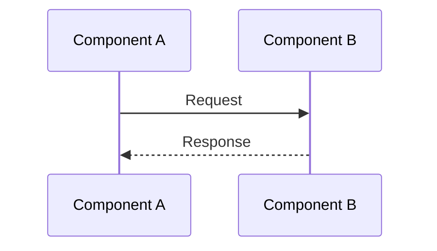
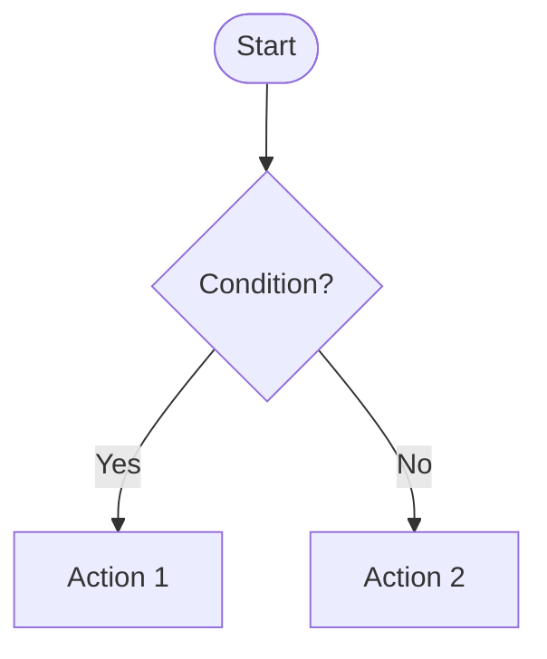
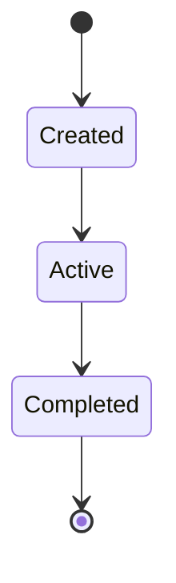
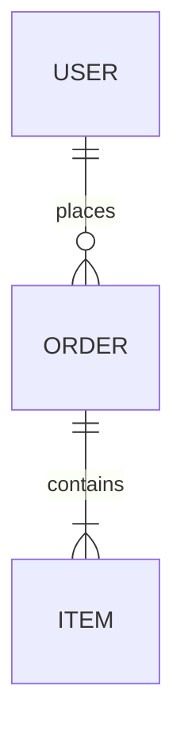
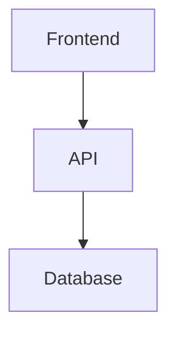

# Diagram Requirements Rule

**Category:** Documentation
**Priority:** Medium
**Version:** 1.0.0
**Applies To:** Complex features, workflows, architecture changes

---

## Overview

All complex implementations MUST include Mermaid diagrams for visualization. Diagrams improve understanding, reduce miscommunication, and serve as living documentation.

---

## When Diagrams Are REQUIRED

```toon
required_triggers[6]{scenario,diagram_type,location}:
  New feature with 3+ components,Sequence/Flowchart,docs/ or inline
  API design with 3+ endpoints,Sequence diagram,API docs
  State management changes,State diagram,Tech spec
  Multi-step workflow,Flowchart,Feature docs
  Agent collaboration (2+ agents),Swimlane/Sequence,Phase 2 deliverable
  Database schema changes,ER diagram,Migration docs
```

---

## When Diagrams Are RECOMMENDED

```toon
recommended_triggers[4]{scenario,diagram_type,benefit}:
  Bug fix with complex flow,Flowchart,Root cause clarity
  Refactoring,Before/After comparison,Impact visibility
  Integration with external API,Sequence diagram,API contract clarity
  Performance optimization,Timeline/Gantt,Bottleneck identification
```

---

## Diagram Types by Use Case

### 1. Sequence Diagrams
**Use for:** Interactions between components, API calls, agent handoffs



### 2. Flowcharts
**Use for:** Decision trees, process flows, conditional logic



### 3. State Diagrams
**Use for:** Lifecycle states, status transitions, workflow states



### 4. Entity Relationship (ER) Diagrams
**Use for:** Database schemas, data models



### 5. Architecture/Graph Diagrams
**Use for:** System architecture, component relationships



---

## Phase-Specific Requirements

### Phase 2: Technical Planning
**MUST include:**
- Architecture diagram (component relationships)
- Sequence diagram (main user flow)

### Phase 3: UI Breakdown
**SHOULD include:**
- Component hierarchy diagram
- State flow diagram (if stateful)

### Phase 4: Test Planning
**SHOULD include:**
- Test coverage flowchart
- Integration test sequence

### Phase 5: Implementation
**MUST update:**
- Any diagrams that changed during implementation

---

## Diagram Quality Standards

### MUST Have
- [ ] Clear title describing what the diagram shows
- [ ] All components labeled
- [ ] Flow direction indicated (arrows)
- [ ] Legend if using custom symbols

### SHOULD Have
- [ ] Color coding for different types (optional)
- [ ] Notes for complex logic
- [ ] Version/date in comments

### MUST NOT
- [ ] Over-complicate with too many elements (max 15-20 nodes)
- [ ] Use unclear abbreviations without legend
- [ ] Leave placeholder text

---

## Location Guidelines

```toon
location_rules[4]{diagram_scope,location,format}:
  Feature-specific,docs/features/[feature]/,Inline in markdown
  Architecture-level,docs/architecture/,Dedicated .md file
  API documentation,docs/api/,Inline in API docs
  Workflow/Process,docs/WORKFLOW_DIAGRAMS.md,Append to central file
```

---

## Enforcement

### During Phase 2 (Design)
- Reviewer checks for required diagrams
- Missing diagrams = approval blocked

### During Phase 6 (Code Review)
- Verify diagrams match implementation
- Update outdated diagrams

### During Phase 8 (Documentation)
- Final diagram review
- Ensure all diagrams are accessible

---

## Tools

### Rendering
- **GitHub:** Native Mermaid support in markdown
- **VS Code:** "Markdown Preview Mermaid Support" extension
- **Online:** [mermaid.live](https://mermaid.live)

### Export
```bash
# Export to PNG/SVG
npx @mermaid-js/mermaid-cli -i diagram.md -o output.png
```

---

## Examples Reference

See `docs/WORKFLOW_DIAGRAMS.md` for comprehensive examples of all diagram types.

---

**Version:** 1.0.0 | **Last Updated:** 2025-12-11
