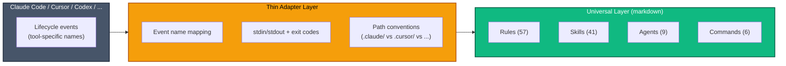

# Portability — Aura Frog Across AI Coding Tools

## Why Portability Matters

The AI coding-tool landscape is moving fast. Teams often use Claude Code, Cursor, Codex, Windsurf, and others — sometimes concurrently. The rules, skills, and agent conventions you invest in should **outlast any single tool's lifecycle**. If a better tool ships next year, your workflow discipline shouldn't start from zero.

Aura Frog is designed as an **instruction layer**, not a Claude Code addon. The bulk of the plugin is markdown conventions that any modern AI coding tool can consume. Only the thin hook layer is tool-specific — and swapping it is an engineering exercise, not a rewrite.

---

## Portability Layers

| Layer | Content | Portability | Notes |
|-------|---------|-------------|-------|
| Rules (57) | Markdown principles, TOON tables | **95% universal** | Pure prompting, no tool-specific syntax |
| Skills (41) | `SKILL.md` with YAML frontmatter | **85% universal** | Frontmatter field names vary (`autoInvoke` vs `auto_invoke`, etc.) |
| Agent definitions (9) | YAML + markdown | **90% universal** | Tool-allowlist concept maps cleanly across tools |
| Commands (6) | Markdown playbooks | **80% universal** | Slash-command UX varies per tool |
| Hooks (28) | `.cjs` scripts on Claude Code events | **20% — adapters needed** | Event names and IPC conventions are tool-specific |
| MCP servers (6) | Model Context Protocol | **100% universal** | MCP is an open cross-tool standard |

**Weighted average across layers: ~87% portable** (weighted by file count).

---

## Adapter Architecture

Aura Frog's hook layer is deliberately thin — 28 handler scripts, ~1,000 lines of CommonJS, each responding to a well-defined event (PreToolUse, PostToolUse, SessionStart, etc.). Porting to another tool boils down to **mapping event names and I/O conventions**.

### Event Mapping Table

| Aura Frog hook | Claude Code event | Cursor equivalent | Codex equivalent |
|----------------|-------------------|-------------------|------------------|
| `pre-tool-use` | `PreToolUse` | `before_tool` | `tool_guard` |
| `post-tool-use` | `PostToolUse` | `after_tool` | `tool_hook` |
| `session-start` | `SessionStart` | `on_open` | `init` |
| `pre-compact` | `PreCompact` | N/A (manual) | N/A |
| `post-compact` | `PostCompact` | N/A | N/A |
| `stop` | `Stop` | `on_idle` | `finish` |

Exact equivalents above are best-effort — see each tool's extension docs for authoritative mappings.

---

## Current Status

| Tool | Status | Estimated coverage | What works / what doesn't |
|------|--------|-------------------:|---------------------------|
| **Claude Code** | ✅ First-class, fully tested | **100%** | Everything |
| **Codex** | 🔄 Adapter in planning | **~85%** | Skills + commands + MCP. No hooks (Codex has no lifecycle events). |
| **Cursor** | 🔄 Adapter planned Q2 2026 | **~80%** | Rules + skills + agent conventions. Different extension model. |
| **Windsurf** | 📋 Community request | **~75%** | Rules + skills + MCP. Unknown hook parity. |

Coverage numbers are **estimates based on documented feature overlap** — not measured. They'll be updated once adapters ship and real-world compatibility testing runs.

---

## Porting Guide for Contributors

If you want to adapt Aura Frog for your tool:

1. **Copy the universal layer as-is:** `aura-frog/rules/`, `aura-frog/skills/`, `aura-frog/agents/`, `aura-frog/commands/`
2. **Rewrite `aura-frog/hooks/`** in your tool's extension language (CommonJS, Python, Lua, etc.)
3. **Map event names** per the table above — each Aura Frog hook script maps to one or more of your tool's events
4. **Adjust paths:** Claude Code convention `.claude/logs/runs/` becomes `.cursor/runs/` or whatever your tool uses
5. **Translate `.mcp.json`** to your tool's MCP config format (most accept the same JSON schema)
6. **Run behavioral evaluation** via `cc-plugin-eval` (port the runner; the test scenarios are portable)

Reference port: [link will be added when the Codex adapter ships]

---

## Non-Portable Items (and Why)

| Item | Why not portable | Workaround |
|------|------------------|------------|
| `CLAUDE.md` filename | Claude Code convention | Symlink or copy at install: `cp CLAUDE.md AGENTS.md` (Codex) or `ln -s` |
| `effort: high` frontmatter | Claude Code–specific config | Other tools ignore unknown fields; map to temperature if needed |
| `paths: "**/*.tsx"` auto-invoke | Claude Code skill feature | Fall back to manual invocation or name-based matching |
| `cache_control` breakpoints | Anthropic SDK–specific | Tool's native caching (if any) or plain context management |
| `subagent_type` values | Claude Code Agent tool | Other tools map to their own spawn primitive or skip |

These exceptions are documented but don't compromise the 95% markdown that ports cleanly.

---

## FAQ

**Q: Does "95% portable" mean I can just copy-paste and run?**
No. The 95% applies to the content (rules, skills, agent definitions, commands, MCP). The remaining 5% — hooks — must be ported to each tool's extension model. Total porting work: typically 1–2 days per target tool for the full hook suite.

**Q: What if I use Claude Code today and never switch?**
Portability costs you nothing. The design works great as a Claude Code–native plugin. Portability is future-proofing.

**Q: Is there a runtime adapter, or do I have to maintain forks?**
Planned: a single adapter repo per target tool (`aura-frog-codex`, `aura-frog-cursor`) that pulls the universal layer as a submodule or published package. See the roadmap for timelines.

**Q: Can I contribute a Windsurf or Cline adapter?**
Yes — we welcome it. Follow the Porting Guide above and open a PR. The reference implementation will be the Codex adapter when it ships (target Q2 2026).

---

## Related

- [README.md](../README.md) — installation + workflow walkthrough
- [BENEFITS.md](reference/BENEFITS.md) — full capability guide (see Part 9: Tool-Agnostic Investment)
- [CHANGELOG.md](reference/CHANGELOG.md) — release history
