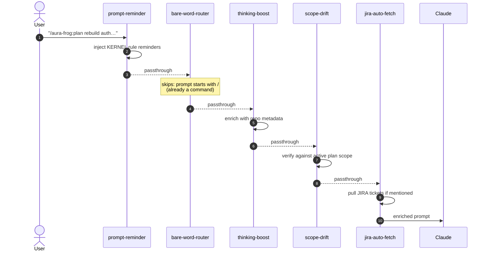
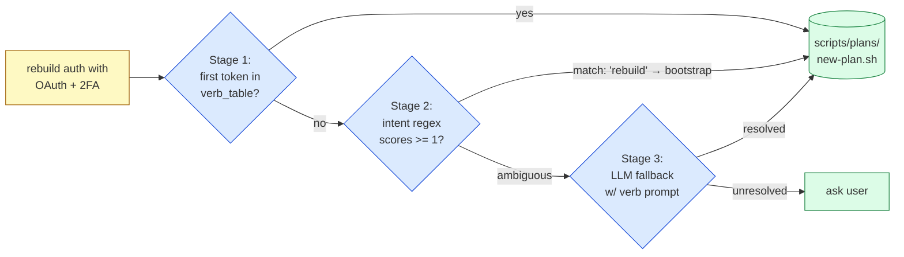
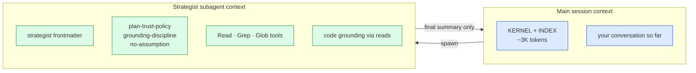
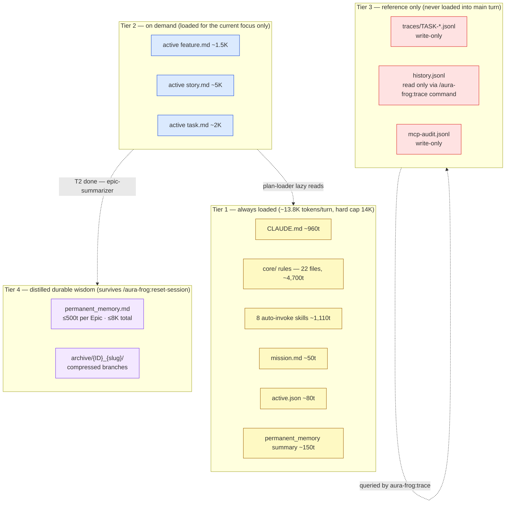
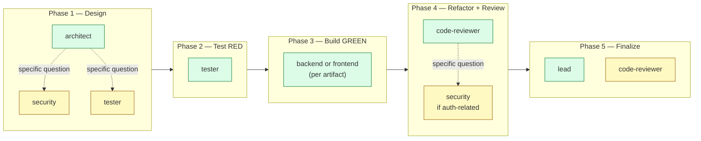
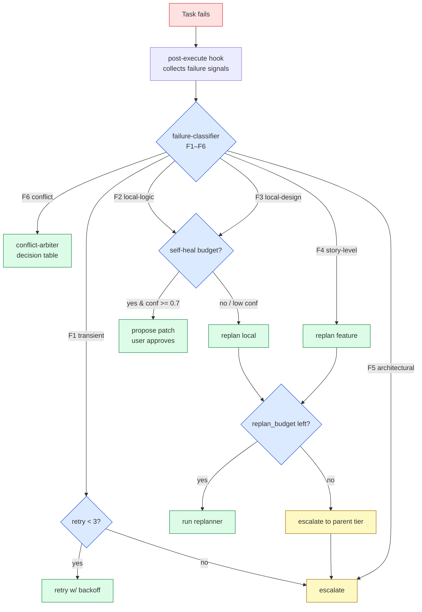

# Hierarchical Planning — Runtime Deep Dive

> Companion to [`README.md § Pillar 1`](../../README.md#1--hierarchical-planning--). The README gives you the *what*. This file walks the *how* — every agent invocation, every memory tier, every failure path — from the moment you type `/aura-frog:plan` until a T4 task closes out.
>
> Audience: anyone curious about the runtime mechanics. Required reading before you propose changes to: planning agents, plan-loader / permanent-memory-loader skills, the bare-word router, or the failure classifier.

---

## TL;DR — five engineering decisions

1. **Determinism over judgment.** Auto-decisions (routing, classification, conflict detection) are deterministic rules — no LLM judge. LLM tokens go to creative work only: interview, decomposition, code, distillation.
2. **Separation over consensus.** No N-agent voting. Each phase has one primary + scoped consultants. Builder ≠ reviewer. Master-planner ≠ executor. Conflict-arbiter is neither party to the conflict.
3. **Memory by layers, not by retrieval.** No vector DB. Four physical tiers, each with its own load discipline and trust ceiling. Token cost is bounded regardless of project age.
4. **Grounding by trace, not by introspection.** Every claim must point at a prior `file_read` event with matching content. Grounding is an O(1) JSONL lookup, not an LLM self-review.
5. **Bounded over unbounded.** Every loop has a budget — retries, replans, self-heals, freezes. When budgets exhaust, the system escalates to a human, not to itself.

---

## Stage 1 — Bootstrap: what runs when you type `/aura-frog:plan`

Walk-through with the example input:

```
/aura-frog:plan "rebuild auth with OAuth + 2FA"
```

### 1.1 Hook chain fires before Claude sees the prompt

`UserPromptSubmit` hooks fire in the order declared in `aura-frog/hooks.json`. Each hook is a fresh Node process (~50 ms cold start). Total budget for the chain is ~250 ms.



`bare-word-router` deliberately no-ops on slash-prefixed prompts (`startsWith('/')` → exit). Its job is single-verb shortcuts like `next` or `expand FEAT-A` when a plan is active — *not* to route an explicit command.

### 1.2 Command file pulls in the orchestrator skill

Claude sees `/aura-frog:plan`, opens `aura-frog/commands/plan.md`, and that file's "Execution Protocol" requires reading `aura-frog/skills/plan-orchestrator/SKILL.md` in full before any routing decision.

```
commands/plan.md (user-facing surface)
        ↓ delegates to
skills/plan-orchestrator/SKILL.md (the playbook)
        ↓ dispatches to
scripts/plans/<verb>.sh (the deterministic mechanic)
        ↓ may invoke
agents/<specialist>.md (LLM work, isolated subagent context)
```

### 1.3 Three-stage routing pipeline (no extra LLM call)



Stage 1 is a string compare. Stage 2 is regex. Stage 3 is the only path that costs an LLM call, and it only fires when the prior two are inconclusive.

### 1.4 The first real agent — `strategist`

`new-plan.sh` does not write the plan tree directly. It hands off to the `strategist` agent via the Agent-tool subagent mechanism. Frontmatter on `aura-frog/agents/strategist.md`:

```yaml
---
name: strategist
description: "Business strategy, MVP scoping, ROI evaluation. Use in Phase 1 Deep tasks…"
tools: Read, Grep, Glob          # read-only on code
model: sonnet                    # creative reasoning, not the heaviest model
color: green
---
```

> Sanity-check: the `strategist` agent ships on `sonnet`, not `opus`. The plan-orchestrator skill itself is fine to run on the inherited session model — there is no `model:` override on the skill. Reach for `model: opus` only on `master-planner` / `conflict-arbiter` / `epic-summarizer`, where the design contract calls for the strongest reasoning.

### 1.5 Subagent isolation — the strategist does not pollute your main context



The strategist runs in a fresh context (only its frontmatter + the rules it explicitly cites). It returns a structured summary to the main session — never its full thinking. This is what keeps the main session under budget even when planning is intensive.

### 1.6 Plan tree on disk (v3.7.3+ layout)

After the interview, the planning agents (strategist + master-planner + feature-architect) write:

```
.claude/plans/
├── INDEX.md                              ← human-readable layout doc
├── active.json                           ← focus pointer (T0 → T4)
├── .counters.json                        ← ID counters
├── history.jsonl                         ← append-only decision log
├── conflicts.jsonl                       ← append-only conflict log
├── mission/mission.md                    ← T0
├── initiatives/INIT-001_q1-rollout/      ← T1 (optional tier)
│   └── initiative.md
└── features/JIRA-1234_oauth-flow/        ← T2 — ticket prefix when attached
    ├── feature.md                        ← spec + ## Runs table
    ├── REQUIREMENTS.md · DESIGN.md       ← /run Phase 1 deliverables
    ├── checkpoints/{ISO8601}.json
    ├── subfeatures/                      ← (optional) T2 recursion
    │   └── FEAT-B_kid-feature/
    │       ├── feature.md
    │       └── stories/…                 ← subfeatures own their own stories
    └── stories/STORY-0001_login-form/    ← T3
        ├── story.md
        └── tasks/TASK-00001_password-input/  ← T4
            ├── task.md
            ├── trace.jsonl               ← per-task forensic log
            └── checkpoints/
```

Frontmatter on every node is strict — the validator script `validate-plan-tree.sh` rejects writes that drop fields. Example for a T2 feature:

```yaml
---
id: FEAT-001
tier: 2
parent: INIT-001            # or MISSION when T1 is skipped
status: planned             # planned | active | done | frozen | discarded
intent: "OAuth provider integration"
acceptance_summary: "Done when sign-in via Google works end-to-end"
context_budget: 8000        # token cap when this node is the active focus
created_at: 2026-05-11T10:00:00Z
revision: 0                 # bumped on every mutation
deviation_score: 0.0        # rolling drift indicator, 0.0 - 1.0
replan_count: 0
replan_budget: 2            # per-node budget; exceed → escalate up a tier
---
```

### 1.7 Decision log (`history.jsonl`) appended atomically

```jsonl
{"ts":"2026-05-11T10:00:15Z","verb":"plan_create","node":"MISSION","agent":"strategist","reason":"user_invoked"}
{"ts":"2026-05-11T10:00:16Z","verb":"plan_create","node":"INIT-001","agent":"strategist","reason":"derived_from_mission"}
{"ts":"2026-05-11T10:00:17Z","verb":"plan_create","node":"FEAT-001","agent":"strategist","reason":"detected_feature_oauth"}
```

Strategist exits. The subagent context is wiped. Main session resumes with only `active.json` (~80 tokens) loaded — Claude knows the plan exists and where the focus is, but doesn't carry the full tree.

### 1.8 The single most-misunderstood part: planning **does not replace** the 5-phase TDD

A common failure mode after the plan tree exists: the user runs `/run feature: FEAT-A` and the model jumps straight to Build GREEN because `feature.md` already documents acceptance criteria. **This is wrong.** The plan tree contains *intent*; the 5-phase workflow converts intent into *executable contracts and verified code*. Both are needed.

| What the plan tree provides | What the 5-phase workflow still does |
|---|---|
| Acceptance criteria (intent) | **Phase 1** — Sprint Contract negotiation (binds intent to a concrete, testable design) |
| Design notes + dependency hints | **Phase 1** — architect proposes the implementation approach grounded in the codebase, surfaces tradeoffs |
| Story / Task decomposition | **Phase 2** — tester writes the failing tests that lock the acceptance criteria into the runner (intent → executable contract) |
| `acceptance_refs` list | **Phase 3** — builder writes the minimum code that turns each ref green |
| `## Runs` table for forensic history | **Phase 4** — different reviewer (not the builder) verifies, refactors, runs cross-checks |
| Plan-state transitions to `done` | **Phase 5** — Finalize writes deliverables back into the plan node and bumps its `status` |

**Anchoring is wiring, not bypass.** When `/run` finds `active.json#active.task`, it auto-anchors so deliverables sync back to the task — but every `/run` cycle still executes Phase 1 → 2 → 3 → 4 → 5. The most commonly-skipped phase under the misread is **Phase 2** ("the plan has acceptance criteria, why write failing tests?") — and that is the exact bug this contract exists to prevent. Acceptance criteria are *intent*; failing tests are *executable contracts*. Phase 2 converts one into the other; nothing else does.

**One `/run` covers one task's full 5-phase cycle.** A feature with 5 tasks needs 5 `/run` invocations — each one claims the next ready task via `/aura-frog:plan next` (or just `next` as a bare word with a plan active), auto-anchors, and runs 5 phases. `/run feature: FEAT-A` does **not** loop through every task of FEAT-A automatically; it runs the 5 phases against one task and stops.

---

## Stage 2 — Memory architecture: four physical tiers (no vector DB)

A frequent misread: "AI plus planning ⇒ vector DB / RAG." Aura Frog does neither. The memory model is four layers stacked on the local filesystem, each with a different load policy.



| Tier | What lives there | Read by | Lifetime | Cost discipline |
|---|---|---|---|---|
| **1 — Always loaded** | KERNEL rules + auto-invoke skill bodies + `mission.md` + `active.json` + permanent-memory summary lines | Every Claude turn | Until rule / skill removed | ~13.8K hard cap; skills measure on load |
| **2 — On demand** | `feature.md` / `story.md` / `task.md` for the *active* branch only | `plan-loader` skill, on turns where the focus shifts | Loaded for the turn, dropped after | ≤ 800 tokens regardless of tree size |
| **3 — Reference only** | `trace.jsonl` per task, `history.jsonl`, `conflicts.jsonl`, MCP audit log | `/aura-frog:trace`, `/aura-frog:plan undo`, forensic replay — *separate query, not the main turn* | Append-only forever | Never leaks into main context |
| **4 — Distilled durable** | `permanent_memory.md` (≤ 500 tokens per Epic, ≤ 8K total file) + `archive/{ID}_{slug}/summary.md` | `permanent-memory-loader` (every turn — summary lines only); full Epic sections on demand | Survives `/aura-frog:reset-session` | Strict caps; oldest Epic archives when full |

### Tier 2 — what `plan-loader` actually loads

`plan-loader` is the only auto-invoke skill that touches the plan tree on every turn. Order of operations:

1. Detect `.claude/plans/` (silent exit if absent — zero overhead for un-planned projects).
2. Read `active.json` to get the focus pointer.
3. Load `mission.md` (always).
4. Walk down the active branch: load active `initiative.md` (if any) → active `feature.md` → active `story.md` → active `task.md`.
5. For the active story, load *summaries* of sibling T4 tasks (id + intent + status), not full bodies.
6. Stamp every loaded node with `trust: plan` per `memory-trust-policy.md`.

The tree could have hundreds of features. Token cost stays ≤ 800 because everything outside the active branch is left on disk.

### Tier 4 — distillation rules

When a T2 feature transitions to `status: done`, the `feature-done-trigger-archive.cjs` hook fires both `epic-summarizer` (writes durable wisdom to `permanent_memory.md`) and `plan-archivist` (compresses the subtree into `archive/`).

`epic-summarizer` operates under strict caps:

- ≤ 500 tokens per Epic
- ≤ 8,000 tokens total file (oldest Epic archives out when the cap is hit)
- No verbatim file content — `sha256:abc…` references only
- No step-by-step walkthroughs; no conversation transcripts
- Confidence-scored: items < 0.7 land in a `### Tentative (low confidence)` subsection

Output template:

```markdown
## Epic: FEAT-001 — OAuth Integration
**Completed:** 2026-05-15T14:00:00Z

### Architectural decisions
- DEC-001: OAuth state in encrypted cookie (not session)
  Rationale: stateless servers; avoid Redis dependency. (Confidence: 0.92)

### Gotchas discovered
- Provider redirect uses query param, NOT hash fragment. (Confidence: 0.95)

### Anti-patterns to avoid
- Never store provider secrets in localStorage. (Confidence: 1.00)
```

### Memory trust policy — sources are ranked, not equal

`memory-trust-policy.md` (always-loaded rule) ranks every memory source so the model knows what to weigh higher when sources disagree:

| Source | Confidence ceiling | Why |
|---|:---:|---|
| `file_read` event (sha256 verified) in the current turn | **1.00** | Fresh, ground-truth on disk |
| Plan node body (user-approved spec) | 0.95 | Approved at gate, but older than fresh read |
| `permanent_memory.md` Epic section | 0.85 | Distilled — accurate but lossy |
| `history.jsonl` decision entry | 0.75 | Past intent, not current state |
| Claude's recollection without grounding | < 0.50 → **BLOCKED** | Hallucination risk |

Stale wisdom never overrides fresh evidence. A fresh `file_read` always wins over a 2-week-old `permanent_memory` claim.

---

## Stage 3 — Anti-hallucination: deterministic, not LLM-judged

Aura Frog's grounding discipline is enforced by an O(1) check against an append-only trace, not by asking another LLM "does this claim look right?"

### Mechanism 1 — Grounding check (per-claim, O(1))

Every claim about the codebase must reference a prior `file_read` event. Schema:

```jsonl
{"type":"file_read","ts":"...","payload":{"path":"src/auth.ts","sha256":"abc123","lines":"1-120"}}
{"type":"tool_call","ts":"...","payload":{"tool":"Edit","args_hash":"def456"}}
{"type":"output_claim","ts":"...","payload":{
   "claim":"verifyToken exported from src/auth.ts line 45",
   "grounded_in":"file_read#0",
   "confidence":0.95
}}
```

`grounding-discipline.md` (always-loaded core rule) is the contract:

> Every factual claim about codebase content MUST carry a `grounded_in` field pointing at a prior `file_read` event for the cited path. Claims missing `grounded_in` with confidence > 0.5 are flagged `ungrounded` and reviewed by `/aura-frog:trace --hallucinations`.

Conceptually the check looks like this (lookup, not LLM):

```python
def check_output_claim(claim, prior_events):
    if not claim.payload.grounded_in:
        return FLAG_UNGROUNDED if claim.payload.confidence > 0.5 else OK
    ref = prior_events[parse_idx(claim.payload.grounded_in)]
    if ref.type != "file_read":      return FLAG_BAD_REF
    if ref.path not in claim.claim:  return FLAG_WRONG_FILE
    return OK
```

User-facing surface (`/aura-frog:trace`):

```text
🐸 47 events recorded:
   ✓ 14 file_read  (grounded evidence)
   ✓ 8  tool_call
   ✓ 24 output_claim  (23 grounded, 1 flagged)

   ⚠ TR-00001-031: ungrounded claim
     "verifyToken accepts options.algorithm parameter"
     Confidence: 0.80
     No prior file_read for src/auth.ts mentions options.algorithm.

   Recommend: /aura-frog:plan undo --to-event TR-00001-031
```

### Mechanism 2 — Hallucination vs. logic error

The same event stream lets us distinguish two failure shapes that need *different* remediation:

| Symptom | Trace fingerprint | Remedy |
|---|---|---|
| **Hallucination** | `output_claim` flagged ungrounded · `file_write` to a path never `file_read` · references to nonexistent symbols | Undo to before the bad claim; retry with stricter grounding |
| **Logic error** | All claims grounded with confidence ≥ 0.9 · all reads sha-verified · `acceptance_check` still fails | Keep the grounded facts; replan the approach |

### Mechanism 3 — Confidence gates

```
1.00         direct file_read quote                  → trust as-is
0.90–0.99    inferred from grounded evidence          → trust + cross-check
0.50–0.89    partial evidence                          → flag for review
< 0.50       speculation                               → BLOCKED at pre-flight gate
```

`pre-flight-validate.cjs` inspects the upcoming tool call. If any `output_claim` with confidence < 0.5 lands in the input context, the tool call is **blocked before execution** — damage prevented at the gate, no undo needed.

### Mechanism 4 — Trust + grounding layered together

A claim's effective confidence is `min(grounding_confidence, source_trust_ceiling)`:

- Grounded in a fresh `file_read` → up to 1.00
- Grounded in `permanent_memory.md` → capped at 0.85
- Grounded in a `history.jsonl` entry → capped at 0.75
- No grounding → < 0.50 → blocked

Concrete consequence: "I remember from a past Epic" can never override "I just read this file." Layered ranking prevents stale wisdom from displacing fresh evidence.

---

## Stage 4 — Agent coordination: separation, not consensus

Aura Frog deliberately rejects the panel-of-experts pattern (AutoGen / MetaGPT / chain-of-debate). Reasons:

- Agents agree with each other too quickly (in-group confirmation bias)
- N agents = N× token cost per decision
- "Who wins" is ambiguous when they disagree
- Accountability vanishes when something goes wrong

Aura Frog uses **role separation + sequential review** with a hard rule: **the reviewer is never the builder**.



### Consultants speak to a scoped question, they do not vote

When the phase primary hits an uncertain sub-decision, it spawns a consultant subagent **with a scoped question** — not "what do you all think?"

```text
Phase 1 architect designs the OAuth flow
        ↓
Uncertain: JWT or session token?
        ↓
Spawn subagent: security agent with scoped prompt:
   "Given context X, recommend JWT vs session for an OAuth flow.
    Constraints: stateless servers; no Redis dependency."
        ↓
Security returns: "JWT, short expiry + refresh rotation"
        ↓
Architect proceeds with the recommendation
        ↓
history.jsonl logs the delegation; trace event records the security
agent's reasoning summary
```

One consultant per uncertain decision. No panel. Security owns that answer; if it's wrong, accountability is unambiguous.

### Builder ≠ Reviewer — enforced, not requested

```bash
# excerpt of run-orchestrator gate check
if [[ "$P3_AGENT" == "$P4_AGENT" ]]; then
  echo "ERROR: Phase 4 reviewer cannot be the Phase 3 builder" >&2
  exit 1
fi
```

Code review by the author has measurable blind spots even when the author is an LLM — confirmation bias is real in language models.

### Conflict-arbiter — the exception with a decision table

When two tasks overlap (file / function / schema / semantic / architectural — the L1–L4 layers), the `conflict-arbiter` agent applies a **deterministic decision table**, not a vote:

| Conflict layer | Tier of candidate | Pending status | Default action |
|---|---|---|---|
| L1 (file) | T4 | pending-confirm | freeze candidate |
| L1 (file) | T4 | active | force-sequence (reorder) |
| L2 (function) | T4 | any | freeze candidate |
| L2 (schema) | T4 | any | replan candidate |
| L3 (semantic) | T4 | pending-confirm | freeze + flag for human |
| L4 (architectural) | any | n/a | replan + escalate to human if T1 |

Arbiter logs the decision to `conflicts.jsonl`. Single accountability.

### Master-planner — the kernel that never executes

```yaml
---
name: master-planner
description: Stateful kernel controller for the plan tree. Owns plan persistence at
.claude/plans/, dispatches replan decisions via failure-classifier, audits every
decision to history.jsonl. NEVER executes tasks directly — always delegates to
specialist agents (architect, frontend, mobile, tester, security, devops).
tools: Read, Write, Edit, Glob, Grep, Bash
mcp_servers: []
color: yellow
---
```

Hard constraint: master-planner does not write application code, run tests, or edit non-plan files. Its job is to read the tree, decide *retry / replan / freeze / escalate*, append to `history.jsonl`, and dispatch. The OS analogue is obvious: master-planner = scheduler. Specialist agents = processes. The scheduler does not compute; it schedules.

---

## Stage 5 — Failure handling: bounded, explicit, escalating

When a task fails, the chain is deterministic — classifier → decision engine → action — and every step has a budget.



### Failure signals (what the post-execute hook collects)

```yaml
result:
  status: failed
  failure_signals:
    error_class: AssertionError
    error_recurrence: 3
    files_thrashed: [src/auth.ts, src/auth.ts, src/auth.ts]
    test_pass_delta: -2
    deviation_from_plan:
      unplanned_files: [src/utils/log.ts]
      skipped_acceptance: [AC-2]
    discoveries:
      - "Existing JWT lib uses a different signing algorithm"
    sibling_fail_rate: 0.0
    cause: test_failure
```

### Classifier — deterministic, no LLM

The shipped taxonomy is **F1 – F6** (F6 added in v3.7.0-beta.2 for conflict-induced failures):

| Class | Meaning | Recommended action |
|---|---|---|
| **F1** | Transient (network, lock, ECONNRESET, rate limit) | Retry with backoff (max 3) |
| **F2** | Local logic (test fail, type error, lint, assertion) | Single retry, or self-heal-propose |
| **F3** | Local design (acceptance unreachable as designed; same test fails 2 fixes in a row) | Replan story (re-decompose T3) |
| **F4** | Story-level (sibling task contracts broken; deviation_score ≥ 0.7) | Replan feature (re-decompose T2) |
| **F5** | Architectural (cross-feature impact; mission constraint violated) | Freeze + escalate to user |
| **F6** | Conflict-induced (`cause: conflict` or non-null `conflict_id`) | Defer to conflict-arbiter |

Decision rules are regex over signals — no LLM call.

### Self-healing — propose, never auto-apply

F2 / F3 with budget remaining and confidence ≥ 0.7 triggers `self-healing-orchestrator`. It **proposes** a patch and **stops**. The user approves via `/aura-frog:heal accept <id>`.

```
🐸 Self-diagnosed (confidence 0.85, F3 local design):

Error: AssertionError — expected callback URL to use a query param.

Diagnosis (from context7 + permanent_memory.md DEC-007):
  • OAuth callbacks use the query string, NOT the hash fragment.
  • Same gotcha recorded in FEAT-005's Epic distillation.

Proposed patch:
  - const session = parseHashFragment(window.location.hash)
  + const session = new URLSearchParams(window.location.search).get('session')

Apply? [y / n / modify / skip]
```

Source restrictions are strict: `context7` (official docs) and `permanent_memory.md` (this project's own learning) only. No Stack Overflow, no random blogs, no general web search. Self-heal counts toward `replan_budget`; max 1 per task, max 5 per session — preventing the "AI suggests fix → fails → suggests another → fails" loop.

### Circuit breakers — the last line of defense

```yaml
circuit_breaker:
  retry_storm:
    threshold: 3 failures in 10 minutes
    half_open_after: 30 minutes
  replan_thrash:
    per_node_budget: 2
    escalate_to: parent_tier
    final_escalation: human
```

A T4 task that exhausts its replan_budget escalates to its T3 story for replan. If T3 replan also exhausts, escalate to T2. T2 exhaustion → human. The escalation ladder is what makes Aura Frog **not** an AutoGPT-style infinite loop: the worst-case token spend is bounded.

---

## Why this design — three trade-offs we accept

| What we give up | What we get |
|---|---|
| Slower than autonomous loops on straightforward work | Bounded token cost — you know the worst case |
| More up-front design (plan tree shape, frontmatter discipline) | Forensic audit — every decision is traceable |
| More approval gates than fully-autonomous agents | No silent failures — escalation goes to a human |

This is an explicit engineering trade-off vs. "let the agent figure it out." Aura Frog optimises for **predictable cost, audit trail, and bounded blast radius** — three properties that matter when you ship to production.

---

## Where to read next

- **Pillar overview:** [`README.md § 1 · Hierarchical Planning`](../../README.md#1--hierarchical-planning--) — the marketing-flavored summary with diagrams.
- **Schema spec:** generated `INDEX.md` at `.claude/plans/INDEX.md` (auto-emitted by `new-plan.sh`) — canonical file layout.
- **Skill playbook:** [`aura-frog/skills/plan-orchestrator/SKILL.md`](../../aura-frog/skills/plan-orchestrator/SKILL.md) — the 11-verb dispatcher.
- **Plan-loader budget math:** [`aura-frog/skills/plan-loader/SKILL.md`](../../aura-frog/skills/plan-loader/SKILL.md) — how the 800-token ceiling holds.
- **Grounding discipline rule:** [`aura-frog/rules/core/grounding-discipline.md`](../../aura-frog/rules/core/grounding-discipline.md) — the anti-hallucination contract.
- **Memory trust policy:** [`aura-frog/rules/core/memory-trust-policy.md`](../../aura-frog/rules/core/memory-trust-policy.md) — source-ranked confidence ceilings.
- **Failure classifier taxonomy:** [`aura-frog/skills/failure-classifier/SKILL.md`](../../aura-frog/skills/failure-classifier/SKILL.md) — F1–F6 rules.
- **Conflict arbitration policy:** [`aura-frog/rules/workflow/conflict-arbitration-policy.md`](../../aura-frog/rules/workflow/conflict-arbitration-policy.md) — the L1–L4 decision table.
- **Self-healing rules:** [`aura-frog/skills/self-healing-orchestrator/SKILL.md`](../../aura-frog/skills/self-healing-orchestrator/SKILL.md) — the propose-never-apply contract.
