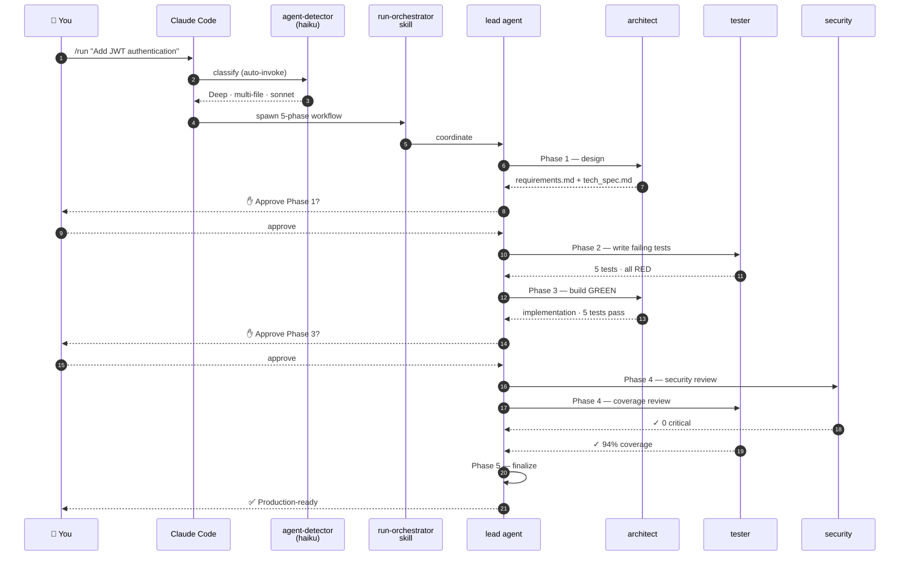

# Walkthrough: A Real Workflow in Action

A complete transcript of implementing user authentication with `/run`. This is what you actually see.

### Interaction Sequence



### Mock Terminal Transcript

```
$ /run "Add JWT authentication to the /api routes"

🐸 agent-detector (haiku):
   Complexity: Deep · Agent: architect (primary), security (reviewer)
   Model: sonnet · Estimated tokens: ~95K

🐸 Sprint Contract — confirm before Phase 2:
   Scope:     JWT middleware, /login + /refresh endpoints, user model
   Done when: 5 tests passing, 0 critical security findings, coverage ≥80%
   Out of scope: password reset, 2FA, social auth

Confirm contract? (yes / modify / skip)

> yes

═══════════════════════════════════════════════
Phase 1: Understand + Design  (architect)
═══════════════════════════════════════════════

📋 Requirements analyzed:
   • POST /auth/login  → issues JWT (15m) + refresh token (7d)
   • POST /auth/refresh → rotates access token
   • Middleware verifies JWT on protected routes
   • User.passwordHash stored as bcrypt (cost 12)

🎯 Technical Design:
   • Stack: express-jwt, bcrypt, crypto.randomUUID for jti
   • Token storage: httpOnly cookie (refresh) + Authorization header (access)
   • Refresh token rotation on every use (prevents replay)
   • RS256 signing (public/private keypair)

⚠️  Risks flagged by strategist:
   • Secret leak → env var with rotation plan
   • No rate-limit → add bucket before deploy (Phase 5 followup)

📁 Saved:
   .claude/logs/runs/250421-jwt-auth/phase-1/requirements.md
   .claude/logs/runs/250421-jwt-auth/phase-1/tech-spec.md

──────────────────────────────────────────────
✋ APPROVAL GATE — Phase 1

Options:
  approve            Continue to Phase 2 (write tests)
  modify <changes>   Adjust design without restart
  reject <reason>    Full redesign
──────────────────────────────────────────────

> approve

═══════════════════════════════════════════════
Phase 2: Test RED  (tester)
═══════════════════════════════════════════════

🧪 Writing failing tests (TDD RED)...
   ✓ auth.test.ts:  login returns JWT for valid creds         [FAIL — no implementation]
   ✓ auth.test.ts:  login rejects invalid password            [FAIL]
   ✓ auth.test.ts:  refresh rotates token on use              [FAIL]
   ✓ middleware.test.ts: rejects missing Authorization header [FAIL]
   ✓ middleware.test.ts: rejects expired JWT                  [FAIL]

📊 Status: 5 failing, 0 passing (correct for RED)

Auto-continue → Phase 3 (tests fail as expected) ✓

═══════════════════════════════════════════════
Phase 3: Build GREEN  (architect)
═══════════════════════════════════════════════

⚙️  Implementing...
   ✓ src/auth/jwt-service.ts    (new · 67 lines)
   ✓ src/auth/middleware.ts     (new · 42 lines)
   ✓ src/routes/auth.ts         (new · 58 lines)
   ✓ src/models/user.ts         (modified · added passwordHash)
   ✓ .env.example               (modified · added JWT_PRIVATE_KEY)

🧪 Running tests...
   ✓ 5 passing, 0 failing
   ✓ Coverage: 94% (target: 80%)

──────────────────────────────────────────────
✋ APPROVAL GATE — Phase 3

> approve

═══════════════════════════════════════════════
Phase 4: Refactor + Review  (security + tester)
═══════════════════════════════════════════════

🔒 Security review (reviewer ≠ builder):
   ✓ No hardcoded secrets (env var pattern correct)
   ✓ bcrypt cost 12 (OWASP minimum: 10)
   ✓ httpOnly cookie flag set on refresh token
   ⚠️  INFO: Consider CSP header on /login response (not blocking)

🧪 Test coverage review:
   ✓ 94% coverage (target: 80%) ✓
   ✓ All critical paths covered
   ✓ No flaky tests detected

Auto-continue → Phase 5 (0 critical findings) ✓

═══════════════════════════════════════════════
Phase 5: Finalize  (lead)
═══════════════════════════════════════════════

📦 Deliverables:
   ✓ 4 new files, 2 modified
   ✓ 5 tests passing, 94% coverage
   ✓ 0 critical security findings
   ✓ ADR saved: docs/adr/0007-jwt-auth.md
   ✓ Deployment note: add rate-limit middleware (tracked in phase-1/risks.md)

📊 Workflow stats:
   Duration: 18m · Tokens: 82K · Budget: 30K target → 2.7x (Deep tier norm)

Ready to commit? (yes / no)

> yes

💾 Committed: 7a3b9c2 · feat(auth): JWT authentication with refresh rotation

✅ Workflow complete — JWT auth shipped.
```

### What You Just Saw

| Step | Who ran it | Your role |
|------|------------|-----------|
| 1. Detection | `agent-detector` skill (haiku, auto) | Nothing — zero friction |
| 2. Sprint Contract | Orchestrator proposed | Confirm scope |
| 3. Phase 1 design | `architect` in forked context | Approve design |
| 4. Phase 2 RED | `tester` (auto-continues) | Nothing |
| 5. Phase 3 GREEN | `architect` implements | Approve implementation |
| 6. Phase 4 review | `security` + `tester` (NOT architect) | Nothing |
| 7. Phase 5 finalize | `lead` | Confirm commit |

**Two approvals. 18 minutes. Production-ready JWT auth with 94% coverage and security review.**

---
