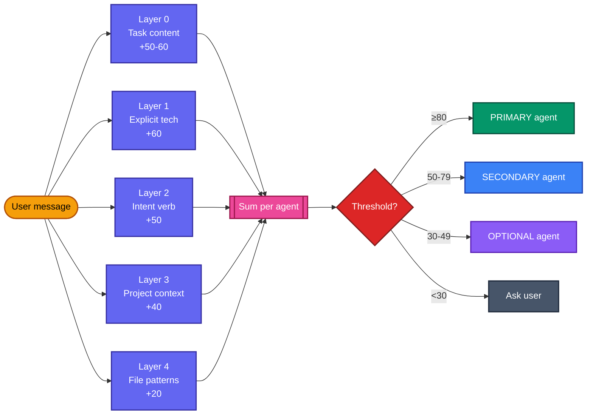

# Why Teams Ship Faster With Aura Frog

### 1. Smart Flow Selection — Right Effort for Every Task

**Not every task gets the 5-phase workflow.** Aura Frog's `agent-detector` classifies complexity on every message and picks the minimum viable flow:

| Task type | Flow | Gates | Example |
|-----------|------|:----:|---------|
| **Typo, one-line fix** | Direct edit (no workflow) | 0 | `/run fix typo in login.ts` |
| **Bug fix** | 4-step TDD (Investigate → RED → GREEN → Verify) | 0 | `/run fix login button not disabling` |
| **Refactor** | Analyze → plan → test → refactor | 0 | `/run refactor auth service` |
| **Add tests** | Detect framework → write → verify coverage | 0 | `/run add tests for payment` |
| **Feature (≤5 files)** | Single-agent inline with TDD | 0–1 | `/run add email validation` |
| **Feature (6+ files, architecture)** | **Full 5-phase workflow** | 2 | `/run implement user subscription` |

**When the 5-phase workflow DOES fire** (Deep complexity only):

```
  ✋ Phase 1: Understand + Design    → You approve the plan
  ⚡ Phase 2: Test RED               → Failing tests written
  ✋ Phase 3: Build GREEN            → You approve the implementation
  ⚡ Phase 4: Refactor + Review      → Auto quality + security check
  ⚡ Phase 5: Finalize               → Docs + notifications
```

**Escape hatches** — you control rigor when the detector gets it wrong:

- `/run fasttrack: <specs>` — skip Phase 1 if you've already designed
- `/run must do: <task>` / `just do: <task>` — bypass brainstorming, execute literally
- `/run reopen <phase>` — unfreeze an approved phase to revise
- `/run reason: sc|tot|cove` — opt in to heavy reasoning (Self-Consistency / Tree of Thoughts / Chain-of-Verification) for hard decisions
- `/run handoff` — save state, resume in a fresh session

**What you get vs what you skip:**
- 80% of tasks never see a gate — fast iteration
- 20% that *matter* (architecture, multi-file, vague scope) get disciplined TDD + human approval
- You never manually pick — the detector routes; you approve only when it matters

Full strategy matrix: [Routing Strategies](#routing-strategies) below. Full benefits guide: [docs/reference/BENEFITS.md](docs/reference/BENEFITS.md).

### 2. The Right Expert for Every Task

9 specialized agents activate automatically — no configuration:

```
"Build a React dashboard"     → frontend
"Optimize the SQL queries"    → architect
"Set up CI/CD pipeline"       → devops
"Fix the login screen crash"  → mobile
"Run a security audit"        → security
```

#### How Agent Detection Works



**Why 5 layers instead of one?** A backend repo can contain frontend work (Blade/Jinja templates, email HTML, PDF styling), and a frontend repo can need backend work (API rate-limits, auth logic). Repo type alone lies. **Task content (Layer 0) overrides repo context** — so `"Fix email template styling"` in a Laravel repo correctly routes to `frontend`, not `architect`.

Details: `skills/agent-detector/SKILL.md` + `skills/agent-detector/task-based-agent-selection.md`.

<details>
<summary>All 15 agents</summary>

| Agent | Model | Tools | When it activates |
|-------|-------|-------|-------------------|
| `lead` | **inherit** | full | Coordinates workflows, enforces gates |
| `architect` | **inherit** | full | System design, DB schema, backend APIs — uses Opus when session is Opus |
| `frontend` | **inherit** | full | React, Vue, Angular, Next.js + design systems — uses Opus when session is Opus |
| `mobile` | **inherit** | full | React Native, Flutter, Expo, NativeWind — uses Opus when session is Opus |
| `strategist` | sonnet | **read-only** | ROI, MVP, scope creep (Phase 1 Deep) |
| `security` | sonnet | **read-only** | OWASP, auth/crypto review (Phase 4) |
| `tester` | sonnet | full | Jest, Cypress, Playwright, Detox, coverage |
| `devops` | sonnet | full | Docker, K8s, CI/CD, monitoring |
| `scanner` | **haiku** | read + Bash | Project detection, session-start context |

Agent + complexity + model selection all done by the `agent-detector` skill (no separate router — consolidated in v3.6.0).

</details>

#### Per-Agent Model Override — How It Works and Why

Each agent and skill declares its own `model:` in YAML frontmatter. Claude Code resolves the model like this:

| Priority | Source | When it applies |
|:--------:|--------|-----------------|
| 1 (highest) | `CLAUDE_CODE_SUBAGENT_MODEL` env var | Override everything — useful for CI or cost control |
| 2 | Per-invocation `model` parameter | Rare — set at spawn time |
| 3 | Agent/skill frontmatter `model:` field | **This is where Aura Frog declarations live** |
| 4 (fallback) | Main session model | Used only if nothing above is set |

**Key point:** frontmatter wins over session model. If you started your session on Opus but invoke `agent-detector`, that skill runs on **haiku** — not Opus. The session model is the *fallback*, not the override.

Why we hard-code certain models:

| Agent or skill | Model | Why |
|----------------|:-----:|-----|
| `agent-detector`, `scanner` | **haiku** | Classification/detection tasks. Fire every message or session-start. Haiku is ~3× faster and ~10× cheaper. Opus here wastes budget. |
| `security`, `strategist`, `tester`, `devops` | **sonnet** | Balanced reasoning for review/analysis/tests/deploy. Locked to sonnet — Opus rarely pays back for these roles. |
| `lead`, `architect`, `frontend`, `mobile` | **inherit** | These do the heavy design/build work. If you chose Opus for a complex task, these agents should reason at Opus too. |

**What this means for you:**
- Starting a session on **Opus** → `lead`, `architect`, `frontend`, `mobile` all run on Opus (they inherit). Review/test/deploy stay on sonnet. Detection stays on haiku. You get Opus-quality design + sonnet-cost everything else.
- Starting on **Sonnet** → everything runs ≤ sonnet (haiku calls still haiku). No Opus unless you escalate the session.
- Want everything on one model? Set `CLAUDE_CODE_SUBAGENT_MODEL=opus` (env var at top of resolution order) — overrides every frontmatter declaration.

**Not what you want?** Edit the `model:` field in `aura-frog/agents/<name>.md` frontmatter. Remove the line to inherit session model. Change to `opus`/`sonnet`/`haiku` to lock. See the Frontmatter Maintenance Rule in `.claude/CLAUDE.md`.

### 3. Complex Features Get Debated Before Built

For deep tasks, 4 agents independently analyze your plan — then challenge each other:

```
📐 Architect    → "How to build it"
🔍 Tester       → "How it can fail"
👤 Frontend     → "How users experience it"
💼 Strategist   → "Should we even build this?"
```

Plans survive 4 rounds of scrutiny before a single line of code. Catches scope creep and wasted effort *before* it happens.

### 4. Your Codebase Loads in Seconds, Not Minutes

Run `project:init` once. Every future session instantly understands your codebase — conventions, architecture, patterns, file relationships. 12 pattern detections. 7 context files generated.

**No more re-explaining your project every session.**

### 5. Multi-Agent Teams for Big Features

For complex work, Aura Frog spins up a real team working in parallel:

```
lead
├── architect     → Designs the system
├── frontend      → Builds the UI
├── tester        → Writes tests
└── security      → Reviews for vulnerabilities

All cross-reviewing each other's work.
```

Only activates when needed. Simple tasks stay single-agent (saves ~3x tokens).

### 6. Context-Aware MCP Servers — Zero Config

6 bundled servers auto-invoke when Claude needs them:

```
"Build with MUI"          → context7 fetches current MUI docs
"Test the login page"     → playwright launches a browser
"Check test coverage"     → vitest runs your suite
"Deploy to Firebase"      → firebase manages the project
```

Plus Figma design fetching and Slack notifications.

<details>
<summary>More features</summary>

#### Self-Improving Learning
Detects your patterns, remembers corrections, creates rules that persist across sessions. Optional Supabase sync for teams.

#### Smart Complexity Routing
Automatically matches effort to task size — typos get direct edits, features get full workflows, architecture gets collaborative planning. No configuration. See [Routing Strategies](#routing-strategies) below.

#### Built-in Safety Net
Run crashed? `/run resume`. Context full? Decisions preserved across `/compact`. Need to pause? Type `handoff` to save everything.

#### Memory That Heals Itself
All cached context is treated as a hint — agents verify against actual files before acting. State only updates after confirmed success (Strict Write Discipline). No stale assumptions propagate.

#### 3-Tier Context Compression
MicroCompact (free, every 10 turns) → AutoCompact (one /compact call at 80%) → ManualCompact (full session snapshot). Context stays lean. Decisions survive.

#### Performance by Design
3-tier rule loading (~75% less context), conditional hooks (~40% fewer executions), agent detection caching, session start caching (<1s repeat sessions).

#### JIRA Ticket Auto-Fetch
Mention a ticket key in any prompt (e.g. *"please look at PROJ-123"*) and the `jira-auto-fetch.cjs` hook pulls the ticket on `UserPromptSubmit`, caches it at `.claude/logs/jira/{TICKET_ID}.json` (24h TTL), and surfaces a 1-line TOON summary so Claude reads it as canonical requirements. Silent if no key is found or if `JIRA_BASE_URL` / `JIRA_EMAIL` / `JIRA_API_TOKEN` env vars are unset (one-time hint per session). Cap: 3 tickets per prompt; optional `JIRA_PROJECT_PREFIXES` allowlist filters out false positives like `RFC-123` or `UTF-8`. No CLI command needed — the hook is the single source of truth.

</details>

---
